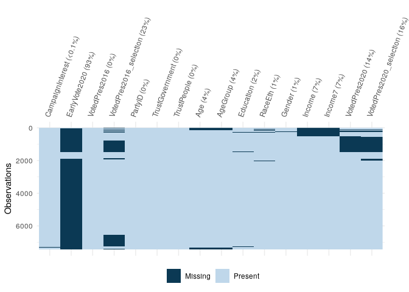
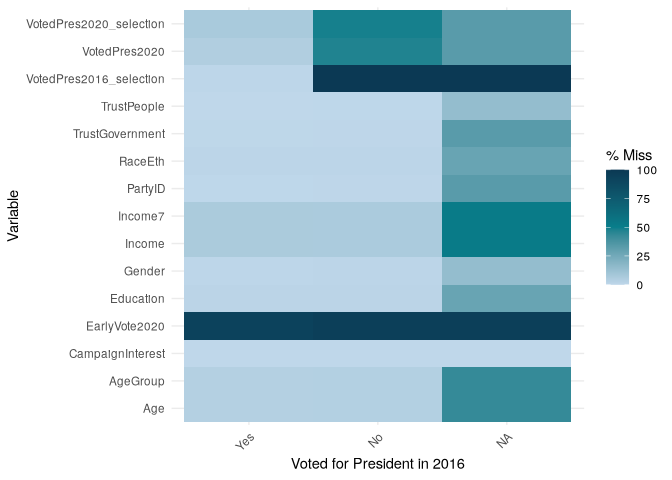
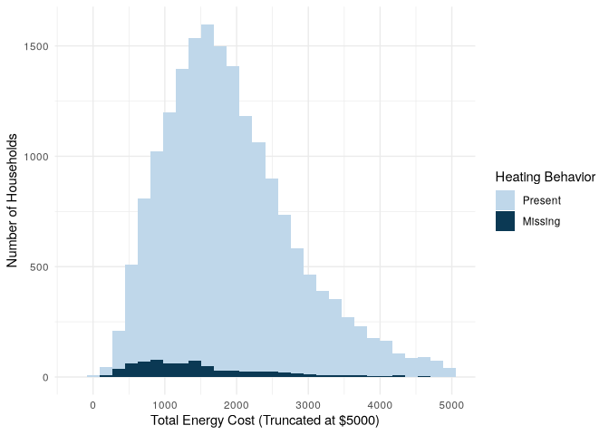

# Missing Data


# Setup

``` r
library(tidyverse)
library(survey)
library(srvyr)
library(naniar)
library(haven)
library(gt)
library(srvyrexploR)
```

``` r
targetpop <- 231592693

anes_adjwgt <- anes_2020 %>%
  mutate(Weight = Weight / sum(Weight) * targetpop)

anes_des <- anes_adjwgt %>%
  as_survey_design(
    weights = Weight,
    strata = Stratum,
    ids = VarUnit,
    nest = TRUE
  )

recs_des <- recs_2020 %>%
  as_survey_rep(
    weights = NWEIGHT,
    repweights = NWEIGHT1:NWEIGHT60,
    type = "JK1",
    scale = 59 / 60,
    mse = TRUE
  )

book_colors <- c("#0b3954", "#087e8b", "#bfd7ea", "#ff8484", "#8d6b94")
```

There are two main categories that missing data typically fall into:
missing by design and unintentional missing data. Missing by design is
part of the survey plan and can be more easily incorporated into weights
and analyses. Unintentional missing data, on the other hand, can lead to
bias in survey estimates if not correctly accounted for. Below we
provide more information on the types of missing data.

1.  Missing by design/questionnaire skip logic: This type of missingness
    occurs when certain respondents are intentionally directed to skip
    specific questions based on their previous responses or
    characteristics. For example, in a survey about employment, if a
    respondent indicates that they are not employed, they may be
    directed to skip questions related to their job responsibilities.
    Additionally, some surveys randomize questions or modules so that
    not all participants respond to all questions. In these instances,
    respondents would have missing data for the modules not randomly
    assigned to them.

2.  Unintentional missing data: This type of missingness occurs when
    researchers do not intend for there to be missing data on a
    particular question, for example, if respondents did not finish the
    survey or refused to answer individual questions. There are three
    main types of unintentional missing data that each should be
    considered and handled differently (Mack, Su, and Westreich 2018;
    Schafer and Graham 2002):

- Missing completely at random (MCAR): The missing data are unrelated to
  both observed and unobserved data, and the probability of being
  missing is the same across all cases. For example, if a respondent
  missed a question because they had to leave the survey early due to an
  emergency.
- Missing at random (MAR): The missing data are related to observed data
  but not unobserved data, and the probability of being missing is the
  same within groups. For example, we know the respondents’ ages and
  older respondents choose not to answer specific questions but younger
  respondents do answer them.
- Missing not at random (MNAR): The missing data are related to
  unobserved data, and the probability of being missing varies for
  reasons we are not measuring. For example, if respondents with
  depression do not answer a question about depression severity.

# Assessing missing data

``` r
anes_2020 %>%
  select(V202051:EarlyVote2020) %>%
  summary()
```

        V202051                 Income7                  Income        V201617x    
     Min.   :-9.0000   $125k or more:1468   Under $9,999    : 647   Min.   :-9.00  
     1st Qu.:-1.0000   Under $20k   :1076   $50,000-59,999  : 485   1st Qu.: 4.00  
     Median :-1.0000   $20k to < 40k:1051   $100,000-109,999: 451   Median :11.00  
     Mean   :-0.7259   $40k to < 60k: 984   $250,000 or more: 405   Mean   :10.36  
     3rd Qu.:-1.0000   $60k to < 80k: 920   $80,000-89,999  : 383   3rd Qu.:17.00  
     Max.   : 3.0000   (Other)      :1437   (Other)         :4565   Max.   :22.00  
                       NA's         : 517   NA's            : 517                  
        V201616      V201615      V201613      V201611      V201610      V201607  
     Min.   :-3   Min.   :-3   Min.   :-3   Min.   :-3   Min.   :-3   Min.   :-3  
     1st Qu.:-3   1st Qu.:-3   1st Qu.:-3   1st Qu.:-3   1st Qu.:-3   1st Qu.:-3  
     Median :-3   Median :-3   Median :-3   Median :-3   Median :-3   Median :-3  
     Mean   :-3   Mean   :-3   Mean   :-3   Mean   :-3   Mean   :-3   Mean   :-3  
     3rd Qu.:-3   3rd Qu.:-3   3rd Qu.:-3   3rd Qu.:-3   3rd Qu.:-3   3rd Qu.:-3  
     Max.   :-3   Max.   :-3   Max.   :-3   Max.   :-3   Max.   :-3   Max.   :-3  
                                                                                  
        Gender        V201600                      RaceEth        V201549x     
     Male  :3375   Min.   :-9.000   White              :5420   Min.   :-9.000  
     Female:4027   1st Qu.: 1.000   Black              : 650   1st Qu.: 1.000  
     NA's  :  51   Median : 2.000   Hispanic           : 662   Median : 1.000  
                   Mean   : 1.472   Asian, NH/PI       : 248   Mean   : 1.499  
                   3rd Qu.: 2.000   AI/AN              : 155   3rd Qu.: 2.000  
                   Max.   : 2.000   Other/multiple race: 237   Max.   : 6.000  
                                    NA's               :  81                   
        V201547z     V201547e     V201547d     V201547c     V201547b     V201547a 
     Min.   :-3   Min.   :-3   Min.   :-3   Min.   :-3   Min.   :-3   Min.   :-3  
     1st Qu.:-3   1st Qu.:-3   1st Qu.:-3   1st Qu.:-3   1st Qu.:-3   1st Qu.:-3  
     Median :-3   Median :-3   Median :-3   Median :-3   Median :-3   Median :-3  
     Mean   :-3   Mean   :-3   Mean   :-3   Mean   :-3   Mean   :-3   Mean   :-3  
     3rd Qu.:-3   3rd Qu.:-3   3rd Qu.:-3   3rd Qu.:-3   3rd Qu.:-3   3rd Qu.:-3  
     Max.   :-3   Max.   :-3   Max.   :-3   Max.   :-3   Max.   :-3   Max.   :-3  
                                                                                  
        V201546              Education       V201510              AgeGroup   
     Min.   :-9.000   Less than HS: 312   Min.   :-9.000   18-29      : 871  
     1st Qu.: 2.000   High school :1160   1st Qu.: 3.000   30-39      :1241  
     Median : 2.000   Post HS     :2514   Median : 5.000   40-49      :1081  
     Mean   : 1.841   Bachelor's  :1877   Mean   : 5.621   50-59      :1200  
     3rd Qu.: 2.000   Graduate    :1474   3rd Qu.: 6.000   60-69      :1436  
     Max.   : 2.000   NA's        : 116   Max.   :95.000   70 or older:1330  
                                                           NA's       : 294  
          Age           V201507x                  TrustPeople      V201237     
     Min.   :18.00   Min.   :-9.00   Always             :  48   Min.   :-9.00  
     1st Qu.:37.00   1st Qu.:35.00   Most of the time   :3511   1st Qu.: 2.00  
     Median :53.00   Median :51.00   About half the time:2020   Median : 3.00  
     Mean   :51.83   Mean   :49.43   Some of the time   :1597   Mean   : 2.78  
     3rd Qu.:66.00   3rd Qu.:66.00   Never              : 264   3rd Qu.: 3.00  
     Max.   :80.00   Max.   :80.00   NA's               :  13   Max.   : 5.00  
     NA's   :294                                                               
                TrustGovernment    V201233                           PartyID    
     Always             :  80   Min.   :-9.000   Strong democrat         :1796  
     Most of the time   :1016   1st Qu.: 3.000   Strong republican       :1545  
     About half the time:2313   Median : 4.000   Independent-democrat    : 881  
     Some of the time   :3313   Mean   : 3.429   Independent             : 876  
     Never              : 702   3rd Qu.: 4.000   Not very strong democrat: 790  
     NA's               :  29   Max.   : 5.000   (Other)                 :1540  
                                                 NA's                    :  25  
        V201231x         V201230            V201229           V201228     
     Min.   :-9.000   Min.   :-9.00000   Min.   :-9.0000   Min.   :-9.00  
     1st Qu.: 2.000   1st Qu.:-1.00000   1st Qu.:-1.0000   1st Qu.: 1.00  
     Median : 4.000   Median :-1.00000   Median : 1.0000   Median : 2.00  
     Mean   : 3.834   Mean   : 0.01302   Mean   : 0.5154   Mean   : 1.99  
     3rd Qu.: 6.000   3rd Qu.: 1.00000   3rd Qu.: 1.0000   3rd Qu.: 3.00  
     Max.   : 7.000   Max.   : 3.00000   Max.   : 2.0000   Max.   : 5.00  
                                                                          
     VotedPres2016_selection    V201103       VotedPres2016    V201102       
     Clinton:2911            Min.   :-9.000   Yes :5810     Min.   :-9.0000  
     Trump  :2466            1st Qu.: 1.000   No  :1622     1st Qu.:-1.0000  
     Other  : 390            Median : 1.000   NA's:  21     Median : 1.0000  
     NA's   :1686            Mean   : 1.042                 Mean   : 0.1048  
                             3rd Qu.: 2.000                 3rd Qu.: 1.0000  
                             Max.   : 5.000                 Max.   : 2.0000  
                                                                             
        V201101            V201029           V201028           V201025x     
     Min.   :-9.00000   Min.   :-9.0000   Min.   :-9.0000   Min.   :-4.000  
     1st Qu.:-1.00000   1st Qu.:-1.0000   1st Qu.:-1.0000   1st Qu.: 3.000  
     Median :-1.00000   Median :-1.0000   Median :-1.0000   Median : 3.000  
     Mean   : 0.08493   Mean   :-0.8967   Mean   :-0.9002   Mean   : 2.919  
     3rd Qu.: 1.00000   3rd Qu.:-1.0000   3rd Qu.:-1.0000   3rd Qu.: 3.000  
     Max.   : 2.00000   Max.   :12.0000   Max.   : 2.0000   Max.   : 4.000  
                                                                            
        V201024        EarlyVote2020
     Min.   :-9.0000   Yes : 375    
     1st Qu.:-1.0000   No  : 115    
     Median :-1.0000   NA's:6963    
     Mean   :-0.8595                
     3rd Qu.:-1.0000                
     Max.   : 4.0000                
                                    

``` r
anes_2020 %>%
  count(VotedPres2020, V202072)
```

    # A tibble: 7 × 3
      VotedPres2020 V202072                                   n
      <fct>         <dbl+lbl>                             <int>
    1 Yes           -1 [-1. Inapplicable]                   361
    2 Yes            1 [1. Yes, voted for President]       5952
    3 No            -1 [-1. Inapplicable]                    10
    4 No             2 [2. No, didn't vote for President]    77
    5 <NA>          -9 [-9. Refused]                          2
    6 <NA>          -6 [-6. No post-election interview]       4
    7 <NA>          -1 [-1. Inapplicable]                  1047

``` r
anes_2020_derived <- anes_2020 %>%
  select(
    -starts_with("V2"), -CaseID, -InterviewMode,
    -Weight, -Stratum, -VarUnit
  )

anes_2020_derived %>%
  vis_miss(cluster = TRUE, show_perc = FALSE) +
  scale_fill_manual(
    values = book_colors[c(3, 1)],
    labels = c("Present", "Missing"),
    name = ""
  ) +
  theme(
    plot.margin = margin(5.5, 30, 5.5, 5.5, "pt"),
    axis.text.x = element_text(angle = 70)
  )
```



Even if we did not have the informative variable names, we could deduce
that VotedPres2020, VotedPres2020_selection, and EarlyVote2020 are
likely connected since their missing data patterns are similar.
Additionally, we can also look at VotedPres2016_selection and see that
there are a lot of missing data in that variable. The missing data are
likely due to a skip pattern, and we can look at other graphics to see
how they relate to other variables.

``` r
anes_2020_derived %>%
  gg_miss_fct(VotedPres2016) +
  scale_fill_gradientn(
    guide = "colorbar",
    name = "% Miss",
    colors = book_colors[c(3, 2, 1)]
  ) +
  ylab("Variable") +
  xlab("Voted for President in 2016")
```

    Scale for fill is already present.
    Adding another scale for fill, which will replace the existing scale.



There are other visualizations that work well with numeric data. For
example, in the RECS 2020 data, we can plot two continuous variables and
the missing data associated with them to see if there are any patterns
in the missingness.

``` r
recs_2020_shadow <- bind_shadow(recs_2020)
ncol(recs_2020)
```

    [1] 100

``` r
ncol(recs_2020_shadow)
```

    [1] 200

``` r
recs_2020_shadow %>%
  count(HeatingBehavior, HeatingBehavior_NA)
```

    # A tibble: 7 × 3
      HeatingBehavior                                       HeatingBehavior_NA     n
      <fct>                                                 <fct>              <int>
    1 Set one temp and leave it                             !NA                 7806
    2 Manually adjust at night/no one home                  !NA                 4654
    3 Programmable or smart thermostat automatically adjus… !NA                 3310
    4 Turn on or off as needed                              !NA                 1491
    5 No control                                            !NA                  438
    6 Other                                                 !NA                   46
    7 <NA>                                                  NA                   751

``` r
recs_2020_shadow %>%
  filter(TOTALDOL < 5000) %>%
  ggplot(aes(x = TOTALDOL, fill = HeatingBehavior_NA)) +
  geom_histogram() +
  scale_fill_manual(
    values = book_colors[c(3, 1)],
    labels = c("Present", "Missing"),
    name = "Heating Behavior"
  ) +
  theme_minimal() +
  xlab("Total Energy Cost (Truncated at $5000)") +
  ylab("Number of Households")
```

    `stat_bin()` using `bins = 30`. Pick better value with `binwidth`.



The distributions appear to be different, suggesting a pattern for the
lack of responses.

# Analyzing Missing Data

## Recoding missing data

Even within a variable, there can be different reasons for missing data.
In publicly released data, negative values are often present to provide
different meanings for values. For example, in the ANES 2020 data, they
have the following negative values to represent different types of
missing data:

- –9: Refused
- –8: Don’t Know
- –7: No post-election data, deleted due to incomplete interview
- –6: No post-election interview
- –5: Interview breakoff (sufficient partial IW)
- –4: Technical error
- –3: Restricted
- –2: Other missing reason (question specific)
- –1: Inapplicable

However, the {naniar} package does have the option to code special
missing values. For example, if we wanted to have two NA values, one
that indicated the question was missing by design (e.g., due to skip
patterns) and one for the other missing categories, we can use the
nabular format to incorporate these with the recode_shadow() function.

``` r
anes_2020_shadow <- anes_2020 %>%
  select(starts_with("V2")) %>%
  mutate(across(everything(), ~ case_when(
    .x < -1 ~ NA,
    TRUE ~ .x
  ))) %>%
  bind_shadow() %>%
  recode_shadow(V201103 = .where(V201103 == -1 ~ "skip"))
anes_2020_shadow %>% count(V201103, V201103_NA)
```

    # A tibble: 5 × 3
      V201103                 V201103_NA     n
      <dbl+lbl>               <fct>      <int>
    1 -1 [-1. Inapplicable]   NA_skip     1643
    2  1 [1. Hillary Clinton] !NA         2911
    3  2 [2. Donald Trump]    !NA         2466
    4  5 [5. Other {SPECIFY}] !NA          390
    5 NA                      NA            43

## Accounting for skip patterns

One has several choices when analyzing these data which include: (1)
only including those with a valid value of HeatingBehavior and
specifying the universe as those with heat or (2) including those who do
not have heat. It is important to specify what population an analysis
generalizes to.

> Choice 1

``` r
recs_des %>%
  filter(!is.na(HeatingBehavior)) %>%
  group_by(HeatingBehavior) %>%
  summarise(
    p = survey_prop()
  )
```

    When `proportion` is unspecified, `survey_prop()` now defaults to `proportion = TRUE`.
    ℹ This should improve confidence interval coverage.
    This message is displayed once per session.

    # A tibble: 6 × 3
      HeatingBehavior                                                      p    p_se
      <fct>                                                            <dbl>   <dbl>
    1 Set one temp and leave it                                      0.430   4.69e-3
    2 Manually adjust at night/no one home                           0.264   4.54e-3
    3 Programmable or smart thermostat automatically adjusts the te… 0.168   3.12e-3
    4 Turn on or off as needed                                       0.102   2.89e-3
    5 No control                                                     0.0333  1.70e-3
    6 Other                                                          0.00208 3.59e-4

> Choice 2

``` r
recs_des %>%
  group_by(interact(SpaceHeatingUsed, HeatingBehavior)) %>%
  summarise(
    p = survey_prop()
  )
```

    # A tibble: 7 × 4
      SpaceHeatingUsed HeatingBehavior                                     p    p_se
      <lgl>            <fct>                                           <dbl>   <dbl>
    1 FALSE            <NA>                                          0.0469  2.07e-3
    2 TRUE             Set one temp and leave it                     0.410   4.60e-3
    3 TRUE             Manually adjust at night/no one home          0.251   4.36e-3
    4 TRUE             Programmable or smart thermostat automatical… 0.160   2.95e-3
    5 TRUE             Turn on or off as needed                      0.0976  2.79e-3
    6 TRUE             No control                                    0.0317  1.62e-3
    7 TRUE             Other                                         0.00198 3.41e-4

If we ran the first analysis, we would say that 16.8% of households with
heat use a programmable or smart thermostat for heating their home. If
we used the results from the second analysis, we would say that 16% of
households use a programmable or smart thermostat for heating their
home. The distinction between the two statements is made bold for
emphasis. Skip patterns often change the universe we are talking about
and need to be carefully examined.

Filtering to the correct universe is important when handling these types
of missing data. The nabular we created above can also help with this.
If we have NA_skip values in the shadow, we can make sure that we filter
out all of these values and only include relevant missing values. To do
this with survey data, we could first create the nabular, then create
the design object on that data, and then use the shadow variables to
assist with filtering the data. Let’s use the nabular we created above
for ANES 2020 (anes_2020_shadow) to create the design object.

``` r
anes_des_shadow <- anes_2020_shadow %>%
  mutate(V200010b = V200010b / sum(V200010b) * targetpop) %>%
  as_survey_design(
    weights = V200010b,
    strata = V200010d,
    ids = V200010c,
    nest = T
  )
```

Without removing any cases:

``` r
anes_des_shadow %>%
  group_by(V201103) %>%
  summarise(
    All_Missing = survey_prop()
  )
```

    # A tibble: 5 × 3
      V201103                 All_Missing All_Missing_se
      <dbl+lbl>                     <dbl>          <dbl>
    1 -1 [-1. Inapplicable]       0.324          0.00933
    2  1 [1. Hillary Clinton]     0.330          0.00728
    3  2 [2. Donald Trump]        0.299          0.00728
    4  5 [5. Other {SPECIFY}]     0.0409         0.00230
    5 NA                          0.00627        0.00121

Removing skip-patterns:

``` r
anes_des_shadow %>%
  filter(V201103_NA != "NA_skip") %>%
  group_by(V201103) %>%
  summarise(
    All_Missing = survey_prop()
  )
```

    # A tibble: 4 × 3
      V201103                 All_Missing All_Missing_se
      <dbl+lbl>                     <dbl>          <dbl>
    1  1 [1. Hillary Clinton]     0.488          0.00870
    2  2 [2. Donald Trump]        0.443          0.00856
    3  5 [5. Other {SPECIFY}]     0.0606         0.00330
    4 NA                          0.00928        0.00178

Removing all missing values:

``` r
anes_des_shadow %>%
  filter(V201103_NA == "!NA") %>%
  group_by(V201103) %>%
  summarise(
    All_Missing = survey_prop()
  )
```

    # A tibble: 3 × 3
      V201103                All_Missing All_Missing_se
      <dbl+lbl>                    <dbl>          <dbl>
    1 1 [1. Hillary Clinton]      0.492         0.00875
    2 2 [2. Donald Trump]         0.447         0.00861
    3 5 [5. Other {SPECIFY}]      0.0611        0.00332
