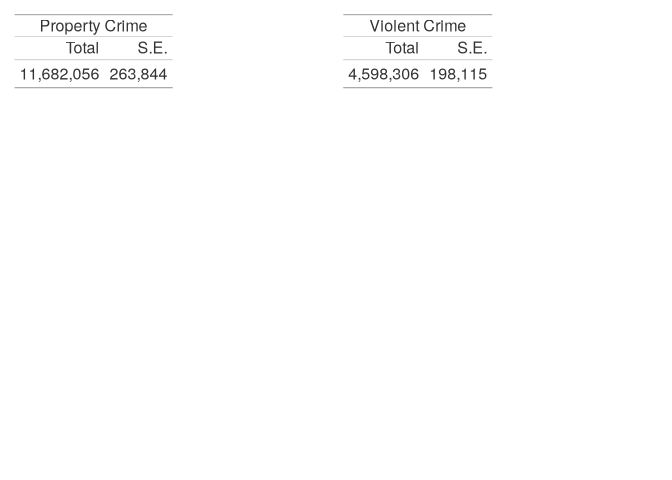

# National Crime Victimization Survey Vignette


# Data structure

The data from ICPSR are distributed with five files, each having its
unique identifier indicated:

- Address Record - `YEARQ`, `IDHH`
- Household Record - `YEARQ`, `IDHH`
- Person Record - `YEARQ`, `IDHH`, `IDPER`
- Incident Record - `YEARQ`, `IDHH`, `IDPER`
- 2021 Collection Year Incident - `YEARQ`, `IDHH`, `IDPER`

In this vignette, we focus on the household, person, and incident files
and have selected a subset of columns for use in the examples. We have
included data in the {srvyexploR} package with this subset of columns,
but the complete data files can be downloaded from
[ICPSR](https://www.icpsr.umich.edu/web/NACJD/studies/38429).

The NCVS User Guide \[@ncvs_user_guide\] uses the following notation:

- $i$ represents NCVS households, identified on the household-level file
  with the household identification number `IDHH`.
- $j$ represents NCVS individual respondents within household $i$,
  identified on the person-level file with the person identification
  number `IDPER`.
- $k$ represents reporting periods (i.e., `YEARQ`) for household $i$ and
  individual respondent $j$.
- $l$ represents victimization records for respondent $j$ in household
  $i$ and reporting period $k$. Each record on the NCVS incident-level
  file is associated with a victimization record $l$.
- $D$ represents one or more domain characteristics of interest in the
  calculation of NCVS estimates. For victimization totals and
  proportions, domains can be defined on the basis of crime types (e.g.,
  violent crimes, property crimes), characteristics of victims (e.g.,
  age, sex, household income), or characteristics of the victimizations
  (e.g., victimizations reported to police, victimizations committed
  with a weapon present). Domains could also be a combination of all of
  these types of characteristics. For example, in the calculation of
  victimization rates, domains are defined on the basis of the
  characteristics of the victims.
- $A_a$ represents the level $a$ of covariate $A$. Covariate $A$ is
  defined in the calculation of victimization proportions and represents
  the characteristic we want to obtain the distribution of
  victimizations in domain $D$.
- $C$ represents the personal or property crime for which we want to
  obtain a victimization rate.

In this vignette, we discuss four estimates:

1.  Victimization totals estimate the number of criminal victimizations
    with a given characteristic. As demonstrated below, these can be
    calculated from any of the data files. The estimated victimization
    total, $\hat{t}_D$ for domain $D$ is estimated as

$$ \hat{t}_D = \sum_{ijkl \in D} v_{ijkl}$$

where $v_{ijkl}$ is the series-adjusted victimization weight for
household $i$, respondent $j$, reporting period $k$, and victimization
$l$, represented in the data as `WGTVICCY`.

2.  Victimization proportions estimate characteristics among
    victimizations or victims. Victimization proportions are calculated
    using the incident data file. The estimated victimization proportion
    for domain $D$ across level $a$ of covariate $A$, $\hat{p}_{A_a,D}$
    is

$$ \hat{p}_{A_a,D} =\frac{\sum_{ijkl \in A_a, D} v_{ijkl}}{\sum_{ijkl \in D} v_{ijkl}}.$$
The numerator is the number of incidents with a particular
characteristic in a domain, and the denominator is the number of
incidents in a domain.

3.  Victimization rates are estimates of the number of victimizations
    per 1,000 persons or households in the population[^1]. Victimization
    rates are calculated using the household or person-level data files.
    The estimated victimization rate for crime $C$ in domain $D$ is

$$\hat{VR}_{C,D}= \frac{\sum_{ijkl \in C,D} v_{ijkl}}{\sum_{ijk \in D} w_{ijk}}\times 1000$$
where $w_{ijk}$ is the person weight (`WGTPERCY`) for personal crimes or
household weight (`WGTHHCY`) for household crimes. The numerator is the
number of incidents in a domain, and the denominator is the number of
persons or households in a domain. Notice that the weights in the
numerator and denominator are different; this is important, and in the
syntax and examples below, we discuss how to make an estimate that
involves two weights.

4.  Prevalence rates are estimates of the percentage of the population
    (persons or households) who are victims of a crime. These are
    estimated using the household or person-level data files. The
    estimated prevalence rate for crime $C$ in domain $D$ is

$$ \hat{PR}_{C, D}= \frac{\sum_{ijk \in {C,D}} I_{ij}w_{ijk}}{\sum_{ijk \in D} w_{ijk}} \times 100$$

where $I_{ij}$ is an indicator that a person or household in domain $D$
was a victim of crime $C$ at any time in the year. The numerator is the
number of victims in domain $D$ for crime $C$, and the denominator is
the number of people or households in the population.

# Preparation

``` r
library(tidyverse)
library(survey)
library(srvyr)
library(gt)
library(srvyrexploR)
library(janitor)
library(prettyunits)
library(patchwork)
```

|  | Description | Value | Label |
|:--:|:--:|:--:|:--:|
| V4016 | How many times incident occur last 6 months | 1–996 | Number of times |
|  |  | 997 | Don’t know |
| V4017 | How many incidents | 1 | 1–5 incidents (not a “series”) |
|  |  | 2 | 6 or more incidents |
|  |  | 8 | Residue (invalid data) |
| V4018 | Incidents similar in detail | 1 | Similar |
|  |  | 2 | Different (not in a “series”) |
|  |  | 8 | Residue (invalid data) |
| V4019 | Enough detail to distinguish incidents | 1 | Yes (not a “series”) |
|  |  | 2 | No (is a “series”) |
|  |  | 8 | Residue (invalid data) |
| WGTVICCY | Adjusted victimization weight |  | Numeric |

(#tab:cb-incident) Codebook for incident variables, related to series
weight

We want to create four variables to indicate if an incident is a series
crime.

- a variable called `series` using `V4017`, `V4018`, and `V4019` where
  an incident is considered a series crime if there are 6 or more
  incidents (`V4107`), the incidents are similar in detail (`V4018`), or
  there is not enough detail to distinguish the incidents (`V4019`)
- top-code the number of incidents (`V4016`) by creating a variable
  `n10v4016`, which is set to 10 if `V4016 > 10`.
- create the `serieswgt` using the two new variables `series` and
  `n10v4019` to classify the max series based on missing data and number
  of incidents
- create the new weight using our new `serieswgt` variable and the
  existing weight (`WGTVICCY`).

``` r
inc_series <- ncvs_2021_incident %>%
  mutate(
    series = case_when(
      V4017 %in% c(1, 8) ~ 1,
      V4018 %in% c(2, 8) ~ 1,
      V4019 %in% c(1, 8) ~ 1,
      TRUE ~ 2
    ),
    n10v4016 = case_when(
      V4016 %in% c(997, 998) ~ NA_real_,
      V4016 > 10 ~ 10,
      TRUE ~ V4016
    ),
    serieswgt = case_when(
      series == 2 & is.na(n10v4016) ~ 6,
      series == 2 ~ n10v4016,
      TRUE ~ 1
    ),
    NEWWGT = WGTVICCY * serieswgt
  )
```

The next step in preparing the files for estimation is to create
indicators on the victimization file for characteristics of interest.
Almost all BJS publications limit the analysis to records where the
victimization occurred in the United States (where `V4022` is not equal
to 1). We do this for all estimates as well. A brief codebook of
variables for this task is located in Table @ref(tab:cb-crimetype).

| Variable | Description | Value | Label |
|:--:|:--:|:--:|:--:|
| V4022 | In what city/town/village | 1 | Outside U.S. |
|  |  | 2 | Not inside a city/town/village |
|  |  | 3 | Same city/town/village as present residence |
|  |  | 4 | Different city/town/village as present residence |
|  |  | 5 | Don’t know |
|  |  | 6 | Don’t know if 2, 4, or 5 |
| V4049 | Did offender have a weapon | 1 | Yes |
|  |  | 2 | No |
|  |  | 3 | Don’t know |
| V4050 | What was the weapon that offender had | 1 | At least one good entry |
|  |  | 3 | Indicates “Yes-Type Weapon-NA” |
|  |  | 7 | Indicates “Gun Type Unknown” |
|  |  | 8 | No good entry |
| V4051 | Hand gun | 0 | No |
|  |  | 1 | Yes |
| V4052 | Other gun | 0 | No |
|  |  | 1 | Yes |
| V4053 | Knife | 0 | No |
|  |  | 1 | Yes |
| V4399 | Reported to police | 1 | Yes |
|  |  | 2 | No |
|  |  | 3 | Don’t know |
| V4529 | Type of crime code | 01 | Completed rape |
|  |  | 02 | Attempted rape |
|  |  | 03 | Sexual attack with serious assault |
|  |  | 04 | Sexual attack with minor assault |
|  |  | 05 | Completed robbery with injury from serious assault |
|  |  | 06 | Completed robbery with injury from minor assault |
|  |  | 07 | Completed robbery without injury from minor assault |
|  |  | 08 | Attempted robbery with injury from serious assault |
|  |  | 09 | Attempted robbery with injury from minor assault |
|  |  | 10 | Attempted robbery without injury |
|  |  | 11 | Completed aggravated assault with injury |
|  |  | 12 | Attempted aggravated assault with weapon |
|  |  | 13 | Threatened assault with weapon |
|  |  | 14 | Simple assault completed with injury |
|  |  | 15 | Sexual assault without injury |
|  |  | 16 | Unwanted sexual contact without force |
|  |  | 17 | Assault without weapon without injury |
|  |  | 18 | Verbal threat of rape |
|  |  | 19 | Verbal threat of sexual assault |
|  |  | 20 | Verbal threat of assault |
|  |  | 21 | Completed purse snatching |
|  |  | 22 | Attempted purse snatching |
|  |  | 23 | Pocket picking (completed only) |
|  |  | 31 | Completed burglary, forcible entry |
|  |  | 32 | Completed burglary, unlawful entry without force |
|  |  | 33 | Attempted forcible entry |
|  |  | 40 | Completed motor vehicle theft |
|  |  | 41 | Attempted motor vehicle theft |
|  |  | 54 | Completed theft less than \$10 |
|  |  | 55 | Completed theft \$10 to \$49 |
|  |  | 56 | Completed theft \$50 to \$249 |
|  |  | 57 | Completed theft \$250 or greater |
|  |  | 58 | Completed theft value NA |
|  |  | 59 | Attempted theft |

(#tab:cb-crimetype) Codebook for incident variables, crime type
indicators and characteristics

Using these variables, we create the following indicators:

1.  Property crime
    - `V4529` () 31
    - Variable: `Property`
2.  Violent crime
    - `V4529` () 20
    - Variable: `Violent`
3.  Property crime reported to the police
    - `V4529` () 31 and `V4399`=1
    - Variable: `Property_ReportPolice`
4.  Violent crime reported to the police
    - `V4529` \< 31 and `V4399`=1
    - Variable: `Violent_ReportPolice`
5.  Aggravated assault without a weapon
    - `V4529` in 11:12 and `V4049`=2
    - Variable: `AAST_NoWeap`
6.  Aggravated assault with a firearm
    - `V4529` in 11:12 and `V4049`=1 and (`V4051`=1 or `V4052`=1 or
      `V4050`=7)
    - Variable: `AAST_Firearm`
7.  Aggravated assault with a knife or sharp object
    - `V4529` in 11:12 and `V4049`=1 and (`V4053`=1 or `V4054`=1)
    - Variable: `AAST_Knife`
8.  Aggravated assault with another type of weapon
    - `V4529` in 11:12 and `V4049`=1 and `V4050`=1 and not firearm or
      knife
    - Variable: `AAST_Other`

``` r
inc_ind <- inc_series %>%
  filter(V4022 != 1) %>% # Only US based
  mutate(
    WeapCat = case_when(
      is.na(V4049) ~ NA_character_,
      V4049 == 2 ~ "NoWeap",
      V4049 == 3 ~ "UnkWeapUse",
      V4050 == 3 ~ "Other",
      V4051 == 1 | V4052 == 1 | V4050 == 7 ~ "Firearm",
      V4053 == 1 | V4054 == 1 ~ "Knife",
      TRUE ~ "Other"
    ),
    V4529_num = parse_number(as.character(V4529)),
    ReportPolice = V4399 == 1,
    Property = V4529_num >= 31,
    Violent = V4529_num <= 20,
    Property_ReportPolice = Property & ReportPolice,
    Violent_ReportPolice = Violent & ReportPolice,
    AAST = V4529_num %in% 11:13,
    AAST_NoWeap = AAST & WeapCat == "NoWeap",
    AAST_Firearm = AAST & WeapCat == "Firearm",
    AAST_Knife = AAST & WeapCat == "Knife",
    AAST_Other = AAST & WeapCat == "Other"
  )
```

Check:

``` r
inc_series %>%
  tabyl(V4022) %>%
  adorn_totals("row") %>%
  adorn_pct_formatting()
```

     V4022    n percent
         1   34    0.4%
         2   65    0.7%
         3 7697   85.7%
         4 1143   12.7%
         5   39    0.4%
         8    4    0.0%
     Total 8982  100.0%

``` r
inc_ind %>%
  tabyl(V4022) %>%
  adorn_totals("row") %>%
  adorn_pct_formatting()
```

     V4022    n percent
         1    0    0.0%
         2   65    0.7%
         3 7697   86.0%
         4 1143   12.8%
         5   39    0.4%
         8    4    0.0%
     Total 8948  100.0%

``` r
inc_ind %>%
  count(WeapCat, V4049, V4050, V4051, V4052, V4052, V4053, V4054) %>%
  adorn_totals()
```

        WeapCat V4049 V4050 V4051 V4052 V4053 V4054    n
        Firearm     1     1     0     1     0     0   15
        Firearm     1     1     0     1     1     1    1
        Firearm     1     1     1     0     0     0  125
        Firearm     1     1     1     0     1     0    2
        Firearm     1     1     1     1     0     0    3
        Firearm     1     7     0     0     0     0    3
          Knife     1     1     0     0     0     1   14
          Knife     1     1     0     0     1     0   71
         NoWeap     2  <NA>  <NA>  <NA>  <NA>  <NA> 1794
          Other     1     1     0     0     0     0  147
          Other     1     3     0     0     0     0   26
     UnkWeapUse     3  <NA>  <NA>  <NA>  <NA>  <NA>  519
           <NA>  <NA>  <NA>  <NA>  <NA>  <NA>  <NA> 6228
          Total     -     -     -     -     -     - 8948

``` r
inc_ind %>%
  count(V4529, Property, Violent, AAST) %>%
  adorn_totals()
```

     V4529 Property Violent  AAST    n
         1    FALSE    TRUE FALSE   45
         2    FALSE    TRUE FALSE   20
         3    FALSE    TRUE FALSE   11
         4    FALSE    TRUE FALSE    3
         5    FALSE    TRUE FALSE   24
         6    FALSE    TRUE FALSE   26
         7    FALSE    TRUE FALSE   59
         8    FALSE    TRUE FALSE    5
         9    FALSE    TRUE FALSE    7
        10    FALSE    TRUE FALSE   57
        11    FALSE    TRUE  TRUE   97
        12    FALSE    TRUE  TRUE   91
        13    FALSE    TRUE  TRUE  163
        14    FALSE    TRUE FALSE  165
        15    FALSE    TRUE FALSE   24
        16    FALSE    TRUE FALSE   12
        17    FALSE    TRUE FALSE  357
        18    FALSE    TRUE FALSE   14
        19    FALSE    TRUE FALSE    3
        20    FALSE    TRUE FALSE  607
        21    FALSE   FALSE FALSE    2
        22    FALSE   FALSE FALSE    2
        23    FALSE   FALSE FALSE   19
        31     TRUE   FALSE FALSE  248
        32     TRUE   FALSE FALSE  634
        33     TRUE   FALSE FALSE  188
        40     TRUE   FALSE FALSE  256
        41     TRUE   FALSE FALSE   97
        54     TRUE   FALSE FALSE  407
        55     TRUE   FALSE FALSE 1006
        56     TRUE   FALSE FALSE 1686
        57     TRUE   FALSE FALSE 1420
        58     TRUE   FALSE FALSE  798
        59     TRUE   FALSE FALSE  395
     Total        -       -     - 8948

``` r
inc_ind %>%
  count(ReportPolice, V4399) %>%
  adorn_totals()
```

     ReportPolice V4399    n
            FALSE     2 5670
            FALSE     3  103
            FALSE     8   12
             TRUE     1 3163
            Total     - 8948

``` r
inc_ind %>%
  count(
    AAST,
    WeapCat,
    AAST_NoWeap,
    AAST_Firearm,
    AAST_Knife,
    AAST_Other
  ) %>%
  adorn_totals()
```

      AAST    WeapCat AAST_NoWeap AAST_Firearm AAST_Knife AAST_Other    n
     FALSE    Firearm       FALSE        FALSE      FALSE      FALSE   34
     FALSE      Knife       FALSE        FALSE      FALSE      FALSE   23
     FALSE     NoWeap       FALSE        FALSE      FALSE      FALSE 1769
     FALSE      Other       FALSE        FALSE      FALSE      FALSE   27
     FALSE UnkWeapUse       FALSE        FALSE      FALSE      FALSE  516
     FALSE       <NA>       FALSE        FALSE      FALSE      FALSE 6228
      TRUE    Firearm       FALSE         TRUE      FALSE      FALSE  115
      TRUE      Knife       FALSE        FALSE       TRUE      FALSE   62
      TRUE     NoWeap        TRUE        FALSE      FALSE      FALSE   25
      TRUE      Other       FALSE        FALSE      FALSE       TRUE  146
      TRUE UnkWeapUse       FALSE        FALSE      FALSE      FALSE    3
     Total          -           -            -          -          - 8948

Separate household/property crime from personal crimes, summing by
`YEARQ`. The indicators are summed using our created series weight
variable (serieswgt). Additionally, the existing weight variable
(`WGTVICCY`) needs to be retained for later analysis.

``` r
inc_hh_sums <- inc_ind %>%
  filter(V4529_num > 23) %>%
  group_by(YEARQ, IDHH) %>%
  summarise(
    WGTVICCY = WGTVICCY[1],
    across(starts_with("Property"),
      ~ sum(. * serieswgt),
      .names = "{.col}"
    ),
    .groups = "drop"
  )

inc_pers_sums <-
  inc_ind %>%
  filter(V4529_num <= 23) %>% # restrict to person crimes
  group_by(YEARQ, IDHH, IDPER) %>%
  summarize(
    WGTVICCY = WGTVICCY[1],
    across(c(starts_with("Violent"), starts_with("AAST")),
      ~ sum(. * serieswgt),
      .names = "{.col}"
    ),
    .groups = "drop"
  )
```

Now, we merge the victimization summary files into the appropriate
files. For any record on the household or person file that is not on the
victimization file, the victimization counts are set to 0 after merging.
In this step, we also create the victimization adjustment factor. See
Section 2.2.4 in the User’s Guide for details of why this adjustment is
created \[@ncvs_user_guide\]. It is calculated as follows:

$$ A_{ijk}=\frac{v_{ijk}}{w_{ijk}}$$

where $w_{ijk}$ is the person weight (`WGTPERCY`) for personal crimes or
the household weight (`WGTHHCY`) for household crimes, and $v_{ijk}$ is
the victimization weight (`WGTVICCY`) for household $i$, respondent $j$,
in reporting period $k$. The adjustment factor is set to 0 if no
incidents are reported.

``` r
hh_z_list <- rep(0, ncol(inc_hh_sums) - 3) %>%
  as.list() %>%
  setNames(names(inc_hh_sums)[-(1:3)])

pers_z_list <- rep(0, ncol(inc_pers_sums) - 4) %>%
  as.list() %>%
  setNames(names(inc_pers_sums)[-(1:4)])

hh_vsum <- ncvs_2021_household %>%
  full_join(inc_hh_sums, by = c("YEARQ", "IDHH")) %>%
  replace_na(hh_z_list) %>%
  mutate(ADJINC_WT = if_else(is.na(WGTVICCY), 0, WGTVICCY / WGTHHCY))

pers_vsum <- ncvs_2021_person %>%
  full_join(inc_pers_sums, by = c("YEARQ", "IDHH", "IDPER")) %>%
  replace_na(pers_z_list) %>%
  mutate(ADJINC_WT = if_else(is.na(WGTVICCY), 0, WGTVICCY / WGTPERCY))
```

# Derived Demographic Variables

## Household variables

For the household file, we create categories for tenure (rental status),
urbanicity, income, place size, and region. A codebook of the household
variables is listed in Table @ref(tab:cb-hh).

| Variable | Description                  | Value | Label                   |
|----------|------------------------------|-------|-------------------------|
| V2015    | Tenure                       | 1     | Owned or being bought   |
|          |                              | 2     | Rented for cash         |
|          |                              | 3     | No cash rent            |
| SC214A   | Household Income             | 01    | Less than \$5,000       |
|          |                              | 02    | \$5,000–7,499           |
|          |                              | 03    | \$7,500–9,999           |
|          |                              | 04    | \$10,000–12,499         |
|          |                              | 05    | \$12,500–14,999         |
|          |                              | 06    | \$15,000–17,499         |
|          |                              | 07    | \$17,500–19,999         |
|          |                              | 08    | \$20,000–24,999         |
|          |                              | 09    | \$25,000–29,999         |
|          |                              | 10    | \$30,000–34,999         |
|          |                              | 11    | \$35,000–39,999         |
|          |                              | 12    | \$40,000–49,999         |
|          |                              | 13    | \$50,000–74,999         |
|          |                              | 15    | \$75,000–99,999         |
|          |                              | 16    | \$100,000–149,999       |
|          |                              | 17    | \$150,000–199,999       |
|          |                              | 18    | \$200,000 or more       |
| V2126B   | Place Size (Population) Code | 00    | Not in a place          |
|          |                              | 13    | Population under 10,000 |
|          |                              | 16    | 10,000–49,999           |
|          |                              | 17    | 50,000–99,999           |
|          |                              | 18    | 100,000–249,999         |
|          |                              | 19    | 250,000–499,999         |
|          |                              | 20    | 500,000–999,999         |
|          |                              | 21    | 1,000,000–2,499,999     |
|          |                              | 22    | 2,500,000–4,999,999     |
|          |                              | 23    | 5,000,000 or more       |
| V2127B   | Region                       | 1     | Northeast               |
|          |                              | 2     | Midwest                 |
|          |                              | 3     | South                   |
|          |                              | 4     | West                    |
| V2143    | Urbanicity                   | 1     | Urban                   |
|          |                              | 2     | Suburban                |
|          |                              | 3     | Rural                   |

(#tab:cb-hh) Codebook for household variables

``` r
hh_vsum_der <- hh_vsum %>%
  mutate(
    Tenure = factor(
      case_when(
        V2015 == 1 ~ "Owned",
        !is.na(V2015) ~ "Rented"
      ),
      levels = c("Owned", "Rented")
    ),
    Urbanicity = factor(
      case_when(
        V2143 == 1 ~ "Urban",
        V2143 == 2 ~ "Suburban",
        V2143 == 3 ~ "Rural"
      ),
      levels = c("Urban", "Suburban", "Rural")
    ),
    SC214A_num = as.numeric(as.character(SC214A)),
    Income = case_when(
      SC214A_num <= 8 ~ "Less than $25,000",
      SC214A_num <= 12 ~ "$25,000--49,999",
      SC214A_num <= 15 ~ "$50,000--99,999",
      SC214A_num <= 17 ~ "$100,000--199,999",
      SC214A_num <= 18 ~ "$200,000 or more"
    ),
    Income = fct_reorder(Income, SC214A_num, .na_rm = FALSE),
    PlaceSize = case_match(
      as.numeric(as.character(V2126B)),
      0 ~ "Not in a place",
      13 ~ "Population under 10,000",
      16 ~ "10,000--49,999",
      17 ~ "50,000--99,999",
      18 ~ "100,000--249,999",
      19 ~ "250,000--499,999",
      20 ~ "500,000--999,999",
      c(21, 22, 23) ~ "1,000,000 or more"
    ),
    PlaceSize = fct_reorder(PlaceSize, as.numeric(V2126B)),
    Region = case_match(
      as.numeric(V2127B),
      1 ~ "Northeast",
      2 ~ "Midwest",
      3 ~ "South",
      4 ~ "West"
    ),
    Region = fct_reorder(Region, as.numeric(V2127B))
  )
```

``` r
hh_vsum_der %>%
  count(Tenure, V2015) %>%
  adorn_totals()
```

     Tenure V2015      n
      Owned     1 101944
     Rented     2  46269
     Rented     3   1925
       <NA>  <NA> 106322
      Total     - 256460

``` r
hh_vsum_der %>%
  count(Urbanicity, V2143) %>%
  adorn_totals()
```

     Urbanicity V2143      n
          Urban     1  26878
       Suburban     2 173491
          Rural     3  56091
          Total     - 256460

``` r
hh_vsum_der %>%
  count(Income, SC214A) %>%
  adorn_totals()
```

                Income SC214A      n
     Less than $25,000      1   7841
     Less than $25,000      2   2626
     Less than $25,000      3   3949
     Less than $25,000      4   5546
     Less than $25,000      5   5445
     Less than $25,000      6   4821
     Less than $25,000      7   5038
     Less than $25,000      8  11887
       $25,000--49,999      9  11550
       $25,000--49,999     10  13689
       $25,000--49,999     11  13655
       $25,000--49,999     12  23282
       $50,000--99,999     13  44601
       $50,000--99,999     15  33353
     $100,000--199,999     16  34287
     $100,000--199,999     17  15317
      $200,000 or more     18  16892
                  <NA>   <NA>   2681
                 Total      - 256460

``` r
hh_vsum_der %>%
  count(PlaceSize, V2126B) %>%
  adorn_totals()
```

                   PlaceSize V2126B      n
              Not in a place      0  69484
     Population under 10,000     13  39873
              10,000--49,999     16  53002
              50,000--99,999     17  27205
            100,000--249,999     18  24461
            250,000--499,999     19  13111
            500,000--999,999     20  15194
           1,000,000 or more     21   6167
           1,000,000 or more     22   3857
           1,000,000 or more     23   4106
                       Total      - 256460

``` r
hh_vsum_der %>%
  count(Region, V2127B) %>%
  adorn_totals()
```

        Region V2127B      n
     Northeast      1  41585
       Midwest      2  74666
         South      3  87783
          West      4  52426
         Total      - 256460

## Person Variables

For the person file, we create categories for sex, race/Hispanic origin,
age categories, and marital status. A codebook of the household
variables is located in Table @ref(tab:cb-pers). We also merge the
household demographics to the person file as well as the design
variables (`V2117` and `V2118`).

| Variable | Description            | Value | Label                               |
|----------|------------------------|-------|-------------------------------------|
| V3014    | Age                    |       | 12–90                               |
| V3015    | Current Marital Status | 1     | Married                             |
|          |                        | 2     | Widowed                             |
|          |                        | 3     | Divorced                            |
|          |                        | 4     | Separated                           |
|          |                        | 5     | Never married                       |
| V3018    | Sex                    | 1     | Male                                |
|          |                        | 2     | Female                              |
| V3023A   | Race                   | 01    | White only                          |
|          |                        | 02    | Black only                          |
|          |                        | 03    | American Indian, Alaska native only |
|          |                        | 04    | Asian only                          |
|          |                        | 05    | Hawaiian/Pacific Islander only      |
|          |                        | 06    | White-Black                         |
|          |                        | 07    | White-American Indian               |
|          |                        | 08    | White-Asian                         |
|          |                        | 09    | White-Hawaiian                      |
|          |                        | 10    | Black-American Indian               |
|          |                        | 11    | Black-Asian                         |
|          |                        | 12    | Black-Hawaiian/Pacific Islander     |
|          |                        | 13    | American Indian-Asian               |
|          |                        | 14    | Asian-Hawaiian/Pacific Islander     |
|          |                        | 15    | White-Black-American Indian         |
|          |                        | 16    | White-Black-Asian                   |
|          |                        | 17    | White-American Indian-Asian         |
|          |                        | 18    | White-Asian-Hawaiian                |
|          |                        | 19    | 2 or 3 races                        |
|          |                        | 20    | 4 or 5 races                        |
| V3024    | Hispanic Origin        | 1     | Yes                                 |
|          |                        | 2     | No                                  |

(#tab:cb-pers) Codebook for person variables

``` r
NHOPI <- "Native Hawaiian or Other Pacific Islander"

pers_vsum_der <- pers_vsum %>%
  mutate(
    Sex = factor(case_when(
      V3018 == 1 ~ "Male",
      V3018 == 2 ~ "Female"
    )),
    RaceHispOrigin = factor(
      case_when(
        V3024 == 1 ~ "Hispanic",
        V3023A == 1 ~ "White",
        V3023A == 2 ~ "Black",
        V3023A == 4 ~ "Asian",
        V3023A == 5 ~ NHOPI,
        TRUE ~ "Other"
      ),
      levels = c(
        "White", "Black", "Hispanic",
        "Asian", NHOPI, "Other"
      )
    ),
    V3014_num = as.numeric(as.character(V3014)),
    AgeGroup = case_when(
      V3014_num <= 17 ~ "12--17",
      V3014_num <= 24 ~ "18--24",
      V3014_num <= 34 ~ "25--34",
      V3014_num <= 49 ~ "35--49",
      V3014_num <= 64 ~ "50--64",
      V3014_num <= 90 ~ "65 or older"
    ),
    AgeGroup = fct_reorder(AgeGroup, V3014_num),
    MaritalStatus = factor(
      case_when(
        V3015 == 1 ~ "Married",
        V3015 == 2 ~ "Widowed",
        V3015 == 3 ~ "Divorced",
        V3015 == 4 ~ "Separated",
        V3015 == 5 ~ "Never married"
      ),
      levels = c(
        "Never married", "Married",
        "Widowed", "Divorced",
        "Separated"
      )
    )
  ) %>%
  left_join(
    hh_vsum_der %>% select(
      YEARQ, IDHH,
      V2117, V2118, Tenure:Region
    ),
    by = c("YEARQ", "IDHH")
  )
```

``` r
pers_vsum_der %>%
  count(Sex, V3018) %>%
  adorn_totals()
```

        Sex V3018      n
     Female     2 150956
       Male     1 140922
      Total     - 291878

``` r
pers_vsum_der %>%
  count(RaceHispOrigin, V3024) %>%
  adorn_totals()
```

                                RaceHispOrigin V3024      n
                                         White     2 197292
                                         White     8    883
                                         Black     2  29947
                                         Black     8    120
                                      Hispanic     1  41450
                                         Asian     2  16015
                                         Asian     8     61
     Native Hawaiian or Other Pacific Islander     2    891
     Native Hawaiian or Other Pacific Islander     8      9
                                         Other     2   5161
                                         Other     8     49
                                         Total     - 291878

``` r
pers_vsum_der %>%
  filter(RaceHispOrigin != "Hispanic" |
    is.na(RaceHispOrigin)) %>%
  count(RaceHispOrigin, V3023A) %>%
  adorn_totals()
```

                                RaceHispOrigin V3023A      n
                                         White      1 198175
                                         Black      2  30067
                                         Asian      4  16076
     Native Hawaiian or Other Pacific Islander      5    900
                                         Other      3   1319
                                         Other      6   1217
                                         Other      7   1025
                                         Other      8    837
                                         Other      9    184
                                         Other     10    178
                                         Other     11     87
                                         Other     12     27
                                         Other     13     13
                                         Other     14     53
                                         Other     15    136
                                         Other     16     45
                                         Other     17     11
                                         Other     18     33
                                         Other     19     22
                                         Other     20     23
                                         Total      - 250428

``` r
pers_vsum_der %>%
  group_by(AgeGroup) %>%
  summarize(
    minAge = min(V3014),
    maxAge = max(V3014),
    .groups = "drop"
  )
```

    # A tibble: 6 × 3
      AgeGroup    minAge maxAge
      <fct>        <dbl>  <dbl>
    1 12--17          12     17
    2 18--24          18     24
    3 25--34          25     34
    4 35--49          35     49
    5 50--64          50     64
    6 65 or older     65     90

``` r
pers_vsum_der %>%
  count(MaritalStatus, V3015) %>%
  adorn_totals()
```

     MaritalStatus V3015      n
     Never married     5  90425
           Married     1 148131
           Widowed     2  17668
          Divorced     3  28596
         Separated     4   4524
              <NA>     8   2534
             Total     - 291878

``` r
hh_vsum_slim <- hh_vsum_der %>%
  select(
    YEARQ:V2118, WGTVICCY:ADJINC_WT,
    Tenure, Urbanicity, Income, PlaceSize, Region
  )

pers_vsum_slim <- pers_vsum_der %>%
  select(YEARQ:WGTPERCY, WGTVICCY:ADJINC_WT, Sex:Region)
```

To calculate estimates about types of crime, such as what percentage of
violent crimes are reported to the police, we must use the incident
file. The incident file is not guaranteed to have every pseudo-stratum
and half-sample code, so dummy records are created to append before
estimation. Finally, we merge demographic variables onto the incident
tibble.

``` r
dummy_records <- hh_vsum_slim %>%
  distinct(V2117, V2118) %>% # Psuedo-stratum and Half-sample code
  mutate(
    Dummy = 1,
    WGTVICCY = 1,
    NEWWGT = 1
  )

inc_analysis <- inc_ind %>%
  mutate(Dummy = 0) %>%
  left_join(select(pers_vsum_slim, YEARQ, IDHH, IDPER, Sex:Region),
    by = c("YEARQ", "IDHH", "IDPER")
  ) %>%
  bind_rows(dummy_records) %>%
  select(
    YEARQ:IDPER, WGTVICCY, NEWWGT, V4529,
    WeapCat, ReportPolice, Property:Region
  )
```

# Survey Design Objects

``` r
inc_des <- inc_analysis %>%
  as_survey_design(
    weight = NEWWGT,
    strata = V2117,
    ids = V2118,
    nest = TRUE
  )

hh_des <- hh_vsum_slim %>%
  as_survey_design(
    weight = WGTHHCY,
    strata = V2117,
    ids = V2118,
    nest = TRUE
  )

pers_des <- pers_vsum_slim %>%
  as_survey_design(
    weight = WGTPERCY,
    strata = V2117,
    ids = V2118,
    nest = TRUE
  )
```

# Calculating Estimates

## Victimization Totals

Mulitple methods:

``` r
vt1 <- inc_des %>%
  summarize(
    PropertyVzn = survey_total(Property, na.rm = T),
    ViolentVzn = survey_total(Violent, na.rm = T)
  ) %>%
  gt() %>%
  tab_spanner(
    label = "Property Crime",
    columns = starts_with("Property")
  ) %>%
  tab_spanner(
    label = "Violent Crime",
    columns = starts_with("Violent")
  ) %>%
  cols_label(
    ends_with("Vzn") ~ "Total",
    ends_with("se") ~ "S.E."
  ) %>%
  fmt_number(decimals = 0)

vt2a <- hh_des %>%
  summarize(Property_Vzn = survey_total(Property * ADJINC_WT,
    na.rm = T
  )) %>%
  gt() %>%
  tab_spanner(
    label = "Property Crime",
    columns = starts_with("Property")
  ) %>%
  cols_label(
    ends_with("Vzn") ~ "Total",
    ends_with("se") ~ "S.E."
  ) %>%
  fmt_number(decimals = 0)

vt2b <- pers_des %>%
  summarize(Violent_Vzn = survey_total(Violent * ADJINC_WT,
    na.rm = T
  )) %>%
  gt() %>%
  tab_spanner(
    label = "Violent Crime",
    columns = starts_with("Violent")
  ) %>%
  cols_label(
    ends_with("Vzn") ~ "Total",
    ends_with("se") ~ "S.E."
  ) %>%
  fmt_number(decimals = 0)
```

``` r
vt1
```

<div id="sbbajodmsj" style="padding-left:0px;padding-right:0px;padding-top:10px;padding-bottom:10px;overflow-x:auto;overflow-y:auto;width:auto;height:auto;">
<style>#sbbajodmsj table {
  font-family: system-ui, 'Segoe UI', Roboto, Helvetica, Arial, sans-serif, 'Apple Color Emoji', 'Segoe UI Emoji', 'Segoe UI Symbol', 'Noto Color Emoji';
  -webkit-font-smoothing: antialiased;
  -moz-osx-font-smoothing: grayscale;
}
&#10;#sbbajodmsj thead, #sbbajodmsj tbody, #sbbajodmsj tfoot, #sbbajodmsj tr, #sbbajodmsj td, #sbbajodmsj th {
  border-style: none;
}
&#10;#sbbajodmsj p {
  margin: 0;
  padding: 0;
}
&#10;#sbbajodmsj .gt_table {
  display: table;
  border-collapse: collapse;
  line-height: normal;
  margin-left: auto;
  margin-right: auto;
  color: #333333;
  font-size: 16px;
  font-weight: normal;
  font-style: normal;
  background-color: #FFFFFF;
  width: auto;
  border-top-style: solid;
  border-top-width: 2px;
  border-top-color: #A8A8A8;
  border-right-style: none;
  border-right-width: 2px;
  border-right-color: #D3D3D3;
  border-bottom-style: solid;
  border-bottom-width: 2px;
  border-bottom-color: #A8A8A8;
  border-left-style: none;
  border-left-width: 2px;
  border-left-color: #D3D3D3;
}
&#10;#sbbajodmsj .gt_caption {
  padding-top: 4px;
  padding-bottom: 4px;
}
&#10;#sbbajodmsj .gt_title {
  color: #333333;
  font-size: 125%;
  font-weight: initial;
  padding-top: 4px;
  padding-bottom: 4px;
  padding-left: 5px;
  padding-right: 5px;
  border-bottom-color: #FFFFFF;
  border-bottom-width: 0;
}
&#10;#sbbajodmsj .gt_subtitle {
  color: #333333;
  font-size: 85%;
  font-weight: initial;
  padding-top: 3px;
  padding-bottom: 5px;
  padding-left: 5px;
  padding-right: 5px;
  border-top-color: #FFFFFF;
  border-top-width: 0;
}
&#10;#sbbajodmsj .gt_heading {
  background-color: #FFFFFF;
  text-align: center;
  border-bottom-color: #FFFFFF;
  border-left-style: none;
  border-left-width: 1px;
  border-left-color: #D3D3D3;
  border-right-style: none;
  border-right-width: 1px;
  border-right-color: #D3D3D3;
}
&#10;#sbbajodmsj .gt_bottom_border {
  border-bottom-style: solid;
  border-bottom-width: 2px;
  border-bottom-color: #D3D3D3;
}
&#10;#sbbajodmsj .gt_col_headings {
  border-top-style: solid;
  border-top-width: 2px;
  border-top-color: #D3D3D3;
  border-bottom-style: solid;
  border-bottom-width: 2px;
  border-bottom-color: #D3D3D3;
  border-left-style: none;
  border-left-width: 1px;
  border-left-color: #D3D3D3;
  border-right-style: none;
  border-right-width: 1px;
  border-right-color: #D3D3D3;
}
&#10;#sbbajodmsj .gt_col_heading {
  color: #333333;
  background-color: #FFFFFF;
  font-size: 100%;
  font-weight: normal;
  text-transform: inherit;
  border-left-style: none;
  border-left-width: 1px;
  border-left-color: #D3D3D3;
  border-right-style: none;
  border-right-width: 1px;
  border-right-color: #D3D3D3;
  vertical-align: bottom;
  padding-top: 5px;
  padding-bottom: 6px;
  padding-left: 5px;
  padding-right: 5px;
  overflow-x: hidden;
}
&#10;#sbbajodmsj .gt_column_spanner_outer {
  color: #333333;
  background-color: #FFFFFF;
  font-size: 100%;
  font-weight: normal;
  text-transform: inherit;
  padding-top: 0;
  padding-bottom: 0;
  padding-left: 4px;
  padding-right: 4px;
}
&#10;#sbbajodmsj .gt_column_spanner_outer:first-child {
  padding-left: 0;
}
&#10;#sbbajodmsj .gt_column_spanner_outer:last-child {
  padding-right: 0;
}
&#10;#sbbajodmsj .gt_column_spanner {
  border-bottom-style: solid;
  border-bottom-width: 2px;
  border-bottom-color: #D3D3D3;
  vertical-align: bottom;
  padding-top: 5px;
  padding-bottom: 5px;
  overflow-x: hidden;
  display: inline-block;
  width: 100%;
}
&#10;#sbbajodmsj .gt_spanner_row {
  border-bottom-style: hidden;
}
&#10;#sbbajodmsj .gt_group_heading {
  padding-top: 8px;
  padding-bottom: 8px;
  padding-left: 5px;
  padding-right: 5px;
  color: #333333;
  background-color: #FFFFFF;
  font-size: 100%;
  font-weight: initial;
  text-transform: inherit;
  border-top-style: solid;
  border-top-width: 2px;
  border-top-color: #D3D3D3;
  border-bottom-style: solid;
  border-bottom-width: 2px;
  border-bottom-color: #D3D3D3;
  border-left-style: none;
  border-left-width: 1px;
  border-left-color: #D3D3D3;
  border-right-style: none;
  border-right-width: 1px;
  border-right-color: #D3D3D3;
  vertical-align: middle;
  text-align: left;
}
&#10;#sbbajodmsj .gt_empty_group_heading {
  padding: 0.5px;
  color: #333333;
  background-color: #FFFFFF;
  font-size: 100%;
  font-weight: initial;
  border-top-style: solid;
  border-top-width: 2px;
  border-top-color: #D3D3D3;
  border-bottom-style: solid;
  border-bottom-width: 2px;
  border-bottom-color: #D3D3D3;
  vertical-align: middle;
}
&#10;#sbbajodmsj .gt_from_md > :first-child {
  margin-top: 0;
}
&#10;#sbbajodmsj .gt_from_md > :last-child {
  margin-bottom: 0;
}
&#10;#sbbajodmsj .gt_row {
  padding-top: 8px;
  padding-bottom: 8px;
  padding-left: 5px;
  padding-right: 5px;
  margin: 10px;
  border-top-style: solid;
  border-top-width: 1px;
  border-top-color: #D3D3D3;
  border-left-style: none;
  border-left-width: 1px;
  border-left-color: #D3D3D3;
  border-right-style: none;
  border-right-width: 1px;
  border-right-color: #D3D3D3;
  vertical-align: middle;
  overflow-x: hidden;
}
&#10;#sbbajodmsj .gt_stub {
  color: #333333;
  background-color: #FFFFFF;
  font-size: 100%;
  font-weight: initial;
  text-transform: inherit;
  border-right-style: solid;
  border-right-width: 2px;
  border-right-color: #D3D3D3;
  padding-left: 5px;
  padding-right: 5px;
}
&#10;#sbbajodmsj .gt_stub_row_group {
  color: #333333;
  background-color: #FFFFFF;
  font-size: 100%;
  font-weight: initial;
  text-transform: inherit;
  border-right-style: solid;
  border-right-width: 2px;
  border-right-color: #D3D3D3;
  padding-left: 5px;
  padding-right: 5px;
  vertical-align: top;
}
&#10;#sbbajodmsj .gt_row_group_first td {
  border-top-width: 2px;
}
&#10;#sbbajodmsj .gt_row_group_first th {
  border-top-width: 2px;
}
&#10;#sbbajodmsj .gt_summary_row {
  color: #333333;
  background-color: #FFFFFF;
  text-transform: inherit;
  padding-top: 8px;
  padding-bottom: 8px;
  padding-left: 5px;
  padding-right: 5px;
}
&#10;#sbbajodmsj .gt_first_summary_row {
  border-top-style: solid;
  border-top-color: #D3D3D3;
}
&#10;#sbbajodmsj .gt_first_summary_row.thick {
  border-top-width: 2px;
}
&#10;#sbbajodmsj .gt_last_summary_row {
  padding-top: 8px;
  padding-bottom: 8px;
  padding-left: 5px;
  padding-right: 5px;
  border-bottom-style: solid;
  border-bottom-width: 2px;
  border-bottom-color: #D3D3D3;
}
&#10;#sbbajodmsj .gt_grand_summary_row {
  color: #333333;
  background-color: #FFFFFF;
  text-transform: inherit;
  padding-top: 8px;
  padding-bottom: 8px;
  padding-left: 5px;
  padding-right: 5px;
}
&#10;#sbbajodmsj .gt_first_grand_summary_row {
  padding-top: 8px;
  padding-bottom: 8px;
  padding-left: 5px;
  padding-right: 5px;
  border-top-style: double;
  border-top-width: 6px;
  border-top-color: #D3D3D3;
}
&#10;#sbbajodmsj .gt_last_grand_summary_row_top {
  padding-top: 8px;
  padding-bottom: 8px;
  padding-left: 5px;
  padding-right: 5px;
  border-bottom-style: double;
  border-bottom-width: 6px;
  border-bottom-color: #D3D3D3;
}
&#10;#sbbajodmsj .gt_striped {
  background-color: rgba(128, 128, 128, 0.05);
}
&#10;#sbbajodmsj .gt_table_body {
  border-top-style: solid;
  border-top-width: 2px;
  border-top-color: #D3D3D3;
  border-bottom-style: solid;
  border-bottom-width: 2px;
  border-bottom-color: #D3D3D3;
}
&#10;#sbbajodmsj .gt_footnotes {
  color: #333333;
  background-color: #FFFFFF;
  border-bottom-style: none;
  border-bottom-width: 2px;
  border-bottom-color: #D3D3D3;
  border-left-style: none;
  border-left-width: 2px;
  border-left-color: #D3D3D3;
  border-right-style: none;
  border-right-width: 2px;
  border-right-color: #D3D3D3;
}
&#10;#sbbajodmsj .gt_footnote {
  margin: 0px;
  font-size: 90%;
  padding-top: 4px;
  padding-bottom: 4px;
  padding-left: 5px;
  padding-right: 5px;
}
&#10;#sbbajodmsj .gt_sourcenotes {
  color: #333333;
  background-color: #FFFFFF;
  border-bottom-style: none;
  border-bottom-width: 2px;
  border-bottom-color: #D3D3D3;
  border-left-style: none;
  border-left-width: 2px;
  border-left-color: #D3D3D3;
  border-right-style: none;
  border-right-width: 2px;
  border-right-color: #D3D3D3;
}
&#10;#sbbajodmsj .gt_sourcenote {
  font-size: 90%;
  padding-top: 4px;
  padding-bottom: 4px;
  padding-left: 5px;
  padding-right: 5px;
}
&#10;#sbbajodmsj .gt_left {
  text-align: left;
}
&#10;#sbbajodmsj .gt_center {
  text-align: center;
}
&#10;#sbbajodmsj .gt_right {
  text-align: right;
  font-variant-numeric: tabular-nums;
}
&#10;#sbbajodmsj .gt_font_normal {
  font-weight: normal;
}
&#10;#sbbajodmsj .gt_font_bold {
  font-weight: bold;
}
&#10;#sbbajodmsj .gt_font_italic {
  font-style: italic;
}
&#10;#sbbajodmsj .gt_super {
  font-size: 65%;
}
&#10;#sbbajodmsj .gt_footnote_marks {
  font-size: 75%;
  vertical-align: 0.4em;
  position: initial;
}
&#10;#sbbajodmsj .gt_asterisk {
  font-size: 100%;
  vertical-align: 0;
}
&#10;#sbbajodmsj .gt_indent_1 {
  text-indent: 5px;
}
&#10;#sbbajodmsj .gt_indent_2 {
  text-indent: 10px;
}
&#10;#sbbajodmsj .gt_indent_3 {
  text-indent: 15px;
}
&#10;#sbbajodmsj .gt_indent_4 {
  text-indent: 20px;
}
&#10;#sbbajodmsj .gt_indent_5 {
  text-indent: 25px;
}
&#10;#sbbajodmsj .katex-display {
  display: inline-flex !important;
  margin-bottom: 0.75em !important;
}
&#10;#sbbajodmsj div.Reactable > div.rt-table > div.rt-thead > div.rt-tr.rt-tr-group-header > div.rt-th-group:after {
  height: 0px !important;
}
</style>

<table class="gt_table" data-quarto-postprocess="true"
data-quarto-disable-processing="false" data-quarto-bootstrap="false">
<colgroup>
<col style="width: 25%" />
<col style="width: 25%" />
<col style="width: 25%" />
<col style="width: 25%" />
</colgroup>
<thead>
<tr class="gt_col_headings gt_spanner_row">
<th colspan="2" id="Property Crime"
class="gt_center gt_columns_top_border gt_column_spanner_outer"
data-quarto-table-cell-role="th" scope="colgroup"><div
class="gt_column_spanner">
Property Crime
</div></th>
<th colspan="2" id="Violent Crime"
class="gt_center gt_columns_top_border gt_column_spanner_outer"
data-quarto-table-cell-role="th" scope="colgroup"><div
class="gt_column_spanner">
Violent Crime
</div></th>
</tr>
<tr class="gt_col_headings">
<th id="PropertyVzn"
class="gt_col_heading gt_columns_bottom_border gt_right"
data-quarto-table-cell-role="th" scope="col">Total</th>
<th id="PropertyVzn_se"
class="gt_col_heading gt_columns_bottom_border gt_right"
data-quarto-table-cell-role="th" scope="col">S.E.</th>
<th id="ViolentVzn"
class="gt_col_heading gt_columns_bottom_border gt_right"
data-quarto-table-cell-role="th" scope="col">Total</th>
<th id="ViolentVzn_se"
class="gt_col_heading gt_columns_bottom_border gt_right"
data-quarto-table-cell-role="th" scope="col">S.E.</th>
</tr>
</thead>
<tbody class="gt_table_body">
<tr>
<td class="gt_row gt_right" headers="PropertyVzn">11,682,056</td>
<td class="gt_row gt_right" headers="PropertyVzn_se">263,844</td>
<td class="gt_row gt_right" headers="ViolentVzn">4,598,306</td>
<td class="gt_row gt_right" headers="ViolentVzn_se">198,115</td>
</tr>
</tbody>
</table>

</div>

``` r
wrap_elements(vt2a) + wrap_elements(vt2b)
```



## Victimization Proportions

The key here is that these are estimates among victimizations, not among
the population. These types of estimates can only be calculated using
the incident design object (inc_des).

> Percentage of property victimizations reported to the police

``` r
prop1 <- inc_des %>%
  filter(Property) %>%
  summarize(Pct = survey_mean(ReportPolice,
    na.rm = T,
    proportion = T,
    vartype = c("se", "ci")
  ) * 100)
prop1
```

    # A tibble: 1 × 4
        Pct Pct_se Pct_low Pct_upp
      <dbl>  <dbl>   <dbl>   <dbl>
    1  30.8  0.798    29.2    32.4

> Percentage of violent victimizations in urban areas

``` r
prop2 <- inc_des %>%
  filter(Violent) %>%
  summarise(
    Pct = survey_mean(Urbanicity == "Urban", na.rm = T) * 100
  )
prop2
```

    # A tibble: 1 × 2
        Pct Pct_se
      <dbl>  <dbl>
    1  18.1   1.49

18.1% of violent crimes occurred in urban areas. 30.8% of property
crimes were reported to the police.

## Vicimization rates

Victimization rates use the incident weight in the numerator and the
person or household weight in the denominator. This is accomplished by
calculating the rates with the weight adjustment (ADJINC_WT) multiplied
by the estimate of interest. Let’s look at an example of property
victimization.

``` r
vr_prop <- hh_des %>%
  summarize(
    Property_Vzn = survey_total(
      Property * ADJINC_WT,
      na.rm = T
    ),
    Property_Rate = survey_mean(
      Property * ADJINC_WT * 1000,
      na.rm = T
    ),
    PopSize = survey_total(1, vartype = NULL)
  )
vr_prop
```

    # A tibble: 1 × 5
      Property_Vzn Property_Vzn_se Property_Rate Property_Rate_se    PopSize
             <dbl>           <dbl>         <dbl>            <dbl>      <dbl>
    1    11682056.         263844.          90.3             1.95 129319232.

In the output above, we see the estimate for property victimization rate
in 2021 was 90.3 per 1,000 households. This is consistent with
calculating the number of victimizations per 1,000 population, as
demonstrated in the following code output.

``` r
vr_prop %>%
  select(-ends_with("se")) %>%
  mutate(Property_Rate_manual = Property_Vzn / PopSize * 1000)
```

    # A tibble: 1 × 4
      Property_Vzn Property_Rate    PopSize Property_Rate_manual
             <dbl>         <dbl>      <dbl>                <dbl>
    1    11682056.          90.3 129319232.                 90.3

> Calculate across characteristics

``` r
pers_des %>%
  summarise(
    across(
      starts_with("AAST_"),
      ~ survey_mean(. * ADJINC_WT * 1000, na.rm = T)
    )
  )
```

    # A tibble: 1 × 8
      AAST_NoWeap AAST_NoWeap_se AAST_Firearm AAST_Firearm_se AAST_Knife
            <dbl>          <dbl>        <dbl>           <dbl>      <dbl>
    1       0.249         0.0595        0.860           0.101      0.455
    # ℹ 3 more variables: AAST_Knife_se <dbl>, AAST_Other <dbl>,
    #   AAST_Other_se <dbl>

> Calculate across several characteristics

For example, we may want to calculate the violent victimization rate and
aggravated assault rate by sex, race/Hispanic origin, age group, marital
status, and household income.

``` r
pers_est_by <- function(byvar) {
  pers_des %>%
    rename(Level := {{ byvar }}) %>%
    filter(!is.na(Level)) %>%
    group_by(Level) %>%
    summarise(
      Violent = survey_mean(Violent * ADJINC_WT * 1000, na.rm = T),
      AAST = survey_mean(AAST * ADJINC_WT * 1000, na.rm = T)
    ) %>%
    mutate(
      Variable = byvar,
      LevelNum = as.numeric(Level),
      Level = as.character(Level)
    ) %>%
    select(Variable, Level, LevelNum, everything())
}

pers_est_df <-
  c("Sex", "RaceHispOrigin", "AgeGroup", "MaritalStatus", "Income") %>%
  map(pers_est_by) %>%
  bind_rows()
```

``` r
vr_gt <- pers_est_df %>%
  mutate(
    Variable = case_when(
      Variable == "RaceHispOrigin" ~ "Race/Hispanic Origin",
      Variable == "MaritalStatus" ~ "Marital Status",
      Variable == "AgeGroup" ~ "Age",
      TRUE ~ Variable
    )
  ) %>%
  select(-LevelNum) %>%
  group_by(Variable) %>%
  gt(rowname_col = "Level") %>%
  tab_spanner(
    label = "Violent Crime",
    id = "viol_span",
    columns = c("Violent", "Violent_se")
  ) %>%
  tab_spanner(
    label = "Aggravated Assault",
    columns = c("AAST", "AAST_se")
  ) %>%
  cols_label(
    Violent = "Rate",
    Violent_se = "S.E.",
    AAST = "Rate",
    AAST_se = "S.E.",
  ) %>%
  fmt_number(
    columns = c("Violent", "Violent_se", "AAST", "AAST_se"),
    decimals = 1
  ) %>%
  tab_footnote(
    footnote = "Includes rape or sexual assault, robbery,
    aggravated assault, and simple assault.",
    locations = cells_column_spanners(spanners = "viol_span")
  ) %>%
  tab_footnote(
    footnote = "Excludes persons of Hispanic origin.",
    locations =
      cells_stub(rows = Level %in%
        c("White", "Black", "Asian", NHOPI, "Other"))
  ) %>%
  tab_footnote(
    footnote = "Includes persons who identified as
    Native Hawaiian or Other Pacific Islander only.",
    locations = cells_stub(rows = Level == NHOPI)
  ) %>%
  tab_footnote(
    footnote = "Includes persons who identified as American Indian or
    Alaska Native only or as two or more races.",
    locations = cells_stub(rows = Level == "Other")
  ) %>%
  tab_source_note(
    source_note = md("*Note*: Rates per 1,000 persons age 12 or older.")
  ) %>%
  tab_source_note(
    source_note = md("*Source*: Bureau of Justice Statistics,
                     National Crime Victimization Survey, 2021.")
  ) %>%
  tab_stubhead(label = "Victim Demographic") %>%
  tab_caption("Rate and standard error of violent victimization,
              by type of crime and demographic characteristics, 2021")
vr_gt
```

<div id="loxvjiqzfp" style="padding-left:0px;padding-right:0px;padding-top:10px;padding-bottom:10px;overflow-x:auto;overflow-y:auto;width:auto;height:auto;">
<style>#loxvjiqzfp table {
  font-family: system-ui, 'Segoe UI', Roboto, Helvetica, Arial, sans-serif, 'Apple Color Emoji', 'Segoe UI Emoji', 'Segoe UI Symbol', 'Noto Color Emoji';
  -webkit-font-smoothing: antialiased;
  -moz-osx-font-smoothing: grayscale;
}
&#10;#loxvjiqzfp thead, #loxvjiqzfp tbody, #loxvjiqzfp tfoot, #loxvjiqzfp tr, #loxvjiqzfp td, #loxvjiqzfp th {
  border-style: none;
}
&#10;#loxvjiqzfp p {
  margin: 0;
  padding: 0;
}
&#10;#loxvjiqzfp .gt_table {
  display: table;
  border-collapse: collapse;
  line-height: normal;
  margin-left: auto;
  margin-right: auto;
  color: #333333;
  font-size: 16px;
  font-weight: normal;
  font-style: normal;
  background-color: #FFFFFF;
  width: auto;
  border-top-style: solid;
  border-top-width: 2px;
  border-top-color: #A8A8A8;
  border-right-style: none;
  border-right-width: 2px;
  border-right-color: #D3D3D3;
  border-bottom-style: solid;
  border-bottom-width: 2px;
  border-bottom-color: #A8A8A8;
  border-left-style: none;
  border-left-width: 2px;
  border-left-color: #D3D3D3;
}
&#10;#loxvjiqzfp .gt_caption {
  padding-top: 4px;
  padding-bottom: 4px;
}
&#10;#loxvjiqzfp .gt_title {
  color: #333333;
  font-size: 125%;
  font-weight: initial;
  padding-top: 4px;
  padding-bottom: 4px;
  padding-left: 5px;
  padding-right: 5px;
  border-bottom-color: #FFFFFF;
  border-bottom-width: 0;
}
&#10;#loxvjiqzfp .gt_subtitle {
  color: #333333;
  font-size: 85%;
  font-weight: initial;
  padding-top: 3px;
  padding-bottom: 5px;
  padding-left: 5px;
  padding-right: 5px;
  border-top-color: #FFFFFF;
  border-top-width: 0;
}
&#10;#loxvjiqzfp .gt_heading {
  background-color: #FFFFFF;
  text-align: center;
  border-bottom-color: #FFFFFF;
  border-left-style: none;
  border-left-width: 1px;
  border-left-color: #D3D3D3;
  border-right-style: none;
  border-right-width: 1px;
  border-right-color: #D3D3D3;
}
&#10;#loxvjiqzfp .gt_bottom_border {
  border-bottom-style: solid;
  border-bottom-width: 2px;
  border-bottom-color: #D3D3D3;
}
&#10;#loxvjiqzfp .gt_col_headings {
  border-top-style: solid;
  border-top-width: 2px;
  border-top-color: #D3D3D3;
  border-bottom-style: solid;
  border-bottom-width: 2px;
  border-bottom-color: #D3D3D3;
  border-left-style: none;
  border-left-width: 1px;
  border-left-color: #D3D3D3;
  border-right-style: none;
  border-right-width: 1px;
  border-right-color: #D3D3D3;
}
&#10;#loxvjiqzfp .gt_col_heading {
  color: #333333;
  background-color: #FFFFFF;
  font-size: 100%;
  font-weight: normal;
  text-transform: inherit;
  border-left-style: none;
  border-left-width: 1px;
  border-left-color: #D3D3D3;
  border-right-style: none;
  border-right-width: 1px;
  border-right-color: #D3D3D3;
  vertical-align: bottom;
  padding-top: 5px;
  padding-bottom: 6px;
  padding-left: 5px;
  padding-right: 5px;
  overflow-x: hidden;
}
&#10;#loxvjiqzfp .gt_column_spanner_outer {
  color: #333333;
  background-color: #FFFFFF;
  font-size: 100%;
  font-weight: normal;
  text-transform: inherit;
  padding-top: 0;
  padding-bottom: 0;
  padding-left: 4px;
  padding-right: 4px;
}
&#10;#loxvjiqzfp .gt_column_spanner_outer:first-child {
  padding-left: 0;
}
&#10;#loxvjiqzfp .gt_column_spanner_outer:last-child {
  padding-right: 0;
}
&#10;#loxvjiqzfp .gt_column_spanner {
  border-bottom-style: solid;
  border-bottom-width: 2px;
  border-bottom-color: #D3D3D3;
  vertical-align: bottom;
  padding-top: 5px;
  padding-bottom: 5px;
  overflow-x: hidden;
  display: inline-block;
  width: 100%;
}
&#10;#loxvjiqzfp .gt_spanner_row {
  border-bottom-style: hidden;
}
&#10;#loxvjiqzfp .gt_group_heading {
  padding-top: 8px;
  padding-bottom: 8px;
  padding-left: 5px;
  padding-right: 5px;
  color: #333333;
  background-color: #FFFFFF;
  font-size: 100%;
  font-weight: initial;
  text-transform: inherit;
  border-top-style: solid;
  border-top-width: 2px;
  border-top-color: #D3D3D3;
  border-bottom-style: solid;
  border-bottom-width: 2px;
  border-bottom-color: #D3D3D3;
  border-left-style: none;
  border-left-width: 1px;
  border-left-color: #D3D3D3;
  border-right-style: none;
  border-right-width: 1px;
  border-right-color: #D3D3D3;
  vertical-align: middle;
  text-align: left;
}
&#10;#loxvjiqzfp .gt_empty_group_heading {
  padding: 0.5px;
  color: #333333;
  background-color: #FFFFFF;
  font-size: 100%;
  font-weight: initial;
  border-top-style: solid;
  border-top-width: 2px;
  border-top-color: #D3D3D3;
  border-bottom-style: solid;
  border-bottom-width: 2px;
  border-bottom-color: #D3D3D3;
  vertical-align: middle;
}
&#10;#loxvjiqzfp .gt_from_md > :first-child {
  margin-top: 0;
}
&#10;#loxvjiqzfp .gt_from_md > :last-child {
  margin-bottom: 0;
}
&#10;#loxvjiqzfp .gt_row {
  padding-top: 8px;
  padding-bottom: 8px;
  padding-left: 5px;
  padding-right: 5px;
  margin: 10px;
  border-top-style: solid;
  border-top-width: 1px;
  border-top-color: #D3D3D3;
  border-left-style: none;
  border-left-width: 1px;
  border-left-color: #D3D3D3;
  border-right-style: none;
  border-right-width: 1px;
  border-right-color: #D3D3D3;
  vertical-align: middle;
  overflow-x: hidden;
}
&#10;#loxvjiqzfp .gt_stub {
  color: #333333;
  background-color: #FFFFFF;
  font-size: 100%;
  font-weight: initial;
  text-transform: inherit;
  border-right-style: solid;
  border-right-width: 2px;
  border-right-color: #D3D3D3;
  padding-left: 5px;
  padding-right: 5px;
}
&#10;#loxvjiqzfp .gt_stub_row_group {
  color: #333333;
  background-color: #FFFFFF;
  font-size: 100%;
  font-weight: initial;
  text-transform: inherit;
  border-right-style: solid;
  border-right-width: 2px;
  border-right-color: #D3D3D3;
  padding-left: 5px;
  padding-right: 5px;
  vertical-align: top;
}
&#10;#loxvjiqzfp .gt_row_group_first td {
  border-top-width: 2px;
}
&#10;#loxvjiqzfp .gt_row_group_first th {
  border-top-width: 2px;
}
&#10;#loxvjiqzfp .gt_summary_row {
  color: #333333;
  background-color: #FFFFFF;
  text-transform: inherit;
  padding-top: 8px;
  padding-bottom: 8px;
  padding-left: 5px;
  padding-right: 5px;
}
&#10;#loxvjiqzfp .gt_first_summary_row {
  border-top-style: solid;
  border-top-color: #D3D3D3;
}
&#10;#loxvjiqzfp .gt_first_summary_row.thick {
  border-top-width: 2px;
}
&#10;#loxvjiqzfp .gt_last_summary_row {
  padding-top: 8px;
  padding-bottom: 8px;
  padding-left: 5px;
  padding-right: 5px;
  border-bottom-style: solid;
  border-bottom-width: 2px;
  border-bottom-color: #D3D3D3;
}
&#10;#loxvjiqzfp .gt_grand_summary_row {
  color: #333333;
  background-color: #FFFFFF;
  text-transform: inherit;
  padding-top: 8px;
  padding-bottom: 8px;
  padding-left: 5px;
  padding-right: 5px;
}
&#10;#loxvjiqzfp .gt_first_grand_summary_row {
  padding-top: 8px;
  padding-bottom: 8px;
  padding-left: 5px;
  padding-right: 5px;
  border-top-style: double;
  border-top-width: 6px;
  border-top-color: #D3D3D3;
}
&#10;#loxvjiqzfp .gt_last_grand_summary_row_top {
  padding-top: 8px;
  padding-bottom: 8px;
  padding-left: 5px;
  padding-right: 5px;
  border-bottom-style: double;
  border-bottom-width: 6px;
  border-bottom-color: #D3D3D3;
}
&#10;#loxvjiqzfp .gt_striped {
  background-color: rgba(128, 128, 128, 0.05);
}
&#10;#loxvjiqzfp .gt_table_body {
  border-top-style: solid;
  border-top-width: 2px;
  border-top-color: #D3D3D3;
  border-bottom-style: solid;
  border-bottom-width: 2px;
  border-bottom-color: #D3D3D3;
}
&#10;#loxvjiqzfp .gt_footnotes {
  color: #333333;
  background-color: #FFFFFF;
  border-bottom-style: none;
  border-bottom-width: 2px;
  border-bottom-color: #D3D3D3;
  border-left-style: none;
  border-left-width: 2px;
  border-left-color: #D3D3D3;
  border-right-style: none;
  border-right-width: 2px;
  border-right-color: #D3D3D3;
}
&#10;#loxvjiqzfp .gt_footnote {
  margin: 0px;
  font-size: 90%;
  padding-top: 4px;
  padding-bottom: 4px;
  padding-left: 5px;
  padding-right: 5px;
}
&#10;#loxvjiqzfp .gt_sourcenotes {
  color: #333333;
  background-color: #FFFFFF;
  border-bottom-style: none;
  border-bottom-width: 2px;
  border-bottom-color: #D3D3D3;
  border-left-style: none;
  border-left-width: 2px;
  border-left-color: #D3D3D3;
  border-right-style: none;
  border-right-width: 2px;
  border-right-color: #D3D3D3;
}
&#10;#loxvjiqzfp .gt_sourcenote {
  font-size: 90%;
  padding-top: 4px;
  padding-bottom: 4px;
  padding-left: 5px;
  padding-right: 5px;
}
&#10;#loxvjiqzfp .gt_left {
  text-align: left;
}
&#10;#loxvjiqzfp .gt_center {
  text-align: center;
}
&#10;#loxvjiqzfp .gt_right {
  text-align: right;
  font-variant-numeric: tabular-nums;
}
&#10;#loxvjiqzfp .gt_font_normal {
  font-weight: normal;
}
&#10;#loxvjiqzfp .gt_font_bold {
  font-weight: bold;
}
&#10;#loxvjiqzfp .gt_font_italic {
  font-style: italic;
}
&#10;#loxvjiqzfp .gt_super {
  font-size: 65%;
}
&#10;#loxvjiqzfp .gt_footnote_marks {
  font-size: 75%;
  vertical-align: 0.4em;
  position: initial;
}
&#10;#loxvjiqzfp .gt_asterisk {
  font-size: 100%;
  vertical-align: 0;
}
&#10;#loxvjiqzfp .gt_indent_1 {
  text-indent: 5px;
}
&#10;#loxvjiqzfp .gt_indent_2 {
  text-indent: 10px;
}
&#10;#loxvjiqzfp .gt_indent_3 {
  text-indent: 15px;
}
&#10;#loxvjiqzfp .gt_indent_4 {
  text-indent: 20px;
}
&#10;#loxvjiqzfp .gt_indent_5 {
  text-indent: 25px;
}
&#10;#loxvjiqzfp .katex-display {
  display: inline-flex !important;
  margin-bottom: 0.75em !important;
}
&#10;#loxvjiqzfp div.Reactable > div.rt-table > div.rt-thead > div.rt-tr.rt-tr-group-header > div.rt-th-group:after {
  height: 0px !important;
}
</style>
<table class="gt_table" data-quarto-disable-processing="false" data-quarto-bootstrap="false">
  <caption>Rate and standard error of violent victimization,
              by type of crime and demographic characteristics, 2021</caption>
  <thead>
    <tr class="gt_col_headings gt_spanner_row">
      <th class="gt_col_heading gt_columns_bottom_border gt_left" rowspan="2" colspan="1" scope="col" id="a::stub">Victim Demographic</th>
      <th class="gt_center gt_columns_top_border gt_column_spanner_outer" rowspan="1" colspan="2" scope="colgroup" id="viol_span">
        <div class="gt_column_spanner">Violent Crime<span class="gt_footnote_marks" style="white-space:nowrap;font-style:italic;font-weight:normal;line-height:0;"><sup>1</sup></span></div>
      </th>
      <th class="gt_center gt_columns_top_border gt_column_spanner_outer" rowspan="1" colspan="2" scope="colgroup" id="Aggravated Assault">
        <div class="gt_column_spanner">Aggravated Assault</div>
      </th>
    </tr>
    <tr class="gt_col_headings">
      <th class="gt_col_heading gt_columns_bottom_border gt_right" rowspan="1" colspan="1" scope="col" id="Violent">Rate</th>
      <th class="gt_col_heading gt_columns_bottom_border gt_right" rowspan="1" colspan="1" scope="col" id="Violent_se">S.E.</th>
      <th class="gt_col_heading gt_columns_bottom_border gt_right" rowspan="1" colspan="1" scope="col" id="AAST">Rate</th>
      <th class="gt_col_heading gt_columns_bottom_border gt_right" rowspan="1" colspan="1" scope="col" id="AAST_se">S.E.</th>
    </tr>
  </thead>
  <tbody class="gt_table_body">
    <tr class="gt_group_heading_row">
      <th colspan="5" class="gt_group_heading" scope="colgroup" id="Sex">Sex</th>
    </tr>
    <tr class="gt_row_group_first"><th id="stub_1_1" scope="row" class="gt_row gt_left gt_stub">Female</th>
<td headers="Sex stub_1_1 Violent" class="gt_row gt_right">15.5</td>
<td headers="Sex stub_1_1 Violent_se" class="gt_row gt_right">0.9</td>
<td headers="Sex stub_1_1 AAST" class="gt_row gt_right">2.3</td>
<td headers="Sex stub_1_1 AAST_se" class="gt_row gt_right">0.2</td></tr>
    <tr><th id="stub_1_2" scope="row" class="gt_row gt_left gt_stub">Male</th>
<td headers="Sex stub_1_2 Violent" class="gt_row gt_right">17.5</td>
<td headers="Sex stub_1_2 Violent_se" class="gt_row gt_right">1.1</td>
<td headers="Sex stub_1_2 AAST" class="gt_row gt_right">3.2</td>
<td headers="Sex stub_1_2 AAST_se" class="gt_row gt_right">0.3</td></tr>
    <tr class="gt_group_heading_row">
      <th colspan="5" class="gt_group_heading" scope="colgroup" id="Race/Hispanic Origin">Race/Hispanic Origin</th>
    </tr>
    <tr class="gt_row_group_first"><th id="stub_1_3" scope="row" class="gt_row gt_left gt_stub">White<span class="gt_footnote_marks" style="white-space:nowrap;font-style:italic;font-weight:normal;line-height:0;"><sup>2</sup></span></th>
<td headers="Race/Hispanic Origin stub_1_3 Violent" class="gt_row gt_right">16.1</td>
<td headers="Race/Hispanic Origin stub_1_3 Violent_se" class="gt_row gt_right">0.9</td>
<td headers="Race/Hispanic Origin stub_1_3 AAST" class="gt_row gt_right">2.7</td>
<td headers="Race/Hispanic Origin stub_1_3 AAST_se" class="gt_row gt_right">0.3</td></tr>
    <tr><th id="stub_1_4" scope="row" class="gt_row gt_left gt_stub">Black<span class="gt_footnote_marks" style="white-space:nowrap;font-style:italic;font-weight:normal;line-height:0;"><sup>2</sup></span></th>
<td headers="Race/Hispanic Origin stub_1_4 Violent" class="gt_row gt_right">18.5</td>
<td headers="Race/Hispanic Origin stub_1_4 Violent_se" class="gt_row gt_right">2.2</td>
<td headers="Race/Hispanic Origin stub_1_4 AAST" class="gt_row gt_right">3.7</td>
<td headers="Race/Hispanic Origin stub_1_4 AAST_se" class="gt_row gt_right">0.7</td></tr>
    <tr><th id="stub_1_5" scope="row" class="gt_row gt_left gt_stub">Hispanic</th>
<td headers="Race/Hispanic Origin stub_1_5 Violent" class="gt_row gt_right">15.9</td>
<td headers="Race/Hispanic Origin stub_1_5 Violent_se" class="gt_row gt_right">1.7</td>
<td headers="Race/Hispanic Origin stub_1_5 AAST" class="gt_row gt_right">2.3</td>
<td headers="Race/Hispanic Origin stub_1_5 AAST_se" class="gt_row gt_right">0.4</td></tr>
    <tr><th id="stub_1_6" scope="row" class="gt_row gt_left gt_stub">Asian<span class="gt_footnote_marks" style="white-space:nowrap;font-style:italic;font-weight:normal;line-height:0;"><sup>2</sup></span></th>
<td headers="Race/Hispanic Origin stub_1_6 Violent" class="gt_row gt_right">8.6</td>
<td headers="Race/Hispanic Origin stub_1_6 Violent_se" class="gt_row gt_right">1.3</td>
<td headers="Race/Hispanic Origin stub_1_6 AAST" class="gt_row gt_right">1.9</td>
<td headers="Race/Hispanic Origin stub_1_6 AAST_se" class="gt_row gt_right">0.6</td></tr>
    <tr><th id="stub_1_7" scope="row" class="gt_row gt_left gt_stub">Native Hawaiian or Other Pacific Islander<span class="gt_footnote_marks" style="white-space:nowrap;font-style:italic;font-weight:normal;line-height:0;"><sup>2,3</sup></span></th>
<td headers="Race/Hispanic Origin stub_1_7 Violent" class="gt_row gt_right">36.1</td>
<td headers="Race/Hispanic Origin stub_1_7 Violent_se" class="gt_row gt_right">34.4</td>
<td headers="Race/Hispanic Origin stub_1_7 AAST" class="gt_row gt_right">0.0</td>
<td headers="Race/Hispanic Origin stub_1_7 AAST_se" class="gt_row gt_right">0.0</td></tr>
    <tr><th id="stub_1_8" scope="row" class="gt_row gt_left gt_stub">Other<span class="gt_footnote_marks" style="white-space:nowrap;font-style:italic;font-weight:normal;line-height:0;"><sup>2,4</sup></span></th>
<td headers="Race/Hispanic Origin stub_1_8 Violent" class="gt_row gt_right">45.4</td>
<td headers="Race/Hispanic Origin stub_1_8 Violent_se" class="gt_row gt_right">13.0</td>
<td headers="Race/Hispanic Origin stub_1_8 AAST" class="gt_row gt_right">6.2</td>
<td headers="Race/Hispanic Origin stub_1_8 AAST_se" class="gt_row gt_right">2.0</td></tr>
    <tr class="gt_group_heading_row">
      <th colspan="5" class="gt_group_heading" scope="colgroup" id="Age">Age</th>
    </tr>
    <tr class="gt_row_group_first"><th id="stub_1_9" scope="row" class="gt_row gt_left gt_stub">12--17</th>
<td headers="Age stub_1_9 Violent" class="gt_row gt_right">13.2</td>
<td headers="Age stub_1_9 Violent_se" class="gt_row gt_right">2.2</td>
<td headers="Age stub_1_9 AAST" class="gt_row gt_right">2.5</td>
<td headers="Age stub_1_9 AAST_se" class="gt_row gt_right">0.8</td></tr>
    <tr><th id="stub_1_10" scope="row" class="gt_row gt_left gt_stub">18--24</th>
<td headers="Age stub_1_10 Violent" class="gt_row gt_right">23.1</td>
<td headers="Age stub_1_10 Violent_se" class="gt_row gt_right">2.1</td>
<td headers="Age stub_1_10 AAST" class="gt_row gt_right">3.9</td>
<td headers="Age stub_1_10 AAST_se" class="gt_row gt_right">0.9</td></tr>
    <tr><th id="stub_1_11" scope="row" class="gt_row gt_left gt_stub">25--34</th>
<td headers="Age stub_1_11 Violent" class="gt_row gt_right">22.0</td>
<td headers="Age stub_1_11 Violent_se" class="gt_row gt_right">2.1</td>
<td headers="Age stub_1_11 AAST" class="gt_row gt_right">4.0</td>
<td headers="Age stub_1_11 AAST_se" class="gt_row gt_right">0.6</td></tr>
    <tr><th id="stub_1_12" scope="row" class="gt_row gt_left gt_stub">35--49</th>
<td headers="Age stub_1_12 Violent" class="gt_row gt_right">19.4</td>
<td headers="Age stub_1_12 Violent_se" class="gt_row gt_right">1.6</td>
<td headers="Age stub_1_12 AAST" class="gt_row gt_right">3.6</td>
<td headers="Age stub_1_12 AAST_se" class="gt_row gt_right">0.5</td></tr>
    <tr><th id="stub_1_13" scope="row" class="gt_row gt_left gt_stub">50--64</th>
<td headers="Age stub_1_13 Violent" class="gt_row gt_right">16.9</td>
<td headers="Age stub_1_13 Violent_se" class="gt_row gt_right">1.9</td>
<td headers="Age stub_1_13 AAST" class="gt_row gt_right">2.0</td>
<td headers="Age stub_1_13 AAST_se" class="gt_row gt_right">0.3</td></tr>
    <tr><th id="stub_1_14" scope="row" class="gt_row gt_left gt_stub">65 or older</th>
<td headers="Age stub_1_14 Violent" class="gt_row gt_right">6.4</td>
<td headers="Age stub_1_14 Violent_se" class="gt_row gt_right">1.1</td>
<td headers="Age stub_1_14 AAST" class="gt_row gt_right">1.1</td>
<td headers="Age stub_1_14 AAST_se" class="gt_row gt_right">0.3</td></tr>
    <tr class="gt_group_heading_row">
      <th colspan="5" class="gt_group_heading" scope="colgroup" id="Marital Status">Marital Status</th>
    </tr>
    <tr class="gt_row_group_first"><th id="stub_1_15" scope="row" class="gt_row gt_left gt_stub">Never married</th>
<td headers="Marital Status stub_1_15 Violent" class="gt_row gt_right">22.2</td>
<td headers="Marital Status stub_1_15 Violent_se" class="gt_row gt_right">1.4</td>
<td headers="Marital Status stub_1_15 AAST" class="gt_row gt_right">4.0</td>
<td headers="Marital Status stub_1_15 AAST_se" class="gt_row gt_right">0.4</td></tr>
    <tr><th id="stub_1_16" scope="row" class="gt_row gt_left gt_stub">Married</th>
<td headers="Marital Status stub_1_16 Violent" class="gt_row gt_right">9.5</td>
<td headers="Marital Status stub_1_16 Violent_se" class="gt_row gt_right">0.9</td>
<td headers="Marital Status stub_1_16 AAST" class="gt_row gt_right">1.5</td>
<td headers="Marital Status stub_1_16 AAST_se" class="gt_row gt_right">0.2</td></tr>
    <tr><th id="stub_1_17" scope="row" class="gt_row gt_left gt_stub">Widowed</th>
<td headers="Marital Status stub_1_17 Violent" class="gt_row gt_right">10.7</td>
<td headers="Marital Status stub_1_17 Violent_se" class="gt_row gt_right">3.5</td>
<td headers="Marital Status stub_1_17 AAST" class="gt_row gt_right">0.9</td>
<td headers="Marital Status stub_1_17 AAST_se" class="gt_row gt_right">0.2</td></tr>
    <tr><th id="stub_1_18" scope="row" class="gt_row gt_left gt_stub">Divorced</th>
<td headers="Marital Status stub_1_18 Violent" class="gt_row gt_right">27.4</td>
<td headers="Marital Status stub_1_18 Violent_se" class="gt_row gt_right">2.9</td>
<td headers="Marital Status stub_1_18 AAST" class="gt_row gt_right">4.0</td>
<td headers="Marital Status stub_1_18 AAST_se" class="gt_row gt_right">0.7</td></tr>
    <tr><th id="stub_1_19" scope="row" class="gt_row gt_left gt_stub">Separated</th>
<td headers="Marital Status stub_1_19 Violent" class="gt_row gt_right">36.8</td>
<td headers="Marital Status stub_1_19 Violent_se" class="gt_row gt_right">6.7</td>
<td headers="Marital Status stub_1_19 AAST" class="gt_row gt_right">8.8</td>
<td headers="Marital Status stub_1_19 AAST_se" class="gt_row gt_right">3.1</td></tr>
    <tr class="gt_group_heading_row">
      <th colspan="5" class="gt_group_heading" scope="colgroup" id="Income">Income</th>
    </tr>
    <tr class="gt_row_group_first"><th id="stub_1_20" scope="row" class="gt_row gt_left gt_stub">Less than $25,000</th>
<td headers="Income stub_1_20 Violent" class="gt_row gt_right">29.6</td>
<td headers="Income stub_1_20 Violent_se" class="gt_row gt_right">2.5</td>
<td headers="Income stub_1_20 AAST" class="gt_row gt_right">5.1</td>
<td headers="Income stub_1_20 AAST_se" class="gt_row gt_right">0.7</td></tr>
    <tr><th id="stub_1_21" scope="row" class="gt_row gt_left gt_stub">$25,000--49,999</th>
<td headers="Income stub_1_21 Violent" class="gt_row gt_right">16.9</td>
<td headers="Income stub_1_21 Violent_se" class="gt_row gt_right">1.5</td>
<td headers="Income stub_1_21 AAST" class="gt_row gt_right">3.0</td>
<td headers="Income stub_1_21 AAST_se" class="gt_row gt_right">0.4</td></tr>
    <tr><th id="stub_1_22" scope="row" class="gt_row gt_left gt_stub">$50,000--99,999</th>
<td headers="Income stub_1_22 Violent" class="gt_row gt_right">14.6</td>
<td headers="Income stub_1_22 Violent_se" class="gt_row gt_right">1.1</td>
<td headers="Income stub_1_22 AAST" class="gt_row gt_right">1.9</td>
<td headers="Income stub_1_22 AAST_se" class="gt_row gt_right">0.3</td></tr>
    <tr><th id="stub_1_23" scope="row" class="gt_row gt_left gt_stub">$100,000--199,999</th>
<td headers="Income stub_1_23 Violent" class="gt_row gt_right">12.2</td>
<td headers="Income stub_1_23 Violent_se" class="gt_row gt_right">1.3</td>
<td headers="Income stub_1_23 AAST" class="gt_row gt_right">2.5</td>
<td headers="Income stub_1_23 AAST_se" class="gt_row gt_right">0.4</td></tr>
    <tr><th id="stub_1_24" scope="row" class="gt_row gt_left gt_stub">$200,000 or more</th>
<td headers="Income stub_1_24 Violent" class="gt_row gt_right">9.7</td>
<td headers="Income stub_1_24 Violent_se" class="gt_row gt_right">1.4</td>
<td headers="Income stub_1_24 AAST" class="gt_row gt_right">1.7</td>
<td headers="Income stub_1_24 AAST_se" class="gt_row gt_right">0.6</td></tr>
  </tbody>
  <tfoot class="gt_sourcenotes">
    <tr>
      <td class="gt_sourcenote" colspan="5"><span data-qmd-base64="PGVtPk5vdGU8L2VtPjogUmF0ZXMgcGVyIDEsMDAwIHBlcnNvbnMgYWdlIDEyIG9yIG9sZGVyLg=="><span class='gt_from_md'><em>Note</em>: Rates per 1,000 persons age 12 or older.</span></span></td>
    </tr>
    <tr>
      <td class="gt_sourcenote" colspan="5"><span data-qmd-base64="PGVtPlNvdXJjZTwvZW0+OiBCdXJlYXUgb2YgSnVzdGljZSBTdGF0aXN0aWNzLApOYXRpb25hbCBDcmltZSBWaWN0aW1pemF0aW9uIFN1cnZleSwgMjAyMS4="><span class='gt_from_md'><em>Source</em>: Bureau of Justice Statistics,
National Crime Victimization Survey, 2021.</span></span></td>
    </tr>
  </tfoot>
  <tfoot class="gt_footnotes">
    <tr>
      <td class="gt_footnote" colspan="5"><span class="gt_footnote_marks" style="white-space:nowrap;font-style:italic;font-weight:normal;line-height:0;"><sup>1</sup></span> Includes rape or sexual assault, robbery,
    aggravated assault, and simple assault.</td>
    </tr>
    <tr>
      <td class="gt_footnote" colspan="5"><span class="gt_footnote_marks" style="white-space:nowrap;font-style:italic;font-weight:normal;line-height:0;"><sup>2</sup></span> Excludes persons of Hispanic origin.</td>
    </tr>
    <tr>
      <td class="gt_footnote" colspan="5"><span class="gt_footnote_marks" style="white-space:nowrap;font-style:italic;font-weight:normal;line-height:0;"><sup>3</sup></span> Includes persons who identified as
    Native Hawaiian or Other Pacific Islander only.</td>
    </tr>
    <tr>
      <td class="gt_footnote" colspan="5"><span class="gt_footnote_marks" style="white-space:nowrap;font-style:italic;font-weight:normal;line-height:0;"><sup>4</sup></span> Includes persons who identified as American Indian or
    Alaska Native only or as two or more races.</td>
    </tr>
  </tfoot>
</table>
</div>

## Prevalence Rates

Prevalence rates differ from victimization rates, as the numerator is
the number of people or households victimized rather than the number of
victimizations. To calculate the prevalence rates, we must run another
summary of the data by calculating an indicator for whether a person or
household is a victim of a particular crime at any point in the year.

``` r
pers_perv_des <-
  pers_vsum_slim %>%
  mutate(Year = floor(YEARQ)) %>%
  mutate(
    Violent_Ind = sum(AAST) > 0,
    AAST_Ind = sum(AAST) > 0,
    .by = c("Year", "IDHH", "IDPER")
  ) %>%
  as_survey(
    weight = WGTPERCY,
    strata = V2117,
    ids = V2118,
    nest = TRUE
  )

pers_prev_ests <- pers_perv_des %>%
  summarise(
    Violent_Prev = survey_mean(Violent_Ind * 100),
    AAST_Prev = survey_mean(AAST_Ind * 100)
  )

pers_prev_ests
```

    # A tibble: 1 × 4
      Violent_Prev Violent_Prev_se AAST_Prev AAST_Prev_se
             <dbl>           <dbl>     <dbl>        <dbl>
    1        0.215          0.0143     0.215       0.0143

In the example above, the indicator is multiplied by 100 to return a
percentage rather than a proportion. In 2021, we estimate that 0.98% of
people aged 12 and older were victims of violent crime in the United
States, and 0.22% were victims of aggravated assault.

# Statistical Testing

Are property victimization rates different between properties owned vs
rented?

``` r
prop_tenure <- hh_des %>%
  group_by(Tenure) %>%
  summarize(
    Property_Rate = survey_mean(Property * ADJINC_WT * 1000,
      na.rm = T, vartype = "ci"
    )
  )
prop_tenure
```

    # A tibble: 3 × 4
      Tenure Property_Rate Property_Rate_low Property_Rate_upp
      <fct>          <dbl>             <dbl>             <dbl>
    1 Owned           68.2              64.3              72.1
    2 Rented         130.              123.              137. 
    3 <NA>           NaN               NaN               NaN  

The property victimization rate for rented households is 129.8 per 1,000
households, while the property victimization rate for owned households
is 68.2, which seem very different, especially given the non-overlapping
confidence intervals. However, survey data are inherently
non-independent, so statistical testing cannot be done by comparing
confidence intervals. To conduct the statistical test, we first need to
create a variable that incorporates the adjusted incident weight
(ADJINC_WT), and then the test can be conducted on this adjusted
variable as discussed in Chapter 6.

``` r
prop_tenure_test <- hh_des %>%
  mutate(
    Prop_Adj = Property * ADJINC_WT * 1000
  ) %>%
  svyttest(
    formula = Prop_Adj ~ Tenure,
    design = .,
    na.rm = T
  ) %>%
  broom::tidy()

prop_tenure_test %>%
  mutate(p.value = pretty_p_value(p.value)) %>%
  gt() %>%
  fmt_number()
```

<div id="wyvbrpjhcy" style="padding-left:0px;padding-right:0px;padding-top:10px;padding-bottom:10px;overflow-x:auto;overflow-y:auto;width:auto;height:auto;">
<style>#wyvbrpjhcy table {
  font-family: system-ui, 'Segoe UI', Roboto, Helvetica, Arial, sans-serif, 'Apple Color Emoji', 'Segoe UI Emoji', 'Segoe UI Symbol', 'Noto Color Emoji';
  -webkit-font-smoothing: antialiased;
  -moz-osx-font-smoothing: grayscale;
}
&#10;#wyvbrpjhcy thead, #wyvbrpjhcy tbody, #wyvbrpjhcy tfoot, #wyvbrpjhcy tr, #wyvbrpjhcy td, #wyvbrpjhcy th {
  border-style: none;
}
&#10;#wyvbrpjhcy p {
  margin: 0;
  padding: 0;
}
&#10;#wyvbrpjhcy .gt_table {
  display: table;
  border-collapse: collapse;
  line-height: normal;
  margin-left: auto;
  margin-right: auto;
  color: #333333;
  font-size: 16px;
  font-weight: normal;
  font-style: normal;
  background-color: #FFFFFF;
  width: auto;
  border-top-style: solid;
  border-top-width: 2px;
  border-top-color: #A8A8A8;
  border-right-style: none;
  border-right-width: 2px;
  border-right-color: #D3D3D3;
  border-bottom-style: solid;
  border-bottom-width: 2px;
  border-bottom-color: #A8A8A8;
  border-left-style: none;
  border-left-width: 2px;
  border-left-color: #D3D3D3;
}
&#10;#wyvbrpjhcy .gt_caption {
  padding-top: 4px;
  padding-bottom: 4px;
}
&#10;#wyvbrpjhcy .gt_title {
  color: #333333;
  font-size: 125%;
  font-weight: initial;
  padding-top: 4px;
  padding-bottom: 4px;
  padding-left: 5px;
  padding-right: 5px;
  border-bottom-color: #FFFFFF;
  border-bottom-width: 0;
}
&#10;#wyvbrpjhcy .gt_subtitle {
  color: #333333;
  font-size: 85%;
  font-weight: initial;
  padding-top: 3px;
  padding-bottom: 5px;
  padding-left: 5px;
  padding-right: 5px;
  border-top-color: #FFFFFF;
  border-top-width: 0;
}
&#10;#wyvbrpjhcy .gt_heading {
  background-color: #FFFFFF;
  text-align: center;
  border-bottom-color: #FFFFFF;
  border-left-style: none;
  border-left-width: 1px;
  border-left-color: #D3D3D3;
  border-right-style: none;
  border-right-width: 1px;
  border-right-color: #D3D3D3;
}
&#10;#wyvbrpjhcy .gt_bottom_border {
  border-bottom-style: solid;
  border-bottom-width: 2px;
  border-bottom-color: #D3D3D3;
}
&#10;#wyvbrpjhcy .gt_col_headings {
  border-top-style: solid;
  border-top-width: 2px;
  border-top-color: #D3D3D3;
  border-bottom-style: solid;
  border-bottom-width: 2px;
  border-bottom-color: #D3D3D3;
  border-left-style: none;
  border-left-width: 1px;
  border-left-color: #D3D3D3;
  border-right-style: none;
  border-right-width: 1px;
  border-right-color: #D3D3D3;
}
&#10;#wyvbrpjhcy .gt_col_heading {
  color: #333333;
  background-color: #FFFFFF;
  font-size: 100%;
  font-weight: normal;
  text-transform: inherit;
  border-left-style: none;
  border-left-width: 1px;
  border-left-color: #D3D3D3;
  border-right-style: none;
  border-right-width: 1px;
  border-right-color: #D3D3D3;
  vertical-align: bottom;
  padding-top: 5px;
  padding-bottom: 6px;
  padding-left: 5px;
  padding-right: 5px;
  overflow-x: hidden;
}
&#10;#wyvbrpjhcy .gt_column_spanner_outer {
  color: #333333;
  background-color: #FFFFFF;
  font-size: 100%;
  font-weight: normal;
  text-transform: inherit;
  padding-top: 0;
  padding-bottom: 0;
  padding-left: 4px;
  padding-right: 4px;
}
&#10;#wyvbrpjhcy .gt_column_spanner_outer:first-child {
  padding-left: 0;
}
&#10;#wyvbrpjhcy .gt_column_spanner_outer:last-child {
  padding-right: 0;
}
&#10;#wyvbrpjhcy .gt_column_spanner {
  border-bottom-style: solid;
  border-bottom-width: 2px;
  border-bottom-color: #D3D3D3;
  vertical-align: bottom;
  padding-top: 5px;
  padding-bottom: 5px;
  overflow-x: hidden;
  display: inline-block;
  width: 100%;
}
&#10;#wyvbrpjhcy .gt_spanner_row {
  border-bottom-style: hidden;
}
&#10;#wyvbrpjhcy .gt_group_heading {
  padding-top: 8px;
  padding-bottom: 8px;
  padding-left: 5px;
  padding-right: 5px;
  color: #333333;
  background-color: #FFFFFF;
  font-size: 100%;
  font-weight: initial;
  text-transform: inherit;
  border-top-style: solid;
  border-top-width: 2px;
  border-top-color: #D3D3D3;
  border-bottom-style: solid;
  border-bottom-width: 2px;
  border-bottom-color: #D3D3D3;
  border-left-style: none;
  border-left-width: 1px;
  border-left-color: #D3D3D3;
  border-right-style: none;
  border-right-width: 1px;
  border-right-color: #D3D3D3;
  vertical-align: middle;
  text-align: left;
}
&#10;#wyvbrpjhcy .gt_empty_group_heading {
  padding: 0.5px;
  color: #333333;
  background-color: #FFFFFF;
  font-size: 100%;
  font-weight: initial;
  border-top-style: solid;
  border-top-width: 2px;
  border-top-color: #D3D3D3;
  border-bottom-style: solid;
  border-bottom-width: 2px;
  border-bottom-color: #D3D3D3;
  vertical-align: middle;
}
&#10;#wyvbrpjhcy .gt_from_md > :first-child {
  margin-top: 0;
}
&#10;#wyvbrpjhcy .gt_from_md > :last-child {
  margin-bottom: 0;
}
&#10;#wyvbrpjhcy .gt_row {
  padding-top: 8px;
  padding-bottom: 8px;
  padding-left: 5px;
  padding-right: 5px;
  margin: 10px;
  border-top-style: solid;
  border-top-width: 1px;
  border-top-color: #D3D3D3;
  border-left-style: none;
  border-left-width: 1px;
  border-left-color: #D3D3D3;
  border-right-style: none;
  border-right-width: 1px;
  border-right-color: #D3D3D3;
  vertical-align: middle;
  overflow-x: hidden;
}
&#10;#wyvbrpjhcy .gt_stub {
  color: #333333;
  background-color: #FFFFFF;
  font-size: 100%;
  font-weight: initial;
  text-transform: inherit;
  border-right-style: solid;
  border-right-width: 2px;
  border-right-color: #D3D3D3;
  padding-left: 5px;
  padding-right: 5px;
}
&#10;#wyvbrpjhcy .gt_stub_row_group {
  color: #333333;
  background-color: #FFFFFF;
  font-size: 100%;
  font-weight: initial;
  text-transform: inherit;
  border-right-style: solid;
  border-right-width: 2px;
  border-right-color: #D3D3D3;
  padding-left: 5px;
  padding-right: 5px;
  vertical-align: top;
}
&#10;#wyvbrpjhcy .gt_row_group_first td {
  border-top-width: 2px;
}
&#10;#wyvbrpjhcy .gt_row_group_first th {
  border-top-width: 2px;
}
&#10;#wyvbrpjhcy .gt_summary_row {
  color: #333333;
  background-color: #FFFFFF;
  text-transform: inherit;
  padding-top: 8px;
  padding-bottom: 8px;
  padding-left: 5px;
  padding-right: 5px;
}
&#10;#wyvbrpjhcy .gt_first_summary_row {
  border-top-style: solid;
  border-top-color: #D3D3D3;
}
&#10;#wyvbrpjhcy .gt_first_summary_row.thick {
  border-top-width: 2px;
}
&#10;#wyvbrpjhcy .gt_last_summary_row {
  padding-top: 8px;
  padding-bottom: 8px;
  padding-left: 5px;
  padding-right: 5px;
  border-bottom-style: solid;
  border-bottom-width: 2px;
  border-bottom-color: #D3D3D3;
}
&#10;#wyvbrpjhcy .gt_grand_summary_row {
  color: #333333;
  background-color: #FFFFFF;
  text-transform: inherit;
  padding-top: 8px;
  padding-bottom: 8px;
  padding-left: 5px;
  padding-right: 5px;
}
&#10;#wyvbrpjhcy .gt_first_grand_summary_row {
  padding-top: 8px;
  padding-bottom: 8px;
  padding-left: 5px;
  padding-right: 5px;
  border-top-style: double;
  border-top-width: 6px;
  border-top-color: #D3D3D3;
}
&#10;#wyvbrpjhcy .gt_last_grand_summary_row_top {
  padding-top: 8px;
  padding-bottom: 8px;
  padding-left: 5px;
  padding-right: 5px;
  border-bottom-style: double;
  border-bottom-width: 6px;
  border-bottom-color: #D3D3D3;
}
&#10;#wyvbrpjhcy .gt_striped {
  background-color: rgba(128, 128, 128, 0.05);
}
&#10;#wyvbrpjhcy .gt_table_body {
  border-top-style: solid;
  border-top-width: 2px;
  border-top-color: #D3D3D3;
  border-bottom-style: solid;
  border-bottom-width: 2px;
  border-bottom-color: #D3D3D3;
}
&#10;#wyvbrpjhcy .gt_footnotes {
  color: #333333;
  background-color: #FFFFFF;
  border-bottom-style: none;
  border-bottom-width: 2px;
  border-bottom-color: #D3D3D3;
  border-left-style: none;
  border-left-width: 2px;
  border-left-color: #D3D3D3;
  border-right-style: none;
  border-right-width: 2px;
  border-right-color: #D3D3D3;
}
&#10;#wyvbrpjhcy .gt_footnote {
  margin: 0px;
  font-size: 90%;
  padding-top: 4px;
  padding-bottom: 4px;
  padding-left: 5px;
  padding-right: 5px;
}
&#10;#wyvbrpjhcy .gt_sourcenotes {
  color: #333333;
  background-color: #FFFFFF;
  border-bottom-style: none;
  border-bottom-width: 2px;
  border-bottom-color: #D3D3D3;
  border-left-style: none;
  border-left-width: 2px;
  border-left-color: #D3D3D3;
  border-right-style: none;
  border-right-width: 2px;
  border-right-color: #D3D3D3;
}
&#10;#wyvbrpjhcy .gt_sourcenote {
  font-size: 90%;
  padding-top: 4px;
  padding-bottom: 4px;
  padding-left: 5px;
  padding-right: 5px;
}
&#10;#wyvbrpjhcy .gt_left {
  text-align: left;
}
&#10;#wyvbrpjhcy .gt_center {
  text-align: center;
}
&#10;#wyvbrpjhcy .gt_right {
  text-align: right;
  font-variant-numeric: tabular-nums;
}
&#10;#wyvbrpjhcy .gt_font_normal {
  font-weight: normal;
}
&#10;#wyvbrpjhcy .gt_font_bold {
  font-weight: bold;
}
&#10;#wyvbrpjhcy .gt_font_italic {
  font-style: italic;
}
&#10;#wyvbrpjhcy .gt_super {
  font-size: 65%;
}
&#10;#wyvbrpjhcy .gt_footnote_marks {
  font-size: 75%;
  vertical-align: 0.4em;
  position: initial;
}
&#10;#wyvbrpjhcy .gt_asterisk {
  font-size: 100%;
  vertical-align: 0;
}
&#10;#wyvbrpjhcy .gt_indent_1 {
  text-indent: 5px;
}
&#10;#wyvbrpjhcy .gt_indent_2 {
  text-indent: 10px;
}
&#10;#wyvbrpjhcy .gt_indent_3 {
  text-indent: 15px;
}
&#10;#wyvbrpjhcy .gt_indent_4 {
  text-indent: 20px;
}
&#10;#wyvbrpjhcy .gt_indent_5 {
  text-indent: 25px;
}
&#10;#wyvbrpjhcy .katex-display {
  display: inline-flex !important;
  margin-bottom: 0.75em !important;
}
&#10;#wyvbrpjhcy div.Reactable > div.rt-table > div.rt-thead > div.rt-tr.rt-tr-group-header > div.rt-th-group:after {
  height: 0px !important;
}
</style>

| estimate | statistic | p.value | parameter | conf.low | conf.high | method | alternative |
|----|----|----|----|----|----|----|----|
| 61.62 | 16.04 | \<0.0001 | 169.00 | 54.03 | 69.21 | Design-based t-test | two.sided |

</div>

The output of the statistical test shown in Table 13.9 indicates a
difference of 61.6 between the property victimization rates of renters
and owners, and the test is highly significant with the p-value of
\<0.0001.

[^1]: BJS publishes victimization rates per 1,000, which are also
    presented in these examples.
