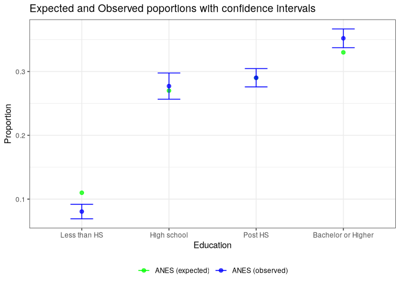
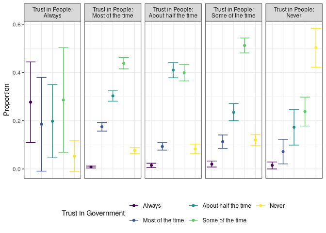

# Statistical Testing


# Setup

Reference prior chapter

``` r
library(tidyverse)
library(survey)
library(srvyr)
library(broom)
library(gt)
library(prettyunits)
library(srvyrexploR)
```

``` r
targetpop <- 231592693

anes_adjwgt <- anes_2020 %>%
  mutate(Weight = Weight / sum(Weight) * targetpop)

anes_des <- anes_adjwgt %>%
  as_survey_design(
    weights = Weight,
    strata = Stratum,
    ids = VarUnit,
    nest = TRUE
  )
recs_des <- recs_2020 %>%
  as_survey_rep(
    weights = NWEIGHT,
    repweights = NWEIGHT1:NWEIGHT60,
    type = "JK1",
    scale = 59 / 60,
    mse = TRUE
  )
```

# Introduction

The general idea of statistical testing is the same for data obtained
through surveys and data obtained through other methods, where we
compare the point estimates and uncertainty estimates of each statistic
to see if statistically significant differences exist. However,
statistical testing for complex surveys involves additional
considerations due to the need to account for the sampling design in
order to obtain accurate uncertainty estimates.

The functions in the {survey} package allow for the correct estimation
of the uncertainty estimates (e.g., standard deviations and confidence
intervals). This chapter covers the following statistical tests with
survey data and the following functions from the {survey} package
(Lumley 2010):

- Comparison of proportions (svyttest())
- Comparison of means (svyttest())
- Goodness-of-fit tests (svygofchisq())
- Tests of independence (svychisq())
- Tests of homogeneity (svychisq())

# Comparison of Proportions and Means

Many of the arguments are the same between `t.test()` and `svyttest()`,
but there are a few key differences:

- We need to use the survey design object instead of the original data
  frame
- We can only use a formula and not separate x and y data
- The confidence level cannot be specified and is always set to 95%.
  However, we show examples of how the confidence level can be changed
  after running the `svyttest()` function by using the `confint()`
  function.

<!-- -->

    svyttest(formula,
             design,
             ...)

The arguments are:

- formula: Formula, outcome~group for two-sample, outcome~0 or outcome~1
  for one-sample. The group variable must be a factor or character with
  two levels, or be coded 0/1 or 1/2. We give more details on formula
  set-up below for different types of tests.
- design: survey design object
- …: This passes options on for one-sided tests only, and thus, we can
  specify na.rm=TRUE

## One-sample t-test for mean

- $H_0:\mu =68$ where μ is the average temperature U.S. households set
  their thermostat to in the summer at night
- $H_A:\mu \ne 68$

``` r
ttest_ex1 <- recs_des %>%
  svyttest(
    formula = SummerTempNight - 68 ~ 0,
    design = .,
    na.rm = T
  )
ttest_ex1
```


        Design-based one-sample t-test

    data:  SummerTempNight - 68 ~ 0
    t = 84.788, df = 58, p-value < 2.2e-16
    alternative hypothesis: true mean is not equal to 0
    95 percent confidence interval:
     3.287816 3.446810
    sample estimates:
        mean 
    3.367313 

``` r
ttest_ex1$estimate + 68
```

        mean 
    71.36731 

Or:

``` r
recs_des %>%
  summarise(mu = survey_mean(SummerTempNight, na.rm = T))
```

    # A tibble: 1 × 2
         mu  mu_se
      <dbl>  <dbl>
    1  71.4 0.0397

To see confidence levels other than 95%:

``` r
confint(ttest_ex1)
```

                                        2.5 %  97.5 %
    as.numeric(SummerTempNight - 68) 3.287816 3.44681
    attr(,"conf.level")
    [1] 0.95

``` r
confint(ttest_ex1, level = 0.80)
```

    [1] 3.315830 3.418796
    attr(,"conf.level")
    [1] 0.8

## One-sample t-test for proportion

Let’s look at the proportion of U.S. households that use A/C in their
homes.

``` r
ac_prop <- recs_des %>%
  group_by(ACUsed) %>%
  summarise(p = survey_prop())
ac_prop
```

    # A tibble: 2 × 3
      ACUsed     p    p_se
      <lgl>  <dbl>   <dbl>
    1 FALSE  0.113 0.00306
    2 TRUE   0.887 0.00306

Based on this, 88.7% of U.S. households use A/C in their homes. If we
wanted to know if this differs from 90%, we could set up our hypothesis
as follows:

- $H_0:p =0.90$ where $p$ is the proportion of U.S. households that use
  A/C in their homes
- $H_A:p \ne 0.90$

``` r
ttest_ex2 <- recs_des %>%
  svyttest(
    formula = (ACUsed == TRUE) - 0.90 ~ 0,
    design = .,
    na.rm = T
  )
ttest_ex2
```


        Design-based one-sample t-test

    data:  (ACUsed == TRUE) - 0.9 ~ 0
    t = -4.4023, df = 58, p-value = 4.663e-05
    alternative hypothesis: true mean is not equal to 0
    95 percent confidence interval:
     -0.019603089 -0.007348283
    sample estimates:
           mean 
    -0.01347569 

``` r
tidy(ttest_ex2)
```

    # A tibble: 1 × 8
      estimate statistic   p.value parameter conf.low conf.high method   alternative
         <dbl>     <dbl>     <dbl>     <dbl>    <dbl>     <dbl> <chr>    <chr>      
    1  -0.0135     -4.40 0.0000466        58  -0.0196  -0.00735 Design-… two.sided  

``` r
tidy(ttest_ex2) %>%
  mutate(p.value = pretty_p_value(p.value)) %>%
  gt() %>%
  fmt_number(decimals = 3)
```

<div id="dblepxpfqu" style="padding-left:0px;padding-right:0px;padding-top:10px;padding-bottom:10px;overflow-x:auto;overflow-y:auto;width:auto;height:auto;">
<style>#dblepxpfqu table {
  font-family: system-ui, 'Segoe UI', Roboto, Helvetica, Arial, sans-serif, 'Apple Color Emoji', 'Segoe UI Emoji', 'Segoe UI Symbol', 'Noto Color Emoji';
  -webkit-font-smoothing: antialiased;
  -moz-osx-font-smoothing: grayscale;
}
&#10;#dblepxpfqu thead, #dblepxpfqu tbody, #dblepxpfqu tfoot, #dblepxpfqu tr, #dblepxpfqu td, #dblepxpfqu th {
  border-style: none;
}
&#10;#dblepxpfqu p {
  margin: 0;
  padding: 0;
}
&#10;#dblepxpfqu .gt_table {
  display: table;
  border-collapse: collapse;
  line-height: normal;
  margin-left: auto;
  margin-right: auto;
  color: #333333;
  font-size: 16px;
  font-weight: normal;
  font-style: normal;
  background-color: #FFFFFF;
  width: auto;
  border-top-style: solid;
  border-top-width: 2px;
  border-top-color: #A8A8A8;
  border-right-style: none;
  border-right-width: 2px;
  border-right-color: #D3D3D3;
  border-bottom-style: solid;
  border-bottom-width: 2px;
  border-bottom-color: #A8A8A8;
  border-left-style: none;
  border-left-width: 2px;
  border-left-color: #D3D3D3;
}
&#10;#dblepxpfqu .gt_caption {
  padding-top: 4px;
  padding-bottom: 4px;
}
&#10;#dblepxpfqu .gt_title {
  color: #333333;
  font-size: 125%;
  font-weight: initial;
  padding-top: 4px;
  padding-bottom: 4px;
  padding-left: 5px;
  padding-right: 5px;
  border-bottom-color: #FFFFFF;
  border-bottom-width: 0;
}
&#10;#dblepxpfqu .gt_subtitle {
  color: #333333;
  font-size: 85%;
  font-weight: initial;
  padding-top: 3px;
  padding-bottom: 5px;
  padding-left: 5px;
  padding-right: 5px;
  border-top-color: #FFFFFF;
  border-top-width: 0;
}
&#10;#dblepxpfqu .gt_heading {
  background-color: #FFFFFF;
  text-align: center;
  border-bottom-color: #FFFFFF;
  border-left-style: none;
  border-left-width: 1px;
  border-left-color: #D3D3D3;
  border-right-style: none;
  border-right-width: 1px;
  border-right-color: #D3D3D3;
}
&#10;#dblepxpfqu .gt_bottom_border {
  border-bottom-style: solid;
  border-bottom-width: 2px;
  border-bottom-color: #D3D3D3;
}
&#10;#dblepxpfqu .gt_col_headings {
  border-top-style: solid;
  border-top-width: 2px;
  border-top-color: #D3D3D3;
  border-bottom-style: solid;
  border-bottom-width: 2px;
  border-bottom-color: #D3D3D3;
  border-left-style: none;
  border-left-width: 1px;
  border-left-color: #D3D3D3;
  border-right-style: none;
  border-right-width: 1px;
  border-right-color: #D3D3D3;
}
&#10;#dblepxpfqu .gt_col_heading {
  color: #333333;
  background-color: #FFFFFF;
  font-size: 100%;
  font-weight: normal;
  text-transform: inherit;
  border-left-style: none;
  border-left-width: 1px;
  border-left-color: #D3D3D3;
  border-right-style: none;
  border-right-width: 1px;
  border-right-color: #D3D3D3;
  vertical-align: bottom;
  padding-top: 5px;
  padding-bottom: 6px;
  padding-left: 5px;
  padding-right: 5px;
  overflow-x: hidden;
}
&#10;#dblepxpfqu .gt_column_spanner_outer {
  color: #333333;
  background-color: #FFFFFF;
  font-size: 100%;
  font-weight: normal;
  text-transform: inherit;
  padding-top: 0;
  padding-bottom: 0;
  padding-left: 4px;
  padding-right: 4px;
}
&#10;#dblepxpfqu .gt_column_spanner_outer:first-child {
  padding-left: 0;
}
&#10;#dblepxpfqu .gt_column_spanner_outer:last-child {
  padding-right: 0;
}
&#10;#dblepxpfqu .gt_column_spanner {
  border-bottom-style: solid;
  border-bottom-width: 2px;
  border-bottom-color: #D3D3D3;
  vertical-align: bottom;
  padding-top: 5px;
  padding-bottom: 5px;
  overflow-x: hidden;
  display: inline-block;
  width: 100%;
}
&#10;#dblepxpfqu .gt_spanner_row {
  border-bottom-style: hidden;
}
&#10;#dblepxpfqu .gt_group_heading {
  padding-top: 8px;
  padding-bottom: 8px;
  padding-left: 5px;
  padding-right: 5px;
  color: #333333;
  background-color: #FFFFFF;
  font-size: 100%;
  font-weight: initial;
  text-transform: inherit;
  border-top-style: solid;
  border-top-width: 2px;
  border-top-color: #D3D3D3;
  border-bottom-style: solid;
  border-bottom-width: 2px;
  border-bottom-color: #D3D3D3;
  border-left-style: none;
  border-left-width: 1px;
  border-left-color: #D3D3D3;
  border-right-style: none;
  border-right-width: 1px;
  border-right-color: #D3D3D3;
  vertical-align: middle;
  text-align: left;
}
&#10;#dblepxpfqu .gt_empty_group_heading {
  padding: 0.5px;
  color: #333333;
  background-color: #FFFFFF;
  font-size: 100%;
  font-weight: initial;
  border-top-style: solid;
  border-top-width: 2px;
  border-top-color: #D3D3D3;
  border-bottom-style: solid;
  border-bottom-width: 2px;
  border-bottom-color: #D3D3D3;
  vertical-align: middle;
}
&#10;#dblepxpfqu .gt_from_md > :first-child {
  margin-top: 0;
}
&#10;#dblepxpfqu .gt_from_md > :last-child {
  margin-bottom: 0;
}
&#10;#dblepxpfqu .gt_row {
  padding-top: 8px;
  padding-bottom: 8px;
  padding-left: 5px;
  padding-right: 5px;
  margin: 10px;
  border-top-style: solid;
  border-top-width: 1px;
  border-top-color: #D3D3D3;
  border-left-style: none;
  border-left-width: 1px;
  border-left-color: #D3D3D3;
  border-right-style: none;
  border-right-width: 1px;
  border-right-color: #D3D3D3;
  vertical-align: middle;
  overflow-x: hidden;
}
&#10;#dblepxpfqu .gt_stub {
  color: #333333;
  background-color: #FFFFFF;
  font-size: 100%;
  font-weight: initial;
  text-transform: inherit;
  border-right-style: solid;
  border-right-width: 2px;
  border-right-color: #D3D3D3;
  padding-left: 5px;
  padding-right: 5px;
}
&#10;#dblepxpfqu .gt_stub_row_group {
  color: #333333;
  background-color: #FFFFFF;
  font-size: 100%;
  font-weight: initial;
  text-transform: inherit;
  border-right-style: solid;
  border-right-width: 2px;
  border-right-color: #D3D3D3;
  padding-left: 5px;
  padding-right: 5px;
  vertical-align: top;
}
&#10;#dblepxpfqu .gt_row_group_first td {
  border-top-width: 2px;
}
&#10;#dblepxpfqu .gt_row_group_first th {
  border-top-width: 2px;
}
&#10;#dblepxpfqu .gt_summary_row {
  color: #333333;
  background-color: #FFFFFF;
  text-transform: inherit;
  padding-top: 8px;
  padding-bottom: 8px;
  padding-left: 5px;
  padding-right: 5px;
}
&#10;#dblepxpfqu .gt_first_summary_row {
  border-top-style: solid;
  border-top-color: #D3D3D3;
}
&#10;#dblepxpfqu .gt_first_summary_row.thick {
  border-top-width: 2px;
}
&#10;#dblepxpfqu .gt_last_summary_row {
  padding-top: 8px;
  padding-bottom: 8px;
  padding-left: 5px;
  padding-right: 5px;
  border-bottom-style: solid;
  border-bottom-width: 2px;
  border-bottom-color: #D3D3D3;
}
&#10;#dblepxpfqu .gt_grand_summary_row {
  color: #333333;
  background-color: #FFFFFF;
  text-transform: inherit;
  padding-top: 8px;
  padding-bottom: 8px;
  padding-left: 5px;
  padding-right: 5px;
}
&#10;#dblepxpfqu .gt_first_grand_summary_row {
  padding-top: 8px;
  padding-bottom: 8px;
  padding-left: 5px;
  padding-right: 5px;
  border-top-style: double;
  border-top-width: 6px;
  border-top-color: #D3D3D3;
}
&#10;#dblepxpfqu .gt_last_grand_summary_row_top {
  padding-top: 8px;
  padding-bottom: 8px;
  padding-left: 5px;
  padding-right: 5px;
  border-bottom-style: double;
  border-bottom-width: 6px;
  border-bottom-color: #D3D3D3;
}
&#10;#dblepxpfqu .gt_striped {
  background-color: rgba(128, 128, 128, 0.05);
}
&#10;#dblepxpfqu .gt_table_body {
  border-top-style: solid;
  border-top-width: 2px;
  border-top-color: #D3D3D3;
  border-bottom-style: solid;
  border-bottom-width: 2px;
  border-bottom-color: #D3D3D3;
}
&#10;#dblepxpfqu .gt_footnotes {
  color: #333333;
  background-color: #FFFFFF;
  border-bottom-style: none;
  border-bottom-width: 2px;
  border-bottom-color: #D3D3D3;
  border-left-style: none;
  border-left-width: 2px;
  border-left-color: #D3D3D3;
  border-right-style: none;
  border-right-width: 2px;
  border-right-color: #D3D3D3;
}
&#10;#dblepxpfqu .gt_footnote {
  margin: 0px;
  font-size: 90%;
  padding-top: 4px;
  padding-bottom: 4px;
  padding-left: 5px;
  padding-right: 5px;
}
&#10;#dblepxpfqu .gt_sourcenotes {
  color: #333333;
  background-color: #FFFFFF;
  border-bottom-style: none;
  border-bottom-width: 2px;
  border-bottom-color: #D3D3D3;
  border-left-style: none;
  border-left-width: 2px;
  border-left-color: #D3D3D3;
  border-right-style: none;
  border-right-width: 2px;
  border-right-color: #D3D3D3;
}
&#10;#dblepxpfqu .gt_sourcenote {
  font-size: 90%;
  padding-top: 4px;
  padding-bottom: 4px;
  padding-left: 5px;
  padding-right: 5px;
}
&#10;#dblepxpfqu .gt_left {
  text-align: left;
}
&#10;#dblepxpfqu .gt_center {
  text-align: center;
}
&#10;#dblepxpfqu .gt_right {
  text-align: right;
  font-variant-numeric: tabular-nums;
}
&#10;#dblepxpfqu .gt_font_normal {
  font-weight: normal;
}
&#10;#dblepxpfqu .gt_font_bold {
  font-weight: bold;
}
&#10;#dblepxpfqu .gt_font_italic {
  font-style: italic;
}
&#10;#dblepxpfqu .gt_super {
  font-size: 65%;
}
&#10;#dblepxpfqu .gt_footnote_marks {
  font-size: 75%;
  vertical-align: 0.4em;
  position: initial;
}
&#10;#dblepxpfqu .gt_asterisk {
  font-size: 100%;
  vertical-align: 0;
}
&#10;#dblepxpfqu .gt_indent_1 {
  text-indent: 5px;
}
&#10;#dblepxpfqu .gt_indent_2 {
  text-indent: 10px;
}
&#10;#dblepxpfqu .gt_indent_3 {
  text-indent: 15px;
}
&#10;#dblepxpfqu .gt_indent_4 {
  text-indent: 20px;
}
&#10;#dblepxpfqu .gt_indent_5 {
  text-indent: 25px;
}
&#10;#dblepxpfqu .katex-display {
  display: inline-flex !important;
  margin-bottom: 0.75em !important;
}
&#10;#dblepxpfqu div.Reactable > div.rt-table > div.rt-thead > div.rt-tr.rt-tr-group-header > div.rt-th-group:after {
  height: 0px !important;
}
</style>

| estimate | statistic | p.value | parameter | conf.low | conf.high | method | alternative |
|----|----|----|----|----|----|----|----|
| −0.013 | −4.402 | \<0.0001 | 58.000 | −0.020 | −0.007 | Design-based one-sample t-test | two.sided |

</div>

The estimate differs from Example 1 in that it does not display $p−0.90$
but rather $p$, or the difference between the U.S. households that use
A/C and our comparison proportion. We can see that there is a difference
of —1.35 percentage points. Additionally, the t-statistic value in the
`statistic` column is —4.4, and the p-value is \<0.0001. These results
indicate that fewer than 90% of U.S. households use A/C in their homes.

## Unpaired two-sample t-test

In addition to `ACUsed`, another variable in the RECS data is a
household’s total electric cost in dollars (`DOLLAREL`).To see if U.S.
households with A/C had higher electrical bills than those without, we
can set up the hypothesis as follows:

- $H_0:\mu_{AC}=\mu_{noAC}$ where $\mu_{AC}$ is the electrical bill cost
  for U.S. households that used A/C, and $\mu_{noAC}$ is the electrical
  bill cost for U.S. households that did not use A/C
- $H_A:\mu_{AC}\ne\mu_{noAC}$

``` r
recs_des %>%
  group_by(ACUsed) %>%
  summarize(mean = survey_mean(DOLLAREL, na.rm = TRUE))
```

    # A tibble: 2 × 3
      ACUsed  mean mean_se
      <lgl>  <dbl>   <dbl>
    1 FALSE  1056.   16.0 
    2 TRUE   1422.    5.69

``` r
ttest_ex3 <- recs_des %>%
  svyttest(
    formula = DOLLAREL ~ ACUsed,
    design = .,
    na.rm = T
  )
tidy(ttest_ex3)
```

    # A tibble: 1 × 8
      estimate statistic  p.value parameter conf.low conf.high method    alternative
         <dbl>     <dbl>    <dbl>     <dbl>    <dbl>     <dbl> <chr>     <chr>      
    1     366.      21.3 4.29e-29        58     331.      400. Design-b… two.sided  

``` r
tidy(ttest_ex3) %>%
  mutate(p.value = pretty_p_value(p.value)) %>%
  gt() %>%
  fmt_number()
```

<div id="ncmcylqnaz" style="padding-left:0px;padding-right:0px;padding-top:10px;padding-bottom:10px;overflow-x:auto;overflow-y:auto;width:auto;height:auto;">
<style>#ncmcylqnaz table {
  font-family: system-ui, 'Segoe UI', Roboto, Helvetica, Arial, sans-serif, 'Apple Color Emoji', 'Segoe UI Emoji', 'Segoe UI Symbol', 'Noto Color Emoji';
  -webkit-font-smoothing: antialiased;
  -moz-osx-font-smoothing: grayscale;
}
&#10;#ncmcylqnaz thead, #ncmcylqnaz tbody, #ncmcylqnaz tfoot, #ncmcylqnaz tr, #ncmcylqnaz td, #ncmcylqnaz th {
  border-style: none;
}
&#10;#ncmcylqnaz p {
  margin: 0;
  padding: 0;
}
&#10;#ncmcylqnaz .gt_table {
  display: table;
  border-collapse: collapse;
  line-height: normal;
  margin-left: auto;
  margin-right: auto;
  color: #333333;
  font-size: 16px;
  font-weight: normal;
  font-style: normal;
  background-color: #FFFFFF;
  width: auto;
  border-top-style: solid;
  border-top-width: 2px;
  border-top-color: #A8A8A8;
  border-right-style: none;
  border-right-width: 2px;
  border-right-color: #D3D3D3;
  border-bottom-style: solid;
  border-bottom-width: 2px;
  border-bottom-color: #A8A8A8;
  border-left-style: none;
  border-left-width: 2px;
  border-left-color: #D3D3D3;
}
&#10;#ncmcylqnaz .gt_caption {
  padding-top: 4px;
  padding-bottom: 4px;
}
&#10;#ncmcylqnaz .gt_title {
  color: #333333;
  font-size: 125%;
  font-weight: initial;
  padding-top: 4px;
  padding-bottom: 4px;
  padding-left: 5px;
  padding-right: 5px;
  border-bottom-color: #FFFFFF;
  border-bottom-width: 0;
}
&#10;#ncmcylqnaz .gt_subtitle {
  color: #333333;
  font-size: 85%;
  font-weight: initial;
  padding-top: 3px;
  padding-bottom: 5px;
  padding-left: 5px;
  padding-right: 5px;
  border-top-color: #FFFFFF;
  border-top-width: 0;
}
&#10;#ncmcylqnaz .gt_heading {
  background-color: #FFFFFF;
  text-align: center;
  border-bottom-color: #FFFFFF;
  border-left-style: none;
  border-left-width: 1px;
  border-left-color: #D3D3D3;
  border-right-style: none;
  border-right-width: 1px;
  border-right-color: #D3D3D3;
}
&#10;#ncmcylqnaz .gt_bottom_border {
  border-bottom-style: solid;
  border-bottom-width: 2px;
  border-bottom-color: #D3D3D3;
}
&#10;#ncmcylqnaz .gt_col_headings {
  border-top-style: solid;
  border-top-width: 2px;
  border-top-color: #D3D3D3;
  border-bottom-style: solid;
  border-bottom-width: 2px;
  border-bottom-color: #D3D3D3;
  border-left-style: none;
  border-left-width: 1px;
  border-left-color: #D3D3D3;
  border-right-style: none;
  border-right-width: 1px;
  border-right-color: #D3D3D3;
}
&#10;#ncmcylqnaz .gt_col_heading {
  color: #333333;
  background-color: #FFFFFF;
  font-size: 100%;
  font-weight: normal;
  text-transform: inherit;
  border-left-style: none;
  border-left-width: 1px;
  border-left-color: #D3D3D3;
  border-right-style: none;
  border-right-width: 1px;
  border-right-color: #D3D3D3;
  vertical-align: bottom;
  padding-top: 5px;
  padding-bottom: 6px;
  padding-left: 5px;
  padding-right: 5px;
  overflow-x: hidden;
}
&#10;#ncmcylqnaz .gt_column_spanner_outer {
  color: #333333;
  background-color: #FFFFFF;
  font-size: 100%;
  font-weight: normal;
  text-transform: inherit;
  padding-top: 0;
  padding-bottom: 0;
  padding-left: 4px;
  padding-right: 4px;
}
&#10;#ncmcylqnaz .gt_column_spanner_outer:first-child {
  padding-left: 0;
}
&#10;#ncmcylqnaz .gt_column_spanner_outer:last-child {
  padding-right: 0;
}
&#10;#ncmcylqnaz .gt_column_spanner {
  border-bottom-style: solid;
  border-bottom-width: 2px;
  border-bottom-color: #D3D3D3;
  vertical-align: bottom;
  padding-top: 5px;
  padding-bottom: 5px;
  overflow-x: hidden;
  display: inline-block;
  width: 100%;
}
&#10;#ncmcylqnaz .gt_spanner_row {
  border-bottom-style: hidden;
}
&#10;#ncmcylqnaz .gt_group_heading {
  padding-top: 8px;
  padding-bottom: 8px;
  padding-left: 5px;
  padding-right: 5px;
  color: #333333;
  background-color: #FFFFFF;
  font-size: 100%;
  font-weight: initial;
  text-transform: inherit;
  border-top-style: solid;
  border-top-width: 2px;
  border-top-color: #D3D3D3;
  border-bottom-style: solid;
  border-bottom-width: 2px;
  border-bottom-color: #D3D3D3;
  border-left-style: none;
  border-left-width: 1px;
  border-left-color: #D3D3D3;
  border-right-style: none;
  border-right-width: 1px;
  border-right-color: #D3D3D3;
  vertical-align: middle;
  text-align: left;
}
&#10;#ncmcylqnaz .gt_empty_group_heading {
  padding: 0.5px;
  color: #333333;
  background-color: #FFFFFF;
  font-size: 100%;
  font-weight: initial;
  border-top-style: solid;
  border-top-width: 2px;
  border-top-color: #D3D3D3;
  border-bottom-style: solid;
  border-bottom-width: 2px;
  border-bottom-color: #D3D3D3;
  vertical-align: middle;
}
&#10;#ncmcylqnaz .gt_from_md > :first-child {
  margin-top: 0;
}
&#10;#ncmcylqnaz .gt_from_md > :last-child {
  margin-bottom: 0;
}
&#10;#ncmcylqnaz .gt_row {
  padding-top: 8px;
  padding-bottom: 8px;
  padding-left: 5px;
  padding-right: 5px;
  margin: 10px;
  border-top-style: solid;
  border-top-width: 1px;
  border-top-color: #D3D3D3;
  border-left-style: none;
  border-left-width: 1px;
  border-left-color: #D3D3D3;
  border-right-style: none;
  border-right-width: 1px;
  border-right-color: #D3D3D3;
  vertical-align: middle;
  overflow-x: hidden;
}
&#10;#ncmcylqnaz .gt_stub {
  color: #333333;
  background-color: #FFFFFF;
  font-size: 100%;
  font-weight: initial;
  text-transform: inherit;
  border-right-style: solid;
  border-right-width: 2px;
  border-right-color: #D3D3D3;
  padding-left: 5px;
  padding-right: 5px;
}
&#10;#ncmcylqnaz .gt_stub_row_group {
  color: #333333;
  background-color: #FFFFFF;
  font-size: 100%;
  font-weight: initial;
  text-transform: inherit;
  border-right-style: solid;
  border-right-width: 2px;
  border-right-color: #D3D3D3;
  padding-left: 5px;
  padding-right: 5px;
  vertical-align: top;
}
&#10;#ncmcylqnaz .gt_row_group_first td {
  border-top-width: 2px;
}
&#10;#ncmcylqnaz .gt_row_group_first th {
  border-top-width: 2px;
}
&#10;#ncmcylqnaz .gt_summary_row {
  color: #333333;
  background-color: #FFFFFF;
  text-transform: inherit;
  padding-top: 8px;
  padding-bottom: 8px;
  padding-left: 5px;
  padding-right: 5px;
}
&#10;#ncmcylqnaz .gt_first_summary_row {
  border-top-style: solid;
  border-top-color: #D3D3D3;
}
&#10;#ncmcylqnaz .gt_first_summary_row.thick {
  border-top-width: 2px;
}
&#10;#ncmcylqnaz .gt_last_summary_row {
  padding-top: 8px;
  padding-bottom: 8px;
  padding-left: 5px;
  padding-right: 5px;
  border-bottom-style: solid;
  border-bottom-width: 2px;
  border-bottom-color: #D3D3D3;
}
&#10;#ncmcylqnaz .gt_grand_summary_row {
  color: #333333;
  background-color: #FFFFFF;
  text-transform: inherit;
  padding-top: 8px;
  padding-bottom: 8px;
  padding-left: 5px;
  padding-right: 5px;
}
&#10;#ncmcylqnaz .gt_first_grand_summary_row {
  padding-top: 8px;
  padding-bottom: 8px;
  padding-left: 5px;
  padding-right: 5px;
  border-top-style: double;
  border-top-width: 6px;
  border-top-color: #D3D3D3;
}
&#10;#ncmcylqnaz .gt_last_grand_summary_row_top {
  padding-top: 8px;
  padding-bottom: 8px;
  padding-left: 5px;
  padding-right: 5px;
  border-bottom-style: double;
  border-bottom-width: 6px;
  border-bottom-color: #D3D3D3;
}
&#10;#ncmcylqnaz .gt_striped {
  background-color: rgba(128, 128, 128, 0.05);
}
&#10;#ncmcylqnaz .gt_table_body {
  border-top-style: solid;
  border-top-width: 2px;
  border-top-color: #D3D3D3;
  border-bottom-style: solid;
  border-bottom-width: 2px;
  border-bottom-color: #D3D3D3;
}
&#10;#ncmcylqnaz .gt_footnotes {
  color: #333333;
  background-color: #FFFFFF;
  border-bottom-style: none;
  border-bottom-width: 2px;
  border-bottom-color: #D3D3D3;
  border-left-style: none;
  border-left-width: 2px;
  border-left-color: #D3D3D3;
  border-right-style: none;
  border-right-width: 2px;
  border-right-color: #D3D3D3;
}
&#10;#ncmcylqnaz .gt_footnote {
  margin: 0px;
  font-size: 90%;
  padding-top: 4px;
  padding-bottom: 4px;
  padding-left: 5px;
  padding-right: 5px;
}
&#10;#ncmcylqnaz .gt_sourcenotes {
  color: #333333;
  background-color: #FFFFFF;
  border-bottom-style: none;
  border-bottom-width: 2px;
  border-bottom-color: #D3D3D3;
  border-left-style: none;
  border-left-width: 2px;
  border-left-color: #D3D3D3;
  border-right-style: none;
  border-right-width: 2px;
  border-right-color: #D3D3D3;
}
&#10;#ncmcylqnaz .gt_sourcenote {
  font-size: 90%;
  padding-top: 4px;
  padding-bottom: 4px;
  padding-left: 5px;
  padding-right: 5px;
}
&#10;#ncmcylqnaz .gt_left {
  text-align: left;
}
&#10;#ncmcylqnaz .gt_center {
  text-align: center;
}
&#10;#ncmcylqnaz .gt_right {
  text-align: right;
  font-variant-numeric: tabular-nums;
}
&#10;#ncmcylqnaz .gt_font_normal {
  font-weight: normal;
}
&#10;#ncmcylqnaz .gt_font_bold {
  font-weight: bold;
}
&#10;#ncmcylqnaz .gt_font_italic {
  font-style: italic;
}
&#10;#ncmcylqnaz .gt_super {
  font-size: 65%;
}
&#10;#ncmcylqnaz .gt_footnote_marks {
  font-size: 75%;
  vertical-align: 0.4em;
  position: initial;
}
&#10;#ncmcylqnaz .gt_asterisk {
  font-size: 100%;
  vertical-align: 0;
}
&#10;#ncmcylqnaz .gt_indent_1 {
  text-indent: 5px;
}
&#10;#ncmcylqnaz .gt_indent_2 {
  text-indent: 10px;
}
&#10;#ncmcylqnaz .gt_indent_3 {
  text-indent: 15px;
}
&#10;#ncmcylqnaz .gt_indent_4 {
  text-indent: 20px;
}
&#10;#ncmcylqnaz .gt_indent_5 {
  text-indent: 25px;
}
&#10;#ncmcylqnaz .katex-display {
  display: inline-flex !important;
  margin-bottom: 0.75em !important;
}
&#10;#ncmcylqnaz div.Reactable > div.rt-table > div.rt-thead > div.rt-tr.rt-tr-group-header > div.rt-th-group:after {
  height: 0px !important;
}
</style>

| estimate | statistic | p.value | parameter | conf.low | conf.high | method | alternative |
|----|----|----|----|----|----|----|----|
| 365.72 | 21.29 | \<0.0001 | 58.00 | 331.33 | 400.11 | Design-based t-test | two.sided |

</div>

The results in Table 6.2 indicate that the difference in electrical
bills for those who used A/C and those who did not is, on average,
\$365.72. The difference appears to be statistically significant as the
t-statistic is 21.3 and the p-value is \<0.0001. Households that used
A/C spent, on average, \$365.72 more in 2020 on electricity than
households without A/C.

## Paired two-sample t-test

Let’s say we want to test whether the temperature at which U.S.
households set their thermostat at night differs depending on the season
(comparing summer and winter17 temperatures). We could set up the
hypothesis as follows:

- $H_0:\mu_{summer}=\mu_{winter}$ where $\mu_{summer}$ is the
  temperature that U.S. households set their thermostat to during summer
  nights, and $\mu_{winter}$ is the temperature that U.S. households set
  their thermostat to during winter nights
- $H_A:\mu_{summer}\ne\mu_{winter}$

``` r
ttest_ex4 <- recs_des %>%
  svyttest(
    design = .,
    formula = SummerTempNight - WinterTempNight ~ 0,
    na.rm = T
  )
tidy(ttest_ex4) %>%
  mutate(p.value = pretty_p_value(p.value)) %>%
  gt() %>%
  fmt_number()
```

<div id="uxngrslzzb" style="padding-left:0px;padding-right:0px;padding-top:10px;padding-bottom:10px;overflow-x:auto;overflow-y:auto;width:auto;height:auto;">
<style>#uxngrslzzb table {
  font-family: system-ui, 'Segoe UI', Roboto, Helvetica, Arial, sans-serif, 'Apple Color Emoji', 'Segoe UI Emoji', 'Segoe UI Symbol', 'Noto Color Emoji';
  -webkit-font-smoothing: antialiased;
  -moz-osx-font-smoothing: grayscale;
}
&#10;#uxngrslzzb thead, #uxngrslzzb tbody, #uxngrslzzb tfoot, #uxngrslzzb tr, #uxngrslzzb td, #uxngrslzzb th {
  border-style: none;
}
&#10;#uxngrslzzb p {
  margin: 0;
  padding: 0;
}
&#10;#uxngrslzzb .gt_table {
  display: table;
  border-collapse: collapse;
  line-height: normal;
  margin-left: auto;
  margin-right: auto;
  color: #333333;
  font-size: 16px;
  font-weight: normal;
  font-style: normal;
  background-color: #FFFFFF;
  width: auto;
  border-top-style: solid;
  border-top-width: 2px;
  border-top-color: #A8A8A8;
  border-right-style: none;
  border-right-width: 2px;
  border-right-color: #D3D3D3;
  border-bottom-style: solid;
  border-bottom-width: 2px;
  border-bottom-color: #A8A8A8;
  border-left-style: none;
  border-left-width: 2px;
  border-left-color: #D3D3D3;
}
&#10;#uxngrslzzb .gt_caption {
  padding-top: 4px;
  padding-bottom: 4px;
}
&#10;#uxngrslzzb .gt_title {
  color: #333333;
  font-size: 125%;
  font-weight: initial;
  padding-top: 4px;
  padding-bottom: 4px;
  padding-left: 5px;
  padding-right: 5px;
  border-bottom-color: #FFFFFF;
  border-bottom-width: 0;
}
&#10;#uxngrslzzb .gt_subtitle {
  color: #333333;
  font-size: 85%;
  font-weight: initial;
  padding-top: 3px;
  padding-bottom: 5px;
  padding-left: 5px;
  padding-right: 5px;
  border-top-color: #FFFFFF;
  border-top-width: 0;
}
&#10;#uxngrslzzb .gt_heading {
  background-color: #FFFFFF;
  text-align: center;
  border-bottom-color: #FFFFFF;
  border-left-style: none;
  border-left-width: 1px;
  border-left-color: #D3D3D3;
  border-right-style: none;
  border-right-width: 1px;
  border-right-color: #D3D3D3;
}
&#10;#uxngrslzzb .gt_bottom_border {
  border-bottom-style: solid;
  border-bottom-width: 2px;
  border-bottom-color: #D3D3D3;
}
&#10;#uxngrslzzb .gt_col_headings {
  border-top-style: solid;
  border-top-width: 2px;
  border-top-color: #D3D3D3;
  border-bottom-style: solid;
  border-bottom-width: 2px;
  border-bottom-color: #D3D3D3;
  border-left-style: none;
  border-left-width: 1px;
  border-left-color: #D3D3D3;
  border-right-style: none;
  border-right-width: 1px;
  border-right-color: #D3D3D3;
}
&#10;#uxngrslzzb .gt_col_heading {
  color: #333333;
  background-color: #FFFFFF;
  font-size: 100%;
  font-weight: normal;
  text-transform: inherit;
  border-left-style: none;
  border-left-width: 1px;
  border-left-color: #D3D3D3;
  border-right-style: none;
  border-right-width: 1px;
  border-right-color: #D3D3D3;
  vertical-align: bottom;
  padding-top: 5px;
  padding-bottom: 6px;
  padding-left: 5px;
  padding-right: 5px;
  overflow-x: hidden;
}
&#10;#uxngrslzzb .gt_column_spanner_outer {
  color: #333333;
  background-color: #FFFFFF;
  font-size: 100%;
  font-weight: normal;
  text-transform: inherit;
  padding-top: 0;
  padding-bottom: 0;
  padding-left: 4px;
  padding-right: 4px;
}
&#10;#uxngrslzzb .gt_column_spanner_outer:first-child {
  padding-left: 0;
}
&#10;#uxngrslzzb .gt_column_spanner_outer:last-child {
  padding-right: 0;
}
&#10;#uxngrslzzb .gt_column_spanner {
  border-bottom-style: solid;
  border-bottom-width: 2px;
  border-bottom-color: #D3D3D3;
  vertical-align: bottom;
  padding-top: 5px;
  padding-bottom: 5px;
  overflow-x: hidden;
  display: inline-block;
  width: 100%;
}
&#10;#uxngrslzzb .gt_spanner_row {
  border-bottom-style: hidden;
}
&#10;#uxngrslzzb .gt_group_heading {
  padding-top: 8px;
  padding-bottom: 8px;
  padding-left: 5px;
  padding-right: 5px;
  color: #333333;
  background-color: #FFFFFF;
  font-size: 100%;
  font-weight: initial;
  text-transform: inherit;
  border-top-style: solid;
  border-top-width: 2px;
  border-top-color: #D3D3D3;
  border-bottom-style: solid;
  border-bottom-width: 2px;
  border-bottom-color: #D3D3D3;
  border-left-style: none;
  border-left-width: 1px;
  border-left-color: #D3D3D3;
  border-right-style: none;
  border-right-width: 1px;
  border-right-color: #D3D3D3;
  vertical-align: middle;
  text-align: left;
}
&#10;#uxngrslzzb .gt_empty_group_heading {
  padding: 0.5px;
  color: #333333;
  background-color: #FFFFFF;
  font-size: 100%;
  font-weight: initial;
  border-top-style: solid;
  border-top-width: 2px;
  border-top-color: #D3D3D3;
  border-bottom-style: solid;
  border-bottom-width: 2px;
  border-bottom-color: #D3D3D3;
  vertical-align: middle;
}
&#10;#uxngrslzzb .gt_from_md > :first-child {
  margin-top: 0;
}
&#10;#uxngrslzzb .gt_from_md > :last-child {
  margin-bottom: 0;
}
&#10;#uxngrslzzb .gt_row {
  padding-top: 8px;
  padding-bottom: 8px;
  padding-left: 5px;
  padding-right: 5px;
  margin: 10px;
  border-top-style: solid;
  border-top-width: 1px;
  border-top-color: #D3D3D3;
  border-left-style: none;
  border-left-width: 1px;
  border-left-color: #D3D3D3;
  border-right-style: none;
  border-right-width: 1px;
  border-right-color: #D3D3D3;
  vertical-align: middle;
  overflow-x: hidden;
}
&#10;#uxngrslzzb .gt_stub {
  color: #333333;
  background-color: #FFFFFF;
  font-size: 100%;
  font-weight: initial;
  text-transform: inherit;
  border-right-style: solid;
  border-right-width: 2px;
  border-right-color: #D3D3D3;
  padding-left: 5px;
  padding-right: 5px;
}
&#10;#uxngrslzzb .gt_stub_row_group {
  color: #333333;
  background-color: #FFFFFF;
  font-size: 100%;
  font-weight: initial;
  text-transform: inherit;
  border-right-style: solid;
  border-right-width: 2px;
  border-right-color: #D3D3D3;
  padding-left: 5px;
  padding-right: 5px;
  vertical-align: top;
}
&#10;#uxngrslzzb .gt_row_group_first td {
  border-top-width: 2px;
}
&#10;#uxngrslzzb .gt_row_group_first th {
  border-top-width: 2px;
}
&#10;#uxngrslzzb .gt_summary_row {
  color: #333333;
  background-color: #FFFFFF;
  text-transform: inherit;
  padding-top: 8px;
  padding-bottom: 8px;
  padding-left: 5px;
  padding-right: 5px;
}
&#10;#uxngrslzzb .gt_first_summary_row {
  border-top-style: solid;
  border-top-color: #D3D3D3;
}
&#10;#uxngrslzzb .gt_first_summary_row.thick {
  border-top-width: 2px;
}
&#10;#uxngrslzzb .gt_last_summary_row {
  padding-top: 8px;
  padding-bottom: 8px;
  padding-left: 5px;
  padding-right: 5px;
  border-bottom-style: solid;
  border-bottom-width: 2px;
  border-bottom-color: #D3D3D3;
}
&#10;#uxngrslzzb .gt_grand_summary_row {
  color: #333333;
  background-color: #FFFFFF;
  text-transform: inherit;
  padding-top: 8px;
  padding-bottom: 8px;
  padding-left: 5px;
  padding-right: 5px;
}
&#10;#uxngrslzzb .gt_first_grand_summary_row {
  padding-top: 8px;
  padding-bottom: 8px;
  padding-left: 5px;
  padding-right: 5px;
  border-top-style: double;
  border-top-width: 6px;
  border-top-color: #D3D3D3;
}
&#10;#uxngrslzzb .gt_last_grand_summary_row_top {
  padding-top: 8px;
  padding-bottom: 8px;
  padding-left: 5px;
  padding-right: 5px;
  border-bottom-style: double;
  border-bottom-width: 6px;
  border-bottom-color: #D3D3D3;
}
&#10;#uxngrslzzb .gt_striped {
  background-color: rgba(128, 128, 128, 0.05);
}
&#10;#uxngrslzzb .gt_table_body {
  border-top-style: solid;
  border-top-width: 2px;
  border-top-color: #D3D3D3;
  border-bottom-style: solid;
  border-bottom-width: 2px;
  border-bottom-color: #D3D3D3;
}
&#10;#uxngrslzzb .gt_footnotes {
  color: #333333;
  background-color: #FFFFFF;
  border-bottom-style: none;
  border-bottom-width: 2px;
  border-bottom-color: #D3D3D3;
  border-left-style: none;
  border-left-width: 2px;
  border-left-color: #D3D3D3;
  border-right-style: none;
  border-right-width: 2px;
  border-right-color: #D3D3D3;
}
&#10;#uxngrslzzb .gt_footnote {
  margin: 0px;
  font-size: 90%;
  padding-top: 4px;
  padding-bottom: 4px;
  padding-left: 5px;
  padding-right: 5px;
}
&#10;#uxngrslzzb .gt_sourcenotes {
  color: #333333;
  background-color: #FFFFFF;
  border-bottom-style: none;
  border-bottom-width: 2px;
  border-bottom-color: #D3D3D3;
  border-left-style: none;
  border-left-width: 2px;
  border-left-color: #D3D3D3;
  border-right-style: none;
  border-right-width: 2px;
  border-right-color: #D3D3D3;
}
&#10;#uxngrslzzb .gt_sourcenote {
  font-size: 90%;
  padding-top: 4px;
  padding-bottom: 4px;
  padding-left: 5px;
  padding-right: 5px;
}
&#10;#uxngrslzzb .gt_left {
  text-align: left;
}
&#10;#uxngrslzzb .gt_center {
  text-align: center;
}
&#10;#uxngrslzzb .gt_right {
  text-align: right;
  font-variant-numeric: tabular-nums;
}
&#10;#uxngrslzzb .gt_font_normal {
  font-weight: normal;
}
&#10;#uxngrslzzb .gt_font_bold {
  font-weight: bold;
}
&#10;#uxngrslzzb .gt_font_italic {
  font-style: italic;
}
&#10;#uxngrslzzb .gt_super {
  font-size: 65%;
}
&#10;#uxngrslzzb .gt_footnote_marks {
  font-size: 75%;
  vertical-align: 0.4em;
  position: initial;
}
&#10;#uxngrslzzb .gt_asterisk {
  font-size: 100%;
  vertical-align: 0;
}
&#10;#uxngrslzzb .gt_indent_1 {
  text-indent: 5px;
}
&#10;#uxngrslzzb .gt_indent_2 {
  text-indent: 10px;
}
&#10;#uxngrslzzb .gt_indent_3 {
  text-indent: 15px;
}
&#10;#uxngrslzzb .gt_indent_4 {
  text-indent: 20px;
}
&#10;#uxngrslzzb .gt_indent_5 {
  text-indent: 25px;
}
&#10;#uxngrslzzb .katex-display {
  display: inline-flex !important;
  margin-bottom: 0.75em !important;
}
&#10;#uxngrslzzb div.Reactable > div.rt-table > div.rt-thead > div.rt-tr.rt-tr-group-header > div.rt-th-group:after {
  height: 0px !important;
}
</style>

| estimate | statistic | p.value | parameter | conf.low | conf.high | method | alternative |
|----|----|----|----|----|----|----|----|
| 2.85 | 50.83 | \<0.0001 | 58.00 | 2.74 | 2.96 | Design-based one-sample t-test | two.sided |

</div>

The results displayed in Table 6.3 indicate that U.S. households set
their thermostat on average 2.9∘F warmer in summer nights than winter
nights, which is statistically significant (t = 50.8, p-value is
\<0.0001).

# Chi-squared Tests

Chi-squared tests ($\chi^2$) allow us to examine multiple proportions
using a goodness-of-fit test, a test of independence, or a test of
homogeneity. These three tests have the same $\chi^2$ distributions but
with slightly different underlying assumptions.

First, goodness-of-fit tests are used when comparing observed data to
expected data. For example, this could be used to determine if
respondent demographics (the observed data in the sample) match known
population information (the expected data). In this case, we can set up
the hypothesis test as follows:

- $H0:p_1=\pi_1, p_2=\pi_2, \dots, p_k=\pi_k$ where pi is the observed
  proportion for category i, $\pi_i$ is the expected proportion for
  category i, and k is the number of categories
- $H_A$:at least one level of pi does not match $\pi_i$

Second, tests of independence are used when comparing two types of
observed data to see if there is a relationship. For example, this could
be used to determine if the proportion of respondents who voted for each
political party in the presidential election matches the proportion of
respondents who voted for each political party in a local election. In
this case, we can set up the hypothesis test as follows:

- $H_0$: The two variables/factors are independent
- $H_A$: The two variables/factors are not independent

Third, tests of homogeneity are used to compare two distributions to see
if they match. For example, this could be used to determine if the
highest education achieved is the same for both men and women. In this
case, we can set up the hypothesis test as follows:

- $H_0:p_{1a}=p_{1b}, p_{2a}=p_{2b}, \dots, p_{ka}=p_{kb}$ where
  $p_{ia}$ is the observed proportion of category i for subgroup a,
  $p_{ib}$ is the observed proportion of category i for subgroup a, and
  k is the number of categories
- $H_A$: at least one category of $p_{ia}$ does not match $p_{ib}$.

<!-- -->

    svygofchisq(formula, p, design, na.rm = TRUE, ...)

- formula: Formula specifying a single factor variable
- p: Vector of probabilities for the categories of the factor in the
  correct order. If the probabilities do not sum to 1, they are rescaled
  to sum to 1.
- design: Survey design object

<!-- -->

    svychisq(formula, design,
             statistic = c("F", "Chisq", "Wald", "adjWald",
                           "lincom", "saddlepoint"),
             na.rm = TRUE)

- formula: Model formula specifying the table (shown in examples)
- design: Survey design object
- statistic: Type of test statistic to use in test (details below)

For tests of homogeneity (when comparing cross-tabulations), the `F` or
`Chisq` statistics should be used18. The F statistic is the default.

For tests of independence, the `Wald` and `adjWald` are recommended as
they provide a better adjustment for variable comparisons (Lumley 2010).
If the data have a small number of primary sampling units (PSUs)
compared to the degrees of freedom, then the `adjWald` statistic should
be used to account for this. The `lincom` and `saddlepoint` statistics
are available for more complicated data structures.

## Goodness-of-fit

Based on the data from the 2020 American Community Survey (ACS) 5-year
estimates20, the education distribution of those aged 18+ in the United
States (among the 50 states and the District of Columbia) is as follows:

- 11% had less than a high school degree
- 27% had a high school degree
- 29% had some college or an associate’s degree
- 33% had a bachelor’s degree or higher

If we want to see if the weighted distribution from the ANES 2020 data
matches this distribution, we could set up the hypothesis as follows:

- $H_0:p_1=0.11, p_2=0.27, p_3=0.29, p_4=0.33$
- $HA$: at least one of the education levels does not match between the
  ANES and the ACS

``` r
anes_des %>%
  drop_na(Education) %>%
  group_by(Education) %>%
  summarize(p = survey_mean())
```

    # A tibble: 5 × 3
      Education         p    p_se
      <fct>         <dbl>   <dbl>
    1 Less than HS 0.0805 0.00568
    2 High school  0.277  0.0102 
    3 Post HS      0.290  0.00713
    4 Bachelor's   0.226  0.00633
    5 Graduate     0.126  0.00499

``` r
anes_des_edu <- anes_des %>%
  mutate(
    Education2 = fct_collapse(Education,
      "Bachelor or Higher" = c(
        "Bachelor's",
        "Graduate"
      )
    )
  )
```

``` r
anes_des_edu %>%
  drop_na(Education2) %>%
  group_by(Education2) %>%
  summarize(p = survey_mean())
```

    # A tibble: 4 × 3
      Education2              p    p_se
      <fct>               <dbl>   <dbl>
    1 Less than HS       0.0805 0.00568
    2 High school        0.277  0.0102 
    3 Post HS            0.290  0.00713
    4 Bachelor or Higher 0.352  0.00732

``` r
p_exp <- c(0.11, 0.27, 0.29, 0.33)
```

``` r
chi_ex1 <- anes_des_edu %>%
  svygofchisq(
    formula = ~Education2,
    p = p_exp,
    design = .,
    na.rm = T
  )
chi_ex1
```


        Design-based chi-squared test for given probabilities

    data:  ~Education2
    X-squared = 2177472, scale = 1.1203e+05, df = 2.2629e+00, p-value =
    8.745e-05

At least 1 poportion does not match.

``` r
ex1_table <- anes_des_edu %>%
  drop_na(Education2) %>%
  group_by(Education2) %>%
  summarize(Observed = survey_mean(vartype = "ci")) %>%
  rename(Education = Education2) %>%
  mutate(Expected = p_exp) %>%
  select(Education, Expected, everything())
ex1_table
```

    # A tibble: 4 × 5
      Education          Expected Observed Observed_low Observed_upp
      <fct>                 <dbl>    <dbl>        <dbl>        <dbl>
    1 Less than HS           0.11   0.0805       0.0691       0.0919
    2 High school            0.27   0.277        0.257        0.298 
    3 Post HS                0.29   0.290        0.276        0.305 
    4 Bachelor or Higher     0.33   0.352        0.337        0.367 

``` r
ex1_table %>%
  pivot_longer(
    cols = c("Expected", "Observed"),
    names_to = "Names",
    values_to = "Proportion"
  ) %>%
  mutate(
    Observed_low = if_else(Names == "Observed", Observed_low, NA_real_),
    Observed_upp = if_else(Names == "Observed", Observed_upp, NA_real_),
    Names = if_else(Names == "Observed", "ANES (observed)",
      "ANES (expected)"
    )
  ) %>%
  ggplot(aes(x = Education, y = Proportion, color = Names)) +
  geom_point(alpha = 0.75, size = 2) +
  geom_errorbar(aes(ymin = Observed_low, ymax = Observed_upp),
    width = 0.26
  ) +
  theme_bw() +
  scale_color_manual(name = "Type", values = c("green", "blue")) +
  theme(legend.position = "bottom", legend.title = element_blank()) +
  labs(title = "Expected and Observed poportions with confidence intervals")
```



## Test of independence

ANES asked respondents two questions about trust:

- Question text: “How often can you trust the federal government to do
  what is right?” (American National Election Studies 2021)
- Question text: “How often can you trust other people?” (American
  National Election Studies 2021)

If we want to see if the distributions of these two questions are
similar or not, we can conduct a test of independence. Here is how the
hypothesis could be set up:

- $H_0$: People’s trust in the federal government and their trust in
  other people are independent (i.e., not related)
- $H_A$: People’s trust in the federal government and their trust in
  other people are not independent (i.e., they are related)

``` r
chi_ex2 <- anes_des %>%
  svychisq(
    formula = ~ TrustGovernment + TrustPeople,
    design = .,
    statistic = "Wald",
    na.rm = T
  )
chi_ex2
```


        Design-based Wald test of association

    data:  NextMethod()
    F = 20.876, ndf = 16, ddf = 51, p-value < 2.2e-16

The 2 variables do not appear independent.

Counts:

``` r
chi_ex2$observed
```

                         TrustPeople
    TrustGovernment            Always Most of the time About half the time
      Always                16.469670        25.009073           31.847901
      Most of the time      11.019706       539.377422          196.257873
      About half the time   11.771981       934.858047          861.970996
      Some of the time      17.007129      1353.778798          839.863454
      Never                  3.173630       236.785418          174.271876
                         TrustPeople
    TrustGovernment       Some of the time       Never
      Always                     36.854263    5.523144
      Most of the time          206.555880   27.183576
      About half the time       428.871087   65.023704
      Some of the time          932.628435   89.596218
      Never                     217.994067  189.306653

### Proportions method 1

``` r
chi_ex2$observed %>%
  as_tibble() %>%
  group_by(TrustPeople) %>%
  mutate(prop = round(n / sum(n), 3)) %>%
  select(-n) %>%
  pivot_wider(names_from = TrustPeople, values_from = prop) %>%
  gt(rowname_col = "TrustGovernment") %>%
  tab_stubhead(label = "Trust in Government") %>%
  tab_spanner(
    label = "Trust in People",
    columns = everything()
  ) %>%
  cols_label(
    `Most of the time` = md("Most of<br/>the time"),
    `About half the time` = md("About half<br />the time"),
    `Some of the time` = md("Some of<br />the time")
  )
```

<div id="pdkxpfiyfo" style="padding-left:0px;padding-right:0px;padding-top:10px;padding-bottom:10px;overflow-x:auto;overflow-y:auto;width:auto;height:auto;">
<style>#pdkxpfiyfo table {
  font-family: system-ui, 'Segoe UI', Roboto, Helvetica, Arial, sans-serif, 'Apple Color Emoji', 'Segoe UI Emoji', 'Segoe UI Symbol', 'Noto Color Emoji';
  -webkit-font-smoothing: antialiased;
  -moz-osx-font-smoothing: grayscale;
}
&#10;#pdkxpfiyfo thead, #pdkxpfiyfo tbody, #pdkxpfiyfo tfoot, #pdkxpfiyfo tr, #pdkxpfiyfo td, #pdkxpfiyfo th {
  border-style: none;
}
&#10;#pdkxpfiyfo p {
  margin: 0;
  padding: 0;
}
&#10;#pdkxpfiyfo .gt_table {
  display: table;
  border-collapse: collapse;
  line-height: normal;
  margin-left: auto;
  margin-right: auto;
  color: #333333;
  font-size: 16px;
  font-weight: normal;
  font-style: normal;
  background-color: #FFFFFF;
  width: auto;
  border-top-style: solid;
  border-top-width: 2px;
  border-top-color: #A8A8A8;
  border-right-style: none;
  border-right-width: 2px;
  border-right-color: #D3D3D3;
  border-bottom-style: solid;
  border-bottom-width: 2px;
  border-bottom-color: #A8A8A8;
  border-left-style: none;
  border-left-width: 2px;
  border-left-color: #D3D3D3;
}
&#10;#pdkxpfiyfo .gt_caption {
  padding-top: 4px;
  padding-bottom: 4px;
}
&#10;#pdkxpfiyfo .gt_title {
  color: #333333;
  font-size: 125%;
  font-weight: initial;
  padding-top: 4px;
  padding-bottom: 4px;
  padding-left: 5px;
  padding-right: 5px;
  border-bottom-color: #FFFFFF;
  border-bottom-width: 0;
}
&#10;#pdkxpfiyfo .gt_subtitle {
  color: #333333;
  font-size: 85%;
  font-weight: initial;
  padding-top: 3px;
  padding-bottom: 5px;
  padding-left: 5px;
  padding-right: 5px;
  border-top-color: #FFFFFF;
  border-top-width: 0;
}
&#10;#pdkxpfiyfo .gt_heading {
  background-color: #FFFFFF;
  text-align: center;
  border-bottom-color: #FFFFFF;
  border-left-style: none;
  border-left-width: 1px;
  border-left-color: #D3D3D3;
  border-right-style: none;
  border-right-width: 1px;
  border-right-color: #D3D3D3;
}
&#10;#pdkxpfiyfo .gt_bottom_border {
  border-bottom-style: solid;
  border-bottom-width: 2px;
  border-bottom-color: #D3D3D3;
}
&#10;#pdkxpfiyfo .gt_col_headings {
  border-top-style: solid;
  border-top-width: 2px;
  border-top-color: #D3D3D3;
  border-bottom-style: solid;
  border-bottom-width: 2px;
  border-bottom-color: #D3D3D3;
  border-left-style: none;
  border-left-width: 1px;
  border-left-color: #D3D3D3;
  border-right-style: none;
  border-right-width: 1px;
  border-right-color: #D3D3D3;
}
&#10;#pdkxpfiyfo .gt_col_heading {
  color: #333333;
  background-color: #FFFFFF;
  font-size: 100%;
  font-weight: normal;
  text-transform: inherit;
  border-left-style: none;
  border-left-width: 1px;
  border-left-color: #D3D3D3;
  border-right-style: none;
  border-right-width: 1px;
  border-right-color: #D3D3D3;
  vertical-align: bottom;
  padding-top: 5px;
  padding-bottom: 6px;
  padding-left: 5px;
  padding-right: 5px;
  overflow-x: hidden;
}
&#10;#pdkxpfiyfo .gt_column_spanner_outer {
  color: #333333;
  background-color: #FFFFFF;
  font-size: 100%;
  font-weight: normal;
  text-transform: inherit;
  padding-top: 0;
  padding-bottom: 0;
  padding-left: 4px;
  padding-right: 4px;
}
&#10;#pdkxpfiyfo .gt_column_spanner_outer:first-child {
  padding-left: 0;
}
&#10;#pdkxpfiyfo .gt_column_spanner_outer:last-child {
  padding-right: 0;
}
&#10;#pdkxpfiyfo .gt_column_spanner {
  border-bottom-style: solid;
  border-bottom-width: 2px;
  border-bottom-color: #D3D3D3;
  vertical-align: bottom;
  padding-top: 5px;
  padding-bottom: 5px;
  overflow-x: hidden;
  display: inline-block;
  width: 100%;
}
&#10;#pdkxpfiyfo .gt_spanner_row {
  border-bottom-style: hidden;
}
&#10;#pdkxpfiyfo .gt_group_heading {
  padding-top: 8px;
  padding-bottom: 8px;
  padding-left: 5px;
  padding-right: 5px;
  color: #333333;
  background-color: #FFFFFF;
  font-size: 100%;
  font-weight: initial;
  text-transform: inherit;
  border-top-style: solid;
  border-top-width: 2px;
  border-top-color: #D3D3D3;
  border-bottom-style: solid;
  border-bottom-width: 2px;
  border-bottom-color: #D3D3D3;
  border-left-style: none;
  border-left-width: 1px;
  border-left-color: #D3D3D3;
  border-right-style: none;
  border-right-width: 1px;
  border-right-color: #D3D3D3;
  vertical-align: middle;
  text-align: left;
}
&#10;#pdkxpfiyfo .gt_empty_group_heading {
  padding: 0.5px;
  color: #333333;
  background-color: #FFFFFF;
  font-size: 100%;
  font-weight: initial;
  border-top-style: solid;
  border-top-width: 2px;
  border-top-color: #D3D3D3;
  border-bottom-style: solid;
  border-bottom-width: 2px;
  border-bottom-color: #D3D3D3;
  vertical-align: middle;
}
&#10;#pdkxpfiyfo .gt_from_md > :first-child {
  margin-top: 0;
}
&#10;#pdkxpfiyfo .gt_from_md > :last-child {
  margin-bottom: 0;
}
&#10;#pdkxpfiyfo .gt_row {
  padding-top: 8px;
  padding-bottom: 8px;
  padding-left: 5px;
  padding-right: 5px;
  margin: 10px;
  border-top-style: solid;
  border-top-width: 1px;
  border-top-color: #D3D3D3;
  border-left-style: none;
  border-left-width: 1px;
  border-left-color: #D3D3D3;
  border-right-style: none;
  border-right-width: 1px;
  border-right-color: #D3D3D3;
  vertical-align: middle;
  overflow-x: hidden;
}
&#10;#pdkxpfiyfo .gt_stub {
  color: #333333;
  background-color: #FFFFFF;
  font-size: 100%;
  font-weight: initial;
  text-transform: inherit;
  border-right-style: solid;
  border-right-width: 2px;
  border-right-color: #D3D3D3;
  padding-left: 5px;
  padding-right: 5px;
}
&#10;#pdkxpfiyfo .gt_stub_row_group {
  color: #333333;
  background-color: #FFFFFF;
  font-size: 100%;
  font-weight: initial;
  text-transform: inherit;
  border-right-style: solid;
  border-right-width: 2px;
  border-right-color: #D3D3D3;
  padding-left: 5px;
  padding-right: 5px;
  vertical-align: top;
}
&#10;#pdkxpfiyfo .gt_row_group_first td {
  border-top-width: 2px;
}
&#10;#pdkxpfiyfo .gt_row_group_first th {
  border-top-width: 2px;
}
&#10;#pdkxpfiyfo .gt_summary_row {
  color: #333333;
  background-color: #FFFFFF;
  text-transform: inherit;
  padding-top: 8px;
  padding-bottom: 8px;
  padding-left: 5px;
  padding-right: 5px;
}
&#10;#pdkxpfiyfo .gt_first_summary_row {
  border-top-style: solid;
  border-top-color: #D3D3D3;
}
&#10;#pdkxpfiyfo .gt_first_summary_row.thick {
  border-top-width: 2px;
}
&#10;#pdkxpfiyfo .gt_last_summary_row {
  padding-top: 8px;
  padding-bottom: 8px;
  padding-left: 5px;
  padding-right: 5px;
  border-bottom-style: solid;
  border-bottom-width: 2px;
  border-bottom-color: #D3D3D3;
}
&#10;#pdkxpfiyfo .gt_grand_summary_row {
  color: #333333;
  background-color: #FFFFFF;
  text-transform: inherit;
  padding-top: 8px;
  padding-bottom: 8px;
  padding-left: 5px;
  padding-right: 5px;
}
&#10;#pdkxpfiyfo .gt_first_grand_summary_row {
  padding-top: 8px;
  padding-bottom: 8px;
  padding-left: 5px;
  padding-right: 5px;
  border-top-style: double;
  border-top-width: 6px;
  border-top-color: #D3D3D3;
}
&#10;#pdkxpfiyfo .gt_last_grand_summary_row_top {
  padding-top: 8px;
  padding-bottom: 8px;
  padding-left: 5px;
  padding-right: 5px;
  border-bottom-style: double;
  border-bottom-width: 6px;
  border-bottom-color: #D3D3D3;
}
&#10;#pdkxpfiyfo .gt_striped {
  background-color: rgba(128, 128, 128, 0.05);
}
&#10;#pdkxpfiyfo .gt_table_body {
  border-top-style: solid;
  border-top-width: 2px;
  border-top-color: #D3D3D3;
  border-bottom-style: solid;
  border-bottom-width: 2px;
  border-bottom-color: #D3D3D3;
}
&#10;#pdkxpfiyfo .gt_footnotes {
  color: #333333;
  background-color: #FFFFFF;
  border-bottom-style: none;
  border-bottom-width: 2px;
  border-bottom-color: #D3D3D3;
  border-left-style: none;
  border-left-width: 2px;
  border-left-color: #D3D3D3;
  border-right-style: none;
  border-right-width: 2px;
  border-right-color: #D3D3D3;
}
&#10;#pdkxpfiyfo .gt_footnote {
  margin: 0px;
  font-size: 90%;
  padding-top: 4px;
  padding-bottom: 4px;
  padding-left: 5px;
  padding-right: 5px;
}
&#10;#pdkxpfiyfo .gt_sourcenotes {
  color: #333333;
  background-color: #FFFFFF;
  border-bottom-style: none;
  border-bottom-width: 2px;
  border-bottom-color: #D3D3D3;
  border-left-style: none;
  border-left-width: 2px;
  border-left-color: #D3D3D3;
  border-right-style: none;
  border-right-width: 2px;
  border-right-color: #D3D3D3;
}
&#10;#pdkxpfiyfo .gt_sourcenote {
  font-size: 90%;
  padding-top: 4px;
  padding-bottom: 4px;
  padding-left: 5px;
  padding-right: 5px;
}
&#10;#pdkxpfiyfo .gt_left {
  text-align: left;
}
&#10;#pdkxpfiyfo .gt_center {
  text-align: center;
}
&#10;#pdkxpfiyfo .gt_right {
  text-align: right;
  font-variant-numeric: tabular-nums;
}
&#10;#pdkxpfiyfo .gt_font_normal {
  font-weight: normal;
}
&#10;#pdkxpfiyfo .gt_font_bold {
  font-weight: bold;
}
&#10;#pdkxpfiyfo .gt_font_italic {
  font-style: italic;
}
&#10;#pdkxpfiyfo .gt_super {
  font-size: 65%;
}
&#10;#pdkxpfiyfo .gt_footnote_marks {
  font-size: 75%;
  vertical-align: 0.4em;
  position: initial;
}
&#10;#pdkxpfiyfo .gt_asterisk {
  font-size: 100%;
  vertical-align: 0;
}
&#10;#pdkxpfiyfo .gt_indent_1 {
  text-indent: 5px;
}
&#10;#pdkxpfiyfo .gt_indent_2 {
  text-indent: 10px;
}
&#10;#pdkxpfiyfo .gt_indent_3 {
  text-indent: 15px;
}
&#10;#pdkxpfiyfo .gt_indent_4 {
  text-indent: 20px;
}
&#10;#pdkxpfiyfo .gt_indent_5 {
  text-indent: 25px;
}
&#10;#pdkxpfiyfo .katex-display {
  display: inline-flex !important;
  margin-bottom: 0.75em !important;
}
&#10;#pdkxpfiyfo div.Reactable > div.rt-table > div.rt-thead > div.rt-tr.rt-tr-group-header > div.rt-th-group:after {
  height: 0px !important;
}
</style>

<table class="gt_table" style="width:100%;"
data-quarto-postprocess="true" data-quarto-disable-processing="false"
data-quarto-bootstrap="false">
<colgroup>
<col style="width: 16%" />
<col style="width: 16%" />
<col style="width: 16%" />
<col style="width: 16%" />
<col style="width: 16%" />
<col style="width: 16%" />
</colgroup>
<thead>
<tr class="gt_col_headings gt_spanner_row">
<th rowspan="2" id="a::stub"
class="gt_col_heading gt_columns_bottom_border gt_left"
data-quarto-table-cell-role="th" scope="col">Trust in Government</th>
<th colspan="5" id="Trust in People"
class="gt_center gt_columns_top_border gt_column_spanner_outer"
data-quarto-table-cell-role="th" scope="colgroup"><div
class="gt_column_spanner">
Trust in People
</div></th>
</tr>
<tr class="gt_col_headings">
<th id="Always" class="gt_col_heading gt_columns_bottom_border gt_right"
data-quarto-table-cell-role="th" scope="col">Always</th>
<th id="Most-of-the-time"
class="gt_col_heading gt_columns_bottom_border gt_right"
data-quarto-table-cell-role="th" scope="col">Most of<br/>the time</th>
<th id="About-half-the-time"
class="gt_col_heading gt_columns_bottom_border gt_right"
data-quarto-table-cell-role="th" scope="col">About half<br />the
time</th>
<th id="Some-of-the-time"
class="gt_col_heading gt_columns_bottom_border gt_right"
data-quarto-table-cell-role="th" scope="col">Some of<br />the time</th>
<th id="Never" class="gt_col_heading gt_columns_bottom_border gt_right"
data-quarto-table-cell-role="th" scope="col">Never</th>
</tr>
</thead>
<tbody class="gt_table_body">
<tr>
<td id="stub_1_1" class="gt_row gt_left gt_stub"
data-quarto-table-cell-role="th" scope="row">Always</td>
<td class="gt_row gt_right" headers="stub_1_1 Always">0.277</td>
<td class="gt_row gt_right"
headers="stub_1_1 Most of the time">0.008</td>
<td class="gt_row gt_right"
headers="stub_1_1 About half the time">0.015</td>
<td class="gt_row gt_right"
headers="stub_1_1 Some of the time">0.020</td>
<td class="gt_row gt_right" headers="stub_1_1 Never">0.015</td>
</tr>
<tr>
<td id="stub_1_2" class="gt_row gt_left gt_stub"
data-quarto-table-cell-role="th" scope="row">Most of the time</td>
<td class="gt_row gt_right" headers="stub_1_2 Always">0.185</td>
<td class="gt_row gt_right"
headers="stub_1_2 Most of the time">0.175</td>
<td class="gt_row gt_right"
headers="stub_1_2 About half the time">0.093</td>
<td class="gt_row gt_right"
headers="stub_1_2 Some of the time">0.113</td>
<td class="gt_row gt_right" headers="stub_1_2 Never">0.072</td>
</tr>
<tr>
<td id="stub_1_3" class="gt_row gt_left gt_stub"
data-quarto-table-cell-role="th" scope="row">About half the time</td>
<td class="gt_row gt_right" headers="stub_1_3 Always">0.198</td>
<td class="gt_row gt_right"
headers="stub_1_3 Most of the time">0.303</td>
<td class="gt_row gt_right"
headers="stub_1_3 About half the time">0.410</td>
<td class="gt_row gt_right"
headers="stub_1_3 Some of the time">0.235</td>
<td class="gt_row gt_right" headers="stub_1_3 Never">0.173</td>
</tr>
<tr>
<td id="stub_1_4" class="gt_row gt_left gt_stub"
data-quarto-table-cell-role="th" scope="row">Some of the time</td>
<td class="gt_row gt_right" headers="stub_1_4 Always">0.286</td>
<td class="gt_row gt_right"
headers="stub_1_4 Most of the time">0.438</td>
<td class="gt_row gt_right"
headers="stub_1_4 About half the time">0.399</td>
<td class="gt_row gt_right"
headers="stub_1_4 Some of the time">0.512</td>
<td class="gt_row gt_right" headers="stub_1_4 Never">0.238</td>
</tr>
<tr>
<td id="stub_1_5" class="gt_row gt_left gt_stub"
data-quarto-table-cell-role="th" scope="row">Never</td>
<td class="gt_row gt_right" headers="stub_1_5 Always">0.053</td>
<td class="gt_row gt_right"
headers="stub_1_5 Most of the time">0.077</td>
<td class="gt_row gt_right"
headers="stub_1_5 About half the time">0.083</td>
<td class="gt_row gt_right"
headers="stub_1_5 Some of the time">0.120</td>
<td class="gt_row gt_right" headers="stub_1_5 Never">0.503</td>
</tr>
</tbody>
</table>

</div>

### Proportions method 2

``` r
chi_ex2_obs <- anes_des %>%
  drop_na(TrustPeople, TrustGovernment) %>%
  group_by(TrustPeople, TrustGovernment) %>%
  summarize(
    Observed = round(survey_mean(vartype = "ci"), 3),
    .groups = "drop"
  )
```

``` r
chi_ex2_obs %>%
  mutate(prop = paste0(
    Observed, " (", Observed_low, ", ", Observed_upp, ")"
  )) %>%
  select(TrustGovernment, TrustPeople, prop) %>%
  pivot_wider(names_from = TrustPeople, values_from = prop) %>%
  gt(rowname_col = "TrustGovernment") %>%
  tab_stubhead(label = "Trust in Government") %>%
  tab_spanner(
    label = "Trust in People",
    columns = everything()
  ) %>%
  tab_options(page.orientation = "landscape")
```

<div id="xfidzvswxd" style="padding-left:0px;padding-right:0px;padding-top:10px;padding-bottom:10px;overflow-x:auto;overflow-y:auto;width:auto;height:auto;">
<style>#xfidzvswxd table {
  font-family: system-ui, 'Segoe UI', Roboto, Helvetica, Arial, sans-serif, 'Apple Color Emoji', 'Segoe UI Emoji', 'Segoe UI Symbol', 'Noto Color Emoji';
  -webkit-font-smoothing: antialiased;
  -moz-osx-font-smoothing: grayscale;
}
&#10;#xfidzvswxd thead, #xfidzvswxd tbody, #xfidzvswxd tfoot, #xfidzvswxd tr, #xfidzvswxd td, #xfidzvswxd th {
  border-style: none;
}
&#10;#xfidzvswxd p {
  margin: 0;
  padding: 0;
}
&#10;#xfidzvswxd .gt_table {
  display: table;
  border-collapse: collapse;
  line-height: normal;
  margin-left: auto;
  margin-right: auto;
  color: #333333;
  font-size: 16px;
  font-weight: normal;
  font-style: normal;
  background-color: #FFFFFF;
  width: auto;
  border-top-style: solid;
  border-top-width: 2px;
  border-top-color: #A8A8A8;
  border-right-style: none;
  border-right-width: 2px;
  border-right-color: #D3D3D3;
  border-bottom-style: solid;
  border-bottom-width: 2px;
  border-bottom-color: #A8A8A8;
  border-left-style: none;
  border-left-width: 2px;
  border-left-color: #D3D3D3;
}
&#10;#xfidzvswxd .gt_caption {
  padding-top: 4px;
  padding-bottom: 4px;
}
&#10;#xfidzvswxd .gt_title {
  color: #333333;
  font-size: 125%;
  font-weight: initial;
  padding-top: 4px;
  padding-bottom: 4px;
  padding-left: 5px;
  padding-right: 5px;
  border-bottom-color: #FFFFFF;
  border-bottom-width: 0;
}
&#10;#xfidzvswxd .gt_subtitle {
  color: #333333;
  font-size: 85%;
  font-weight: initial;
  padding-top: 3px;
  padding-bottom: 5px;
  padding-left: 5px;
  padding-right: 5px;
  border-top-color: #FFFFFF;
  border-top-width: 0;
}
&#10;#xfidzvswxd .gt_heading {
  background-color: #FFFFFF;
  text-align: center;
  border-bottom-color: #FFFFFF;
  border-left-style: none;
  border-left-width: 1px;
  border-left-color: #D3D3D3;
  border-right-style: none;
  border-right-width: 1px;
  border-right-color: #D3D3D3;
}
&#10;#xfidzvswxd .gt_bottom_border {
  border-bottom-style: solid;
  border-bottom-width: 2px;
  border-bottom-color: #D3D3D3;
}
&#10;#xfidzvswxd .gt_col_headings {
  border-top-style: solid;
  border-top-width: 2px;
  border-top-color: #D3D3D3;
  border-bottom-style: solid;
  border-bottom-width: 2px;
  border-bottom-color: #D3D3D3;
  border-left-style: none;
  border-left-width: 1px;
  border-left-color: #D3D3D3;
  border-right-style: none;
  border-right-width: 1px;
  border-right-color: #D3D3D3;
}
&#10;#xfidzvswxd .gt_col_heading {
  color: #333333;
  background-color: #FFFFFF;
  font-size: 100%;
  font-weight: normal;
  text-transform: inherit;
  border-left-style: none;
  border-left-width: 1px;
  border-left-color: #D3D3D3;
  border-right-style: none;
  border-right-width: 1px;
  border-right-color: #D3D3D3;
  vertical-align: bottom;
  padding-top: 5px;
  padding-bottom: 6px;
  padding-left: 5px;
  padding-right: 5px;
  overflow-x: hidden;
}
&#10;#xfidzvswxd .gt_column_spanner_outer {
  color: #333333;
  background-color: #FFFFFF;
  font-size: 100%;
  font-weight: normal;
  text-transform: inherit;
  padding-top: 0;
  padding-bottom: 0;
  padding-left: 4px;
  padding-right: 4px;
}
&#10;#xfidzvswxd .gt_column_spanner_outer:first-child {
  padding-left: 0;
}
&#10;#xfidzvswxd .gt_column_spanner_outer:last-child {
  padding-right: 0;
}
&#10;#xfidzvswxd .gt_column_spanner {
  border-bottom-style: solid;
  border-bottom-width: 2px;
  border-bottom-color: #D3D3D3;
  vertical-align: bottom;
  padding-top: 5px;
  padding-bottom: 5px;
  overflow-x: hidden;
  display: inline-block;
  width: 100%;
}
&#10;#xfidzvswxd .gt_spanner_row {
  border-bottom-style: hidden;
}
&#10;#xfidzvswxd .gt_group_heading {
  padding-top: 8px;
  padding-bottom: 8px;
  padding-left: 5px;
  padding-right: 5px;
  color: #333333;
  background-color: #FFFFFF;
  font-size: 100%;
  font-weight: initial;
  text-transform: inherit;
  border-top-style: solid;
  border-top-width: 2px;
  border-top-color: #D3D3D3;
  border-bottom-style: solid;
  border-bottom-width: 2px;
  border-bottom-color: #D3D3D3;
  border-left-style: none;
  border-left-width: 1px;
  border-left-color: #D3D3D3;
  border-right-style: none;
  border-right-width: 1px;
  border-right-color: #D3D3D3;
  vertical-align: middle;
  text-align: left;
}
&#10;#xfidzvswxd .gt_empty_group_heading {
  padding: 0.5px;
  color: #333333;
  background-color: #FFFFFF;
  font-size: 100%;
  font-weight: initial;
  border-top-style: solid;
  border-top-width: 2px;
  border-top-color: #D3D3D3;
  border-bottom-style: solid;
  border-bottom-width: 2px;
  border-bottom-color: #D3D3D3;
  vertical-align: middle;
}
&#10;#xfidzvswxd .gt_from_md > :first-child {
  margin-top: 0;
}
&#10;#xfidzvswxd .gt_from_md > :last-child {
  margin-bottom: 0;
}
&#10;#xfidzvswxd .gt_row {
  padding-top: 8px;
  padding-bottom: 8px;
  padding-left: 5px;
  padding-right: 5px;
  margin: 10px;
  border-top-style: solid;
  border-top-width: 1px;
  border-top-color: #D3D3D3;
  border-left-style: none;
  border-left-width: 1px;
  border-left-color: #D3D3D3;
  border-right-style: none;
  border-right-width: 1px;
  border-right-color: #D3D3D3;
  vertical-align: middle;
  overflow-x: hidden;
}
&#10;#xfidzvswxd .gt_stub {
  color: #333333;
  background-color: #FFFFFF;
  font-size: 100%;
  font-weight: initial;
  text-transform: inherit;
  border-right-style: solid;
  border-right-width: 2px;
  border-right-color: #D3D3D3;
  padding-left: 5px;
  padding-right: 5px;
}
&#10;#xfidzvswxd .gt_stub_row_group {
  color: #333333;
  background-color: #FFFFFF;
  font-size: 100%;
  font-weight: initial;
  text-transform: inherit;
  border-right-style: solid;
  border-right-width: 2px;
  border-right-color: #D3D3D3;
  padding-left: 5px;
  padding-right: 5px;
  vertical-align: top;
}
&#10;#xfidzvswxd .gt_row_group_first td {
  border-top-width: 2px;
}
&#10;#xfidzvswxd .gt_row_group_first th {
  border-top-width: 2px;
}
&#10;#xfidzvswxd .gt_summary_row {
  color: #333333;
  background-color: #FFFFFF;
  text-transform: inherit;
  padding-top: 8px;
  padding-bottom: 8px;
  padding-left: 5px;
  padding-right: 5px;
}
&#10;#xfidzvswxd .gt_first_summary_row {
  border-top-style: solid;
  border-top-color: #D3D3D3;
}
&#10;#xfidzvswxd .gt_first_summary_row.thick {
  border-top-width: 2px;
}
&#10;#xfidzvswxd .gt_last_summary_row {
  padding-top: 8px;
  padding-bottom: 8px;
  padding-left: 5px;
  padding-right: 5px;
  border-bottom-style: solid;
  border-bottom-width: 2px;
  border-bottom-color: #D3D3D3;
}
&#10;#xfidzvswxd .gt_grand_summary_row {
  color: #333333;
  background-color: #FFFFFF;
  text-transform: inherit;
  padding-top: 8px;
  padding-bottom: 8px;
  padding-left: 5px;
  padding-right: 5px;
}
&#10;#xfidzvswxd .gt_first_grand_summary_row {
  padding-top: 8px;
  padding-bottom: 8px;
  padding-left: 5px;
  padding-right: 5px;
  border-top-style: double;
  border-top-width: 6px;
  border-top-color: #D3D3D3;
}
&#10;#xfidzvswxd .gt_last_grand_summary_row_top {
  padding-top: 8px;
  padding-bottom: 8px;
  padding-left: 5px;
  padding-right: 5px;
  border-bottom-style: double;
  border-bottom-width: 6px;
  border-bottom-color: #D3D3D3;
}
&#10;#xfidzvswxd .gt_striped {
  background-color: rgba(128, 128, 128, 0.05);
}
&#10;#xfidzvswxd .gt_table_body {
  border-top-style: solid;
  border-top-width: 2px;
  border-top-color: #D3D3D3;
  border-bottom-style: solid;
  border-bottom-width: 2px;
  border-bottom-color: #D3D3D3;
}
&#10;#xfidzvswxd .gt_footnotes {
  color: #333333;
  background-color: #FFFFFF;
  border-bottom-style: none;
  border-bottom-width: 2px;
  border-bottom-color: #D3D3D3;
  border-left-style: none;
  border-left-width: 2px;
  border-left-color: #D3D3D3;
  border-right-style: none;
  border-right-width: 2px;
  border-right-color: #D3D3D3;
}
&#10;#xfidzvswxd .gt_footnote {
  margin: 0px;
  font-size: 90%;
  padding-top: 4px;
  padding-bottom: 4px;
  padding-left: 5px;
  padding-right: 5px;
}
&#10;#xfidzvswxd .gt_sourcenotes {
  color: #333333;
  background-color: #FFFFFF;
  border-bottom-style: none;
  border-bottom-width: 2px;
  border-bottom-color: #D3D3D3;
  border-left-style: none;
  border-left-width: 2px;
  border-left-color: #D3D3D3;
  border-right-style: none;
  border-right-width: 2px;
  border-right-color: #D3D3D3;
}
&#10;#xfidzvswxd .gt_sourcenote {
  font-size: 90%;
  padding-top: 4px;
  padding-bottom: 4px;
  padding-left: 5px;
  padding-right: 5px;
}
&#10;#xfidzvswxd .gt_left {
  text-align: left;
}
&#10;#xfidzvswxd .gt_center {
  text-align: center;
}
&#10;#xfidzvswxd .gt_right {
  text-align: right;
  font-variant-numeric: tabular-nums;
}
&#10;#xfidzvswxd .gt_font_normal {
  font-weight: normal;
}
&#10;#xfidzvswxd .gt_font_bold {
  font-weight: bold;
}
&#10;#xfidzvswxd .gt_font_italic {
  font-style: italic;
}
&#10;#xfidzvswxd .gt_super {
  font-size: 65%;
}
&#10;#xfidzvswxd .gt_footnote_marks {
  font-size: 75%;
  vertical-align: 0.4em;
  position: initial;
}
&#10;#xfidzvswxd .gt_asterisk {
  font-size: 100%;
  vertical-align: 0;
}
&#10;#xfidzvswxd .gt_indent_1 {
  text-indent: 5px;
}
&#10;#xfidzvswxd .gt_indent_2 {
  text-indent: 10px;
}
&#10;#xfidzvswxd .gt_indent_3 {
  text-indent: 15px;
}
&#10;#xfidzvswxd .gt_indent_4 {
  text-indent: 20px;
}
&#10;#xfidzvswxd .gt_indent_5 {
  text-indent: 25px;
}
&#10;#xfidzvswxd .katex-display {
  display: inline-flex !important;
  margin-bottom: 0.75em !important;
}
&#10;#xfidzvswxd div.Reactable > div.rt-table > div.rt-thead > div.rt-tr.rt-tr-group-header > div.rt-th-group:after {
  height: 0px !important;
}
</style>

<table class="gt_table" style="width:100%;"
data-quarto-postprocess="true" data-quarto-disable-processing="false"
data-quarto-bootstrap="false">
<colgroup>
<col style="width: 16%" />
<col style="width: 16%" />
<col style="width: 16%" />
<col style="width: 16%" />
<col style="width: 16%" />
<col style="width: 16%" />
</colgroup>
<thead>
<tr class="gt_col_headings gt_spanner_row">
<th rowspan="2" id="a::stub"
class="gt_col_heading gt_columns_bottom_border gt_left"
data-quarto-table-cell-role="th" scope="col">Trust in Government</th>
<th colspan="5" id="Trust in People"
class="gt_center gt_columns_top_border gt_column_spanner_outer"
data-quarto-table-cell-role="th" scope="colgroup"><div
class="gt_column_spanner">
Trust in People
</div></th>
</tr>
<tr class="gt_col_headings">
<th id="Always" class="gt_col_heading gt_columns_bottom_border gt_right"
data-quarto-table-cell-role="th" scope="col">Always</th>
<th id="Most-of-the-time"
class="gt_col_heading gt_columns_bottom_border gt_right"
data-quarto-table-cell-role="th" scope="col">Most of the time</th>
<th id="About-half-the-time"
class="gt_col_heading gt_columns_bottom_border gt_right"
data-quarto-table-cell-role="th" scope="col">About half the time</th>
<th id="Some-of-the-time"
class="gt_col_heading gt_columns_bottom_border gt_right"
data-quarto-table-cell-role="th" scope="col">Some of the time</th>
<th id="Never" class="gt_col_heading gt_columns_bottom_border gt_right"
data-quarto-table-cell-role="th" scope="col">Never</th>
</tr>
</thead>
<tbody class="gt_table_body">
<tr>
<td id="stub_1_1" class="gt_row gt_center gt_stub"
data-quarto-table-cell-role="th" scope="row">Always</td>
<td class="gt_row gt_right" headers="stub_1_1 Always">0.277 (0.11,
0.444)</td>
<td class="gt_row gt_right" headers="stub_1_1 Most of the time">0.008
(0.004, 0.012)</td>
<td class="gt_row gt_right" headers="stub_1_1 About half the time">0.015
(0.006, 0.024)</td>
<td class="gt_row gt_right" headers="stub_1_1 Some of the time">0.02
(0.008, 0.033)</td>
<td class="gt_row gt_right" headers="stub_1_1 Never">0.015 (0,
0.029)</td>
</tr>
<tr>
<td id="stub_1_2" class="gt_row gt_center gt_stub"
data-quarto-table-cell-role="th" scope="row">Most of the time</td>
<td class="gt_row gt_right" headers="stub_1_2 Always">0.185 (-0.009,
0.38)</td>
<td class="gt_row gt_right" headers="stub_1_2 Most of the time">0.175
(0.157, 0.192)</td>
<td class="gt_row gt_right" headers="stub_1_2 About half the time">0.093
(0.078, 0.109)</td>
<td class="gt_row gt_right" headers="stub_1_2 Some of the time">0.113
(0.085, 0.141)</td>
<td class="gt_row gt_right" headers="stub_1_2 Never">0.072 (0.021,
0.123)</td>
</tr>
<tr>
<td id="stub_1_3" class="gt_row gt_center gt_stub"
data-quarto-table-cell-role="th" scope="row">About half the time</td>
<td class="gt_row gt_right" headers="stub_1_3 Always">0.198 (0.046,
0.35)</td>
<td class="gt_row gt_right" headers="stub_1_3 Most of the time">0.303
(0.281, 0.324)</td>
<td class="gt_row gt_right" headers="stub_1_3 About half the time">0.41
(0.378, 0.441)</td>
<td class="gt_row gt_right" headers="stub_1_3 Some of the time">0.235
(0.2, 0.271)</td>
<td class="gt_row gt_right" headers="stub_1_3 Never">0.173 (0.099,
0.246)</td>
</tr>
<tr>
<td id="stub_1_4" class="gt_row gt_center gt_stub"
data-quarto-table-cell-role="th" scope="row">Some of the time</td>
<td class="gt_row gt_right" headers="stub_1_4 Always">0.286 (0.069,
0.503)</td>
<td class="gt_row gt_right" headers="stub_1_4 Most of the time">0.438
(0.415, 0.462)</td>
<td class="gt_row gt_right" headers="stub_1_4 About half the time">0.399
(0.365, 0.433)</td>
<td class="gt_row gt_right" headers="stub_1_4 Some of the time">0.512
(0.481, 0.543)</td>
<td class="gt_row gt_right" headers="stub_1_4 Never">0.238 (0.178,
0.298)</td>
</tr>
<tr>
<td id="stub_1_5" class="gt_row gt_center gt_stub"
data-quarto-table-cell-role="th" scope="row">Never</td>
<td class="gt_row gt_right" headers="stub_1_5 Always">0.053 (-0.01,
0.117)</td>
<td class="gt_row gt_right" headers="stub_1_5 Most of the time">0.077
(0.064, 0.089)</td>
<td class="gt_row gt_right" headers="stub_1_5 About half the time">0.083
(0.063, 0.103)</td>
<td class="gt_row gt_right" headers="stub_1_5 Some of the time">0.12
(0.097, 0.142)</td>
<td class="gt_row gt_right" headers="stub_1_5 Never">0.503 (0.422,
0.583)</td>
</tr>
</tbody>
</table>

</div>

With ggplot

``` r
chi_ex2_obs %>%
  mutate(
    TrustPeople = fct_reorder(
      str_c("Trust in People:\n", TrustPeople),
      order(TrustPeople)
    )
  ) %>%
  ggplot(aes(x = TrustGovernment, y = Observed, color = TrustGovernment)) +
  facet_wrap(~TrustPeople, ncol = 5) +
  geom_point() +
  geom_errorbar(aes(ymin = Observed_low, ymax = Observed_upp)) +
  ylab("Proportion") +
  xlab("") +
  theme_bw() +
  scale_color_viridis_d(name = "Trust in Government") +
  theme(
    axis.text.x = element_blank(),
    axis.ticks.x = element_blank(),
    legend.position = "bottom"
  ) +
  guides(col = guide_legend(nrow = 2))
```



## Test of Homogeneity

See if there is a difference between age groups in the 2020 election:

``` r
chi_ex3 <- anes_des %>%
  drop_na(VotedPres2020_selection, AgeGroup) %>%
  svychisq(
    formula = ~ AgeGroup + VotedPres2020_selection,
    design = .,
    statistis = "Chisq",
    na.rm = T
  )
chi_ex3
```


        Pearson's X^2: Rao & Scott adjustment

    data:  NextMethod()
    F = 9.7993, ndf = 8.1236, ddf = 414.3016, p-value = 1.224e-12

``` r
chi_ex3_obs <- anes_des %>%
  filter(VotedPres2020 == "Yes") %>%
  drop_na(VotedPres2020_selection, AgeGroup) %>%
  group_by(VotedPres2020_selection, AgeGroup) %>%
  summarize(Observed = round(survey_mean(vartype = "ci"), 3))

chi_ex3_obs_table <- chi_ex3_obs %>%
  mutate(prop = paste0(
    Observed, " (", Observed_low, ", ",
    Observed_upp, ")"
  )) %>%
  select(AgeGroup, VotedPres2020_selection, prop) %>%
  pivot_wider(
    names_from = VotedPres2020_selection,
    values_from = prop
  ) %>%
  gt(rowname_col = "AgeGroup") %>%
  tab_stubhead(label = "Age Group")
chi_ex3_obs_table
```

<div id="jvapvtqcgg" style="padding-left:0px;padding-right:0px;padding-top:10px;padding-bottom:10px;overflow-x:auto;overflow-y:auto;width:auto;height:auto;">
<style>#jvapvtqcgg table {
  font-family: system-ui, 'Segoe UI', Roboto, Helvetica, Arial, sans-serif, 'Apple Color Emoji', 'Segoe UI Emoji', 'Segoe UI Symbol', 'Noto Color Emoji';
  -webkit-font-smoothing: antialiased;
  -moz-osx-font-smoothing: grayscale;
}
&#10;#jvapvtqcgg thead, #jvapvtqcgg tbody, #jvapvtqcgg tfoot, #jvapvtqcgg tr, #jvapvtqcgg td, #jvapvtqcgg th {
  border-style: none;
}
&#10;#jvapvtqcgg p {
  margin: 0;
  padding: 0;
}
&#10;#jvapvtqcgg .gt_table {
  display: table;
  border-collapse: collapse;
  line-height: normal;
  margin-left: auto;
  margin-right: auto;
  color: #333333;
  font-size: 16px;
  font-weight: normal;
  font-style: normal;
  background-color: #FFFFFF;
  width: auto;
  border-top-style: solid;
  border-top-width: 2px;
  border-top-color: #A8A8A8;
  border-right-style: none;
  border-right-width: 2px;
  border-right-color: #D3D3D3;
  border-bottom-style: solid;
  border-bottom-width: 2px;
  border-bottom-color: #A8A8A8;
  border-left-style: none;
  border-left-width: 2px;
  border-left-color: #D3D3D3;
}
&#10;#jvapvtqcgg .gt_caption {
  padding-top: 4px;
  padding-bottom: 4px;
}
&#10;#jvapvtqcgg .gt_title {
  color: #333333;
  font-size: 125%;
  font-weight: initial;
  padding-top: 4px;
  padding-bottom: 4px;
  padding-left: 5px;
  padding-right: 5px;
  border-bottom-color: #FFFFFF;
  border-bottom-width: 0;
}
&#10;#jvapvtqcgg .gt_subtitle {
  color: #333333;
  font-size: 85%;
  font-weight: initial;
  padding-top: 3px;
  padding-bottom: 5px;
  padding-left: 5px;
  padding-right: 5px;
  border-top-color: #FFFFFF;
  border-top-width: 0;
}
&#10;#jvapvtqcgg .gt_heading {
  background-color: #FFFFFF;
  text-align: center;
  border-bottom-color: #FFFFFF;
  border-left-style: none;
  border-left-width: 1px;
  border-left-color: #D3D3D3;
  border-right-style: none;
  border-right-width: 1px;
  border-right-color: #D3D3D3;
}
&#10;#jvapvtqcgg .gt_bottom_border {
  border-bottom-style: solid;
  border-bottom-width: 2px;
  border-bottom-color: #D3D3D3;
}
&#10;#jvapvtqcgg .gt_col_headings {
  border-top-style: solid;
  border-top-width: 2px;
  border-top-color: #D3D3D3;
  border-bottom-style: solid;
  border-bottom-width: 2px;
  border-bottom-color: #D3D3D3;
  border-left-style: none;
  border-left-width: 1px;
  border-left-color: #D3D3D3;
  border-right-style: none;
  border-right-width: 1px;
  border-right-color: #D3D3D3;
}
&#10;#jvapvtqcgg .gt_col_heading {
  color: #333333;
  background-color: #FFFFFF;
  font-size: 100%;
  font-weight: normal;
  text-transform: inherit;
  border-left-style: none;
  border-left-width: 1px;
  border-left-color: #D3D3D3;
  border-right-style: none;
  border-right-width: 1px;
  border-right-color: #D3D3D3;
  vertical-align: bottom;
  padding-top: 5px;
  padding-bottom: 6px;
  padding-left: 5px;
  padding-right: 5px;
  overflow-x: hidden;
}
&#10;#jvapvtqcgg .gt_column_spanner_outer {
  color: #333333;
  background-color: #FFFFFF;
  font-size: 100%;
  font-weight: normal;
  text-transform: inherit;
  padding-top: 0;
  padding-bottom: 0;
  padding-left: 4px;
  padding-right: 4px;
}
&#10;#jvapvtqcgg .gt_column_spanner_outer:first-child {
  padding-left: 0;
}
&#10;#jvapvtqcgg .gt_column_spanner_outer:last-child {
  padding-right: 0;
}
&#10;#jvapvtqcgg .gt_column_spanner {
  border-bottom-style: solid;
  border-bottom-width: 2px;
  border-bottom-color: #D3D3D3;
  vertical-align: bottom;
  padding-top: 5px;
  padding-bottom: 5px;
  overflow-x: hidden;
  display: inline-block;
  width: 100%;
}
&#10;#jvapvtqcgg .gt_spanner_row {
  border-bottom-style: hidden;
}
&#10;#jvapvtqcgg .gt_group_heading {
  padding-top: 8px;
  padding-bottom: 8px;
  padding-left: 5px;
  padding-right: 5px;
  color: #333333;
  background-color: #FFFFFF;
  font-size: 100%;
  font-weight: initial;
  text-transform: inherit;
  border-top-style: solid;
  border-top-width: 2px;
  border-top-color: #D3D3D3;
  border-bottom-style: solid;
  border-bottom-width: 2px;
  border-bottom-color: #D3D3D3;
  border-left-style: none;
  border-left-width: 1px;
  border-left-color: #D3D3D3;
  border-right-style: none;
  border-right-width: 1px;
  border-right-color: #D3D3D3;
  vertical-align: middle;
  text-align: left;
}
&#10;#jvapvtqcgg .gt_empty_group_heading {
  padding: 0.5px;
  color: #333333;
  background-color: #FFFFFF;
  font-size: 100%;
  font-weight: initial;
  border-top-style: solid;
  border-top-width: 2px;
  border-top-color: #D3D3D3;
  border-bottom-style: solid;
  border-bottom-width: 2px;
  border-bottom-color: #D3D3D3;
  vertical-align: middle;
}
&#10;#jvapvtqcgg .gt_from_md > :first-child {
  margin-top: 0;
}
&#10;#jvapvtqcgg .gt_from_md > :last-child {
  margin-bottom: 0;
}
&#10;#jvapvtqcgg .gt_row {
  padding-top: 8px;
  padding-bottom: 8px;
  padding-left: 5px;
  padding-right: 5px;
  margin: 10px;
  border-top-style: solid;
  border-top-width: 1px;
  border-top-color: #D3D3D3;
  border-left-style: none;
  border-left-width: 1px;
  border-left-color: #D3D3D3;
  border-right-style: none;
  border-right-width: 1px;
  border-right-color: #D3D3D3;
  vertical-align: middle;
  overflow-x: hidden;
}
&#10;#jvapvtqcgg .gt_stub {
  color: #333333;
  background-color: #FFFFFF;
  font-size: 100%;
  font-weight: initial;
  text-transform: inherit;
  border-right-style: solid;
  border-right-width: 2px;
  border-right-color: #D3D3D3;
  padding-left: 5px;
  padding-right: 5px;
}
&#10;#jvapvtqcgg .gt_stub_row_group {
  color: #333333;
  background-color: #FFFFFF;
  font-size: 100%;
  font-weight: initial;
  text-transform: inherit;
  border-right-style: solid;
  border-right-width: 2px;
  border-right-color: #D3D3D3;
  padding-left: 5px;
  padding-right: 5px;
  vertical-align: top;
}
&#10;#jvapvtqcgg .gt_row_group_first td {
  border-top-width: 2px;
}
&#10;#jvapvtqcgg .gt_row_group_first th {
  border-top-width: 2px;
}
&#10;#jvapvtqcgg .gt_summary_row {
  color: #333333;
  background-color: #FFFFFF;
  text-transform: inherit;
  padding-top: 8px;
  padding-bottom: 8px;
  padding-left: 5px;
  padding-right: 5px;
}
&#10;#jvapvtqcgg .gt_first_summary_row {
  border-top-style: solid;
  border-top-color: #D3D3D3;
}
&#10;#jvapvtqcgg .gt_first_summary_row.thick {
  border-top-width: 2px;
}
&#10;#jvapvtqcgg .gt_last_summary_row {
  padding-top: 8px;
  padding-bottom: 8px;
  padding-left: 5px;
  padding-right: 5px;
  border-bottom-style: solid;
  border-bottom-width: 2px;
  border-bottom-color: #D3D3D3;
}
&#10;#jvapvtqcgg .gt_grand_summary_row {
  color: #333333;
  background-color: #FFFFFF;
  text-transform: inherit;
  padding-top: 8px;
  padding-bottom: 8px;
  padding-left: 5px;
  padding-right: 5px;
}
&#10;#jvapvtqcgg .gt_first_grand_summary_row {
  padding-top: 8px;
  padding-bottom: 8px;
  padding-left: 5px;
  padding-right: 5px;
  border-top-style: double;
  border-top-width: 6px;
  border-top-color: #D3D3D3;
}
&#10;#jvapvtqcgg .gt_last_grand_summary_row_top {
  padding-top: 8px;
  padding-bottom: 8px;
  padding-left: 5px;
  padding-right: 5px;
  border-bottom-style: double;
  border-bottom-width: 6px;
  border-bottom-color: #D3D3D3;
}
&#10;#jvapvtqcgg .gt_striped {
  background-color: rgba(128, 128, 128, 0.05);
}
&#10;#jvapvtqcgg .gt_table_body {
  border-top-style: solid;
  border-top-width: 2px;
  border-top-color: #D3D3D3;
  border-bottom-style: solid;
  border-bottom-width: 2px;
  border-bottom-color: #D3D3D3;
}
&#10;#jvapvtqcgg .gt_footnotes {
  color: #333333;
  background-color: #FFFFFF;
  border-bottom-style: none;
  border-bottom-width: 2px;
  border-bottom-color: #D3D3D3;
  border-left-style: none;
  border-left-width: 2px;
  border-left-color: #D3D3D3;
  border-right-style: none;
  border-right-width: 2px;
  border-right-color: #D3D3D3;
}
&#10;#jvapvtqcgg .gt_footnote {
  margin: 0px;
  font-size: 90%;
  padding-top: 4px;
  padding-bottom: 4px;
  padding-left: 5px;
  padding-right: 5px;
}
&#10;#jvapvtqcgg .gt_sourcenotes {
  color: #333333;
  background-color: #FFFFFF;
  border-bottom-style: none;
  border-bottom-width: 2px;
  border-bottom-color: #D3D3D3;
  border-left-style: none;
  border-left-width: 2px;
  border-left-color: #D3D3D3;
  border-right-style: none;
  border-right-width: 2px;
  border-right-color: #D3D3D3;
}
&#10;#jvapvtqcgg .gt_sourcenote {
  font-size: 90%;
  padding-top: 4px;
  padding-bottom: 4px;
  padding-left: 5px;
  padding-right: 5px;
}
&#10;#jvapvtqcgg .gt_left {
  text-align: left;
}
&#10;#jvapvtqcgg .gt_center {
  text-align: center;
}
&#10;#jvapvtqcgg .gt_right {
  text-align: right;
  font-variant-numeric: tabular-nums;
}
&#10;#jvapvtqcgg .gt_font_normal {
  font-weight: normal;
}
&#10;#jvapvtqcgg .gt_font_bold {
  font-weight: bold;
}
&#10;#jvapvtqcgg .gt_font_italic {
  font-style: italic;
}
&#10;#jvapvtqcgg .gt_super {
  font-size: 65%;
}
&#10;#jvapvtqcgg .gt_footnote_marks {
  font-size: 75%;
  vertical-align: 0.4em;
  position: initial;
}
&#10;#jvapvtqcgg .gt_asterisk {
  font-size: 100%;
  vertical-align: 0;
}
&#10;#jvapvtqcgg .gt_indent_1 {
  text-indent: 5px;
}
&#10;#jvapvtqcgg .gt_indent_2 {
  text-indent: 10px;
}
&#10;#jvapvtqcgg .gt_indent_3 {
  text-indent: 15px;
}
&#10;#jvapvtqcgg .gt_indent_4 {
  text-indent: 20px;
}
&#10;#jvapvtqcgg .gt_indent_5 {
  text-indent: 25px;
}
&#10;#jvapvtqcgg .katex-display {
  display: inline-flex !important;
  margin-bottom: 0.75em !important;
}
&#10;#jvapvtqcgg div.Reactable > div.rt-table > div.rt-thead > div.rt-tr.rt-tr-group-header > div.rt-th-group:after {
  height: 0px !important;
}
</style>

| Age Group   | Biden                | Trump                | Other                |
|-------------|----------------------|----------------------|----------------------|
| 18-29       | 0.203 (0.177, 0.229) | 0.113 (0.095, 0.132) | 0.221 (0.144, 0.298) |
| 30-39       | 0.168 (0.152, 0.184) | 0.146 (0.125, 0.168) | 0.302 (0.21, 0.394)  |
| 40-49       | 0.163 (0.146, 0.18)  | 0.157 (0.137, 0.177) | 0.21 (0.13, 0.29)    |
| 50-59       | 0.152 (0.135, 0.17)  | 0.229 (0.202, 0.256) | 0.104 (0.04, 0.168)  |
| 60-69       | 0.177 (0.159, 0.196) | 0.193 (0.173, 0.213) | 0.103 (0.025, 0.182) |
| 70 or older | 0.136 (0.123, 0.149) | 0.161 (0.143, 0.179) | 0.06 (0.01, 0.109)   |

</div>
