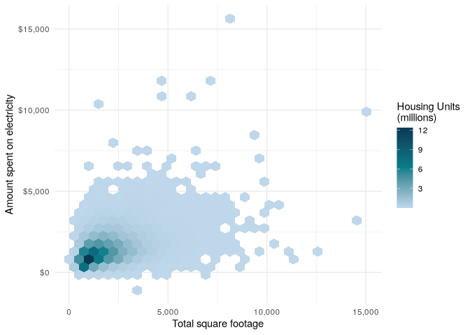
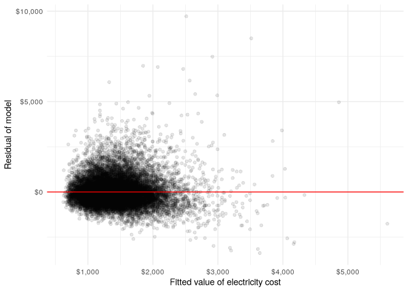
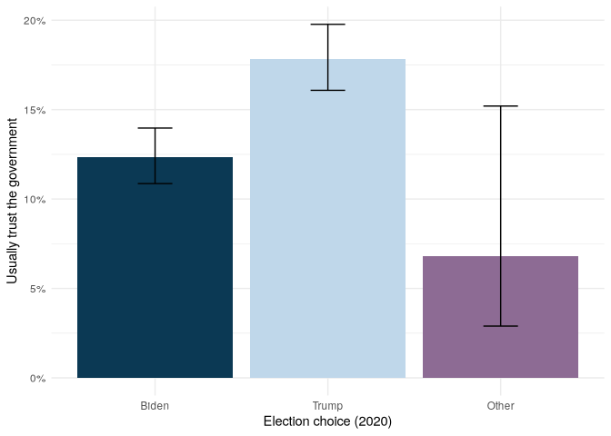
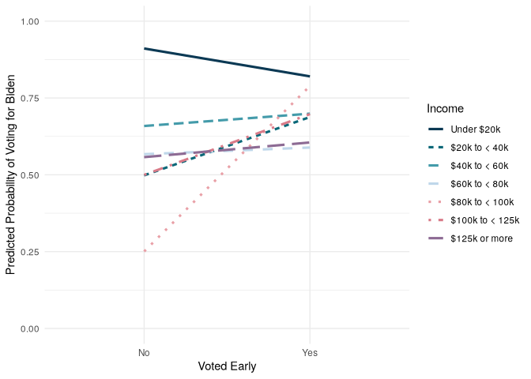

# Modeling


# Setup

Reference prior chapter

``` r
library(tidyverse)
library(survey)
library(srvyr)
library(broom)
library(gt)
library(prettyunits)
load("data/anes_2020.rda")
load("data/recs_2020.rda")
```

``` r
targetpop <- 231592693

anes_adjwgt <- anes_2020 %>%
  mutate(Weight = Weight / sum(Weight) * targetpop)

anes_des <- anes_adjwgt %>%
  as_survey_design(
    weights = Weight,
    strata = Stratum,
    ids = VarUnit,
    nest = TRUE
  )
recs_des <- recs_2020 %>%
  as_survey_rep(
    weights = NWEIGHT,
    repweights = NWEIGHT1:NWEIGHT60,
    type = "JK1",
    scale = 59 / 60,
    mse = TRUE
  )
```

# Analysis of Variance

- $H_0:\mu_1=\mu_2=\dots=\mu_k$ where $\mu_i$ is the mean outcome for
  group i
- $H_A$:At least one mean is different

Some assumptions when using ANOVA on survey data include:

- The outcome variable is normally distributed within each group.
- The variances of the outcome variable between each group are
  approximately equal.
- We do NOT assume independence between the groups as with ANOVA on
  non-survey data. The covariance is accounted for in the survey design.

<!-- -->

    des_obj %>%
      svyglm(
        formula = outcome ~ group,
        design = .,
        na.action = na.omit,
        df.resid = NULL
      )

- formula: formula in the form of `outcome~group`. The group variable
  must be a factor or character.
- design: a `tbl_svy` object created by `as_survey`
- na.action: handling of missing data
- df.resid: degrees of freedom for Wald tests (optional); defaults to
  using `degf(design)-(g-1)` where g is the number of groups

In RECS, respondents are asked what temperature they set their
thermostat to during the evening when using A/C during the summer23. To
analyze these data, we filter the respondents to only those using A/C
(ACUsed)24. Then, if we want to see if there are regional differences,
we can use group_by(). A descriptive analysis of the temperature at
night (SummerTempNight) set by region and the sample sizes is displayed
below.

``` r
recs_des %>%
  filter(ACUsed) %>%
  group_by(Region) %>%
  summarize(
    SMN = survey_mean(SummerTempNight, na.rm = T),
    n = unweighted(n()),
    n_na = unweighted(sum(is.na(SummerTempNight)))
  )
```

    # A tibble: 4 × 5
      Region      SMN SMN_se     n  n_na
      <fct>     <dbl>  <dbl> <int> <int>
    1 Northeast  69.7 0.103   3204     0
    2 Midwest    71.0 0.0897  3619     0
    3 South      71.8 0.0536  6065     0
    4 West       72.5 0.129   3283     0

In the following code, we test whether this temperature varies by region
by first using `svyglm()` to run the test and then using `broom::tidy()`
to display the output. Note that the temperature setting is set to NA
when the household does not use A/C, and since the default handling of
NAs is `na.action=na.omit`, records that do not use A/C are not included
in this regression.

``` r
anova_out <- recs_des %>%
  svyglm(
    design = .,
    formula = SummerTempNight ~ Region
  )
tidy(anova_out)
```

    # A tibble: 4 × 5
      term          estimate std.error statistic   p.value
      <chr>            <dbl>     <dbl>     <dbl>     <dbl>
    1 (Intercept)      69.7      0.103    674.   3.69e-111
    2 RegionMidwest     1.34     0.138      9.68 1.46e- 13
    3 RegionSouth       2.05     0.128     16.0  1.36e- 22
    4 RegionWest        2.80     0.177     15.9  2.27e- 22

Change reference level to Midwest

``` r
recs_des %>%
  mutate(Region = fct_relevel(Region, "Midwest", after = 0)) %>%
  svyglm(
    design = .,
    formula = SummerTempNight ~ Region
  ) %>%
  tidy() %>%
  mutate(p.value = pretty_p_value(p.value)) %>%
  gt() %>%
  fmt_number()
```

<div id="nmtdvwwifp" style="padding-left:0px;padding-right:0px;padding-top:10px;padding-bottom:10px;overflow-x:auto;overflow-y:auto;width:auto;height:auto;">
<style>#nmtdvwwifp table {
  font-family: system-ui, 'Segoe UI', Roboto, Helvetica, Arial, sans-serif, 'Apple Color Emoji', 'Segoe UI Emoji', 'Segoe UI Symbol', 'Noto Color Emoji';
  -webkit-font-smoothing: antialiased;
  -moz-osx-font-smoothing: grayscale;
}
&#10;#nmtdvwwifp thead, #nmtdvwwifp tbody, #nmtdvwwifp tfoot, #nmtdvwwifp tr, #nmtdvwwifp td, #nmtdvwwifp th {
  border-style: none;
}
&#10;#nmtdvwwifp p {
  margin: 0;
  padding: 0;
}
&#10;#nmtdvwwifp .gt_table {
  display: table;
  border-collapse: collapse;
  line-height: normal;
  margin-left: auto;
  margin-right: auto;
  color: #333333;
  font-size: 16px;
  font-weight: normal;
  font-style: normal;
  background-color: #FFFFFF;
  width: auto;
  border-top-style: solid;
  border-top-width: 2px;
  border-top-color: #A8A8A8;
  border-right-style: none;
  border-right-width: 2px;
  border-right-color: #D3D3D3;
  border-bottom-style: solid;
  border-bottom-width: 2px;
  border-bottom-color: #A8A8A8;
  border-left-style: none;
  border-left-width: 2px;
  border-left-color: #D3D3D3;
}
&#10;#nmtdvwwifp .gt_caption {
  padding-top: 4px;
  padding-bottom: 4px;
}
&#10;#nmtdvwwifp .gt_title {
  color: #333333;
  font-size: 125%;
  font-weight: initial;
  padding-top: 4px;
  padding-bottom: 4px;
  padding-left: 5px;
  padding-right: 5px;
  border-bottom-color: #FFFFFF;
  border-bottom-width: 0;
}
&#10;#nmtdvwwifp .gt_subtitle {
  color: #333333;
  font-size: 85%;
  font-weight: initial;
  padding-top: 3px;
  padding-bottom: 5px;
  padding-left: 5px;
  padding-right: 5px;
  border-top-color: #FFFFFF;
  border-top-width: 0;
}
&#10;#nmtdvwwifp .gt_heading {
  background-color: #FFFFFF;
  text-align: center;
  border-bottom-color: #FFFFFF;
  border-left-style: none;
  border-left-width: 1px;
  border-left-color: #D3D3D3;
  border-right-style: none;
  border-right-width: 1px;
  border-right-color: #D3D3D3;
}
&#10;#nmtdvwwifp .gt_bottom_border {
  border-bottom-style: solid;
  border-bottom-width: 2px;
  border-bottom-color: #D3D3D3;
}
&#10;#nmtdvwwifp .gt_col_headings {
  border-top-style: solid;
  border-top-width: 2px;
  border-top-color: #D3D3D3;
  border-bottom-style: solid;
  border-bottom-width: 2px;
  border-bottom-color: #D3D3D3;
  border-left-style: none;
  border-left-width: 1px;
  border-left-color: #D3D3D3;
  border-right-style: none;
  border-right-width: 1px;
  border-right-color: #D3D3D3;
}
&#10;#nmtdvwwifp .gt_col_heading {
  color: #333333;
  background-color: #FFFFFF;
  font-size: 100%;
  font-weight: normal;
  text-transform: inherit;
  border-left-style: none;
  border-left-width: 1px;
  border-left-color: #D3D3D3;
  border-right-style: none;
  border-right-width: 1px;
  border-right-color: #D3D3D3;
  vertical-align: bottom;
  padding-top: 5px;
  padding-bottom: 6px;
  padding-left: 5px;
  padding-right: 5px;
  overflow-x: hidden;
}
&#10;#nmtdvwwifp .gt_column_spanner_outer {
  color: #333333;
  background-color: #FFFFFF;
  font-size: 100%;
  font-weight: normal;
  text-transform: inherit;
  padding-top: 0;
  padding-bottom: 0;
  padding-left: 4px;
  padding-right: 4px;
}
&#10;#nmtdvwwifp .gt_column_spanner_outer:first-child {
  padding-left: 0;
}
&#10;#nmtdvwwifp .gt_column_spanner_outer:last-child {
  padding-right: 0;
}
&#10;#nmtdvwwifp .gt_column_spanner {
  border-bottom-style: solid;
  border-bottom-width: 2px;
  border-bottom-color: #D3D3D3;
  vertical-align: bottom;
  padding-top: 5px;
  padding-bottom: 5px;
  overflow-x: hidden;
  display: inline-block;
  width: 100%;
}
&#10;#nmtdvwwifp .gt_spanner_row {
  border-bottom-style: hidden;
}
&#10;#nmtdvwwifp .gt_group_heading {
  padding-top: 8px;
  padding-bottom: 8px;
  padding-left: 5px;
  padding-right: 5px;
  color: #333333;
  background-color: #FFFFFF;
  font-size: 100%;
  font-weight: initial;
  text-transform: inherit;
  border-top-style: solid;
  border-top-width: 2px;
  border-top-color: #D3D3D3;
  border-bottom-style: solid;
  border-bottom-width: 2px;
  border-bottom-color: #D3D3D3;
  border-left-style: none;
  border-left-width: 1px;
  border-left-color: #D3D3D3;
  border-right-style: none;
  border-right-width: 1px;
  border-right-color: #D3D3D3;
  vertical-align: middle;
  text-align: left;
}
&#10;#nmtdvwwifp .gt_empty_group_heading {
  padding: 0.5px;
  color: #333333;
  background-color: #FFFFFF;
  font-size: 100%;
  font-weight: initial;
  border-top-style: solid;
  border-top-width: 2px;
  border-top-color: #D3D3D3;
  border-bottom-style: solid;
  border-bottom-width: 2px;
  border-bottom-color: #D3D3D3;
  vertical-align: middle;
}
&#10;#nmtdvwwifp .gt_from_md > :first-child {
  margin-top: 0;
}
&#10;#nmtdvwwifp .gt_from_md > :last-child {
  margin-bottom: 0;
}
&#10;#nmtdvwwifp .gt_row {
  padding-top: 8px;
  padding-bottom: 8px;
  padding-left: 5px;
  padding-right: 5px;
  margin: 10px;
  border-top-style: solid;
  border-top-width: 1px;
  border-top-color: #D3D3D3;
  border-left-style: none;
  border-left-width: 1px;
  border-left-color: #D3D3D3;
  border-right-style: none;
  border-right-width: 1px;
  border-right-color: #D3D3D3;
  vertical-align: middle;
  overflow-x: hidden;
}
&#10;#nmtdvwwifp .gt_stub {
  color: #333333;
  background-color: #FFFFFF;
  font-size: 100%;
  font-weight: initial;
  text-transform: inherit;
  border-right-style: solid;
  border-right-width: 2px;
  border-right-color: #D3D3D3;
  padding-left: 5px;
  padding-right: 5px;
}
&#10;#nmtdvwwifp .gt_stub_row_group {
  color: #333333;
  background-color: #FFFFFF;
  font-size: 100%;
  font-weight: initial;
  text-transform: inherit;
  border-right-style: solid;
  border-right-width: 2px;
  border-right-color: #D3D3D3;
  padding-left: 5px;
  padding-right: 5px;
  vertical-align: top;
}
&#10;#nmtdvwwifp .gt_row_group_first td {
  border-top-width: 2px;
}
&#10;#nmtdvwwifp .gt_row_group_first th {
  border-top-width: 2px;
}
&#10;#nmtdvwwifp .gt_summary_row {
  color: #333333;
  background-color: #FFFFFF;
  text-transform: inherit;
  padding-top: 8px;
  padding-bottom: 8px;
  padding-left: 5px;
  padding-right: 5px;
}
&#10;#nmtdvwwifp .gt_first_summary_row {
  border-top-style: solid;
  border-top-color: #D3D3D3;
}
&#10;#nmtdvwwifp .gt_first_summary_row.thick {
  border-top-width: 2px;
}
&#10;#nmtdvwwifp .gt_last_summary_row {
  padding-top: 8px;
  padding-bottom: 8px;
  padding-left: 5px;
  padding-right: 5px;
  border-bottom-style: solid;
  border-bottom-width: 2px;
  border-bottom-color: #D3D3D3;
}
&#10;#nmtdvwwifp .gt_grand_summary_row {
  color: #333333;
  background-color: #FFFFFF;
  text-transform: inherit;
  padding-top: 8px;
  padding-bottom: 8px;
  padding-left: 5px;
  padding-right: 5px;
}
&#10;#nmtdvwwifp .gt_first_grand_summary_row {
  padding-top: 8px;
  padding-bottom: 8px;
  padding-left: 5px;
  padding-right: 5px;
  border-top-style: double;
  border-top-width: 6px;
  border-top-color: #D3D3D3;
}
&#10;#nmtdvwwifp .gt_last_grand_summary_row_top {
  padding-top: 8px;
  padding-bottom: 8px;
  padding-left: 5px;
  padding-right: 5px;
  border-bottom-style: double;
  border-bottom-width: 6px;
  border-bottom-color: #D3D3D3;
}
&#10;#nmtdvwwifp .gt_striped {
  background-color: rgba(128, 128, 128, 0.05);
}
&#10;#nmtdvwwifp .gt_table_body {
  border-top-style: solid;
  border-top-width: 2px;
  border-top-color: #D3D3D3;
  border-bottom-style: solid;
  border-bottom-width: 2px;
  border-bottom-color: #D3D3D3;
}
&#10;#nmtdvwwifp .gt_footnotes {
  color: #333333;
  background-color: #FFFFFF;
  border-bottom-style: none;
  border-bottom-width: 2px;
  border-bottom-color: #D3D3D3;
  border-left-style: none;
  border-left-width: 2px;
  border-left-color: #D3D3D3;
  border-right-style: none;
  border-right-width: 2px;
  border-right-color: #D3D3D3;
}
&#10;#nmtdvwwifp .gt_footnote {
  margin: 0px;
  font-size: 90%;
  padding-top: 4px;
  padding-bottom: 4px;
  padding-left: 5px;
  padding-right: 5px;
}
&#10;#nmtdvwwifp .gt_sourcenotes {
  color: #333333;
  background-color: #FFFFFF;
  border-bottom-style: none;
  border-bottom-width: 2px;
  border-bottom-color: #D3D3D3;
  border-left-style: none;
  border-left-width: 2px;
  border-left-color: #D3D3D3;
  border-right-style: none;
  border-right-width: 2px;
  border-right-color: #D3D3D3;
}
&#10;#nmtdvwwifp .gt_sourcenote {
  font-size: 90%;
  padding-top: 4px;
  padding-bottom: 4px;
  padding-left: 5px;
  padding-right: 5px;
}
&#10;#nmtdvwwifp .gt_left {
  text-align: left;
}
&#10;#nmtdvwwifp .gt_center {
  text-align: center;
}
&#10;#nmtdvwwifp .gt_right {
  text-align: right;
  font-variant-numeric: tabular-nums;
}
&#10;#nmtdvwwifp .gt_font_normal {
  font-weight: normal;
}
&#10;#nmtdvwwifp .gt_font_bold {
  font-weight: bold;
}
&#10;#nmtdvwwifp .gt_font_italic {
  font-style: italic;
}
&#10;#nmtdvwwifp .gt_super {
  font-size: 65%;
}
&#10;#nmtdvwwifp .gt_footnote_marks {
  font-size: 75%;
  vertical-align: 0.4em;
  position: initial;
}
&#10;#nmtdvwwifp .gt_asterisk {
  font-size: 100%;
  vertical-align: 0;
}
&#10;#nmtdvwwifp .gt_indent_1 {
  text-indent: 5px;
}
&#10;#nmtdvwwifp .gt_indent_2 {
  text-indent: 10px;
}
&#10;#nmtdvwwifp .gt_indent_3 {
  text-indent: 15px;
}
&#10;#nmtdvwwifp .gt_indent_4 {
  text-indent: 20px;
}
&#10;#nmtdvwwifp .gt_indent_5 {
  text-indent: 25px;
}
&#10;#nmtdvwwifp .katex-display {
  display: inline-flex !important;
  margin-bottom: 0.75em !important;
}
&#10;#nmtdvwwifp div.Reactable > div.rt-table > div.rt-thead > div.rt-tr.rt-tr-group-header > div.rt-th-group:after {
  height: 0px !important;
}
</style>

| term            | estimate | std.error | statistic | p.value  |
|-----------------|----------|-----------|-----------|----------|
| (Intercept)     | 71.04    | 0.09      | 791.83    | \<0.0001 |
| RegionNortheast | −1.34    | 0.14      | −9.68     | \<0.0001 |
| RegionSouth     | 0.71     | 0.10      | 6.91      | \<0.0001 |
| RegionWest      | 1.47     | 0.16      | 9.17      | \<0.0001 |

</div>

``` r
print_table <- function(table) {
  tidy(table) %>%
    mutate(p.value = pretty_p_value(p.value)) %>%
    gt() %>%
    fmt_number()
}
recs_des %>%
  mutate(Region = fct_relevel(Region, "Midwest", after = 0)) %>%
  svyglm(
    design = .,
    formula = SummerTempNight ~ Region
  ) %>%
  print_table()
```

<div id="xzxrgwhhet" style="padding-left:0px;padding-right:0px;padding-top:10px;padding-bottom:10px;overflow-x:auto;overflow-y:auto;width:auto;height:auto;">
<style>#xzxrgwhhet table {
  font-family: system-ui, 'Segoe UI', Roboto, Helvetica, Arial, sans-serif, 'Apple Color Emoji', 'Segoe UI Emoji', 'Segoe UI Symbol', 'Noto Color Emoji';
  -webkit-font-smoothing: antialiased;
  -moz-osx-font-smoothing: grayscale;
}
&#10;#xzxrgwhhet thead, #xzxrgwhhet tbody, #xzxrgwhhet tfoot, #xzxrgwhhet tr, #xzxrgwhhet td, #xzxrgwhhet th {
  border-style: none;
}
&#10;#xzxrgwhhet p {
  margin: 0;
  padding: 0;
}
&#10;#xzxrgwhhet .gt_table {
  display: table;
  border-collapse: collapse;
  line-height: normal;
  margin-left: auto;
  margin-right: auto;
  color: #333333;
  font-size: 16px;
  font-weight: normal;
  font-style: normal;
  background-color: #FFFFFF;
  width: auto;
  border-top-style: solid;
  border-top-width: 2px;
  border-top-color: #A8A8A8;
  border-right-style: none;
  border-right-width: 2px;
  border-right-color: #D3D3D3;
  border-bottom-style: solid;
  border-bottom-width: 2px;
  border-bottom-color: #A8A8A8;
  border-left-style: none;
  border-left-width: 2px;
  border-left-color: #D3D3D3;
}
&#10;#xzxrgwhhet .gt_caption {
  padding-top: 4px;
  padding-bottom: 4px;
}
&#10;#xzxrgwhhet .gt_title {
  color: #333333;
  font-size: 125%;
  font-weight: initial;
  padding-top: 4px;
  padding-bottom: 4px;
  padding-left: 5px;
  padding-right: 5px;
  border-bottom-color: #FFFFFF;
  border-bottom-width: 0;
}
&#10;#xzxrgwhhet .gt_subtitle {
  color: #333333;
  font-size: 85%;
  font-weight: initial;
  padding-top: 3px;
  padding-bottom: 5px;
  padding-left: 5px;
  padding-right: 5px;
  border-top-color: #FFFFFF;
  border-top-width: 0;
}
&#10;#xzxrgwhhet .gt_heading {
  background-color: #FFFFFF;
  text-align: center;
  border-bottom-color: #FFFFFF;
  border-left-style: none;
  border-left-width: 1px;
  border-left-color: #D3D3D3;
  border-right-style: none;
  border-right-width: 1px;
  border-right-color: #D3D3D3;
}
&#10;#xzxrgwhhet .gt_bottom_border {
  border-bottom-style: solid;
  border-bottom-width: 2px;
  border-bottom-color: #D3D3D3;
}
&#10;#xzxrgwhhet .gt_col_headings {
  border-top-style: solid;
  border-top-width: 2px;
  border-top-color: #D3D3D3;
  border-bottom-style: solid;
  border-bottom-width: 2px;
  border-bottom-color: #D3D3D3;
  border-left-style: none;
  border-left-width: 1px;
  border-left-color: #D3D3D3;
  border-right-style: none;
  border-right-width: 1px;
  border-right-color: #D3D3D3;
}
&#10;#xzxrgwhhet .gt_col_heading {
  color: #333333;
  background-color: #FFFFFF;
  font-size: 100%;
  font-weight: normal;
  text-transform: inherit;
  border-left-style: none;
  border-left-width: 1px;
  border-left-color: #D3D3D3;
  border-right-style: none;
  border-right-width: 1px;
  border-right-color: #D3D3D3;
  vertical-align: bottom;
  padding-top: 5px;
  padding-bottom: 6px;
  padding-left: 5px;
  padding-right: 5px;
  overflow-x: hidden;
}
&#10;#xzxrgwhhet .gt_column_spanner_outer {
  color: #333333;
  background-color: #FFFFFF;
  font-size: 100%;
  font-weight: normal;
  text-transform: inherit;
  padding-top: 0;
  padding-bottom: 0;
  padding-left: 4px;
  padding-right: 4px;
}
&#10;#xzxrgwhhet .gt_column_spanner_outer:first-child {
  padding-left: 0;
}
&#10;#xzxrgwhhet .gt_column_spanner_outer:last-child {
  padding-right: 0;
}
&#10;#xzxrgwhhet .gt_column_spanner {
  border-bottom-style: solid;
  border-bottom-width: 2px;
  border-bottom-color: #D3D3D3;
  vertical-align: bottom;
  padding-top: 5px;
  padding-bottom: 5px;
  overflow-x: hidden;
  display: inline-block;
  width: 100%;
}
&#10;#xzxrgwhhet .gt_spanner_row {
  border-bottom-style: hidden;
}
&#10;#xzxrgwhhet .gt_group_heading {
  padding-top: 8px;
  padding-bottom: 8px;
  padding-left: 5px;
  padding-right: 5px;
  color: #333333;
  background-color: #FFFFFF;
  font-size: 100%;
  font-weight: initial;
  text-transform: inherit;
  border-top-style: solid;
  border-top-width: 2px;
  border-top-color: #D3D3D3;
  border-bottom-style: solid;
  border-bottom-width: 2px;
  border-bottom-color: #D3D3D3;
  border-left-style: none;
  border-left-width: 1px;
  border-left-color: #D3D3D3;
  border-right-style: none;
  border-right-width: 1px;
  border-right-color: #D3D3D3;
  vertical-align: middle;
  text-align: left;
}
&#10;#xzxrgwhhet .gt_empty_group_heading {
  padding: 0.5px;
  color: #333333;
  background-color: #FFFFFF;
  font-size: 100%;
  font-weight: initial;
  border-top-style: solid;
  border-top-width: 2px;
  border-top-color: #D3D3D3;
  border-bottom-style: solid;
  border-bottom-width: 2px;
  border-bottom-color: #D3D3D3;
  vertical-align: middle;
}
&#10;#xzxrgwhhet .gt_from_md > :first-child {
  margin-top: 0;
}
&#10;#xzxrgwhhet .gt_from_md > :last-child {
  margin-bottom: 0;
}
&#10;#xzxrgwhhet .gt_row {
  padding-top: 8px;
  padding-bottom: 8px;
  padding-left: 5px;
  padding-right: 5px;
  margin: 10px;
  border-top-style: solid;
  border-top-width: 1px;
  border-top-color: #D3D3D3;
  border-left-style: none;
  border-left-width: 1px;
  border-left-color: #D3D3D3;
  border-right-style: none;
  border-right-width: 1px;
  border-right-color: #D3D3D3;
  vertical-align: middle;
  overflow-x: hidden;
}
&#10;#xzxrgwhhet .gt_stub {
  color: #333333;
  background-color: #FFFFFF;
  font-size: 100%;
  font-weight: initial;
  text-transform: inherit;
  border-right-style: solid;
  border-right-width: 2px;
  border-right-color: #D3D3D3;
  padding-left: 5px;
  padding-right: 5px;
}
&#10;#xzxrgwhhet .gt_stub_row_group {
  color: #333333;
  background-color: #FFFFFF;
  font-size: 100%;
  font-weight: initial;
  text-transform: inherit;
  border-right-style: solid;
  border-right-width: 2px;
  border-right-color: #D3D3D3;
  padding-left: 5px;
  padding-right: 5px;
  vertical-align: top;
}
&#10;#xzxrgwhhet .gt_row_group_first td {
  border-top-width: 2px;
}
&#10;#xzxrgwhhet .gt_row_group_first th {
  border-top-width: 2px;
}
&#10;#xzxrgwhhet .gt_summary_row {
  color: #333333;
  background-color: #FFFFFF;
  text-transform: inherit;
  padding-top: 8px;
  padding-bottom: 8px;
  padding-left: 5px;
  padding-right: 5px;
}
&#10;#xzxrgwhhet .gt_first_summary_row {
  border-top-style: solid;
  border-top-color: #D3D3D3;
}
&#10;#xzxrgwhhet .gt_first_summary_row.thick {
  border-top-width: 2px;
}
&#10;#xzxrgwhhet .gt_last_summary_row {
  padding-top: 8px;
  padding-bottom: 8px;
  padding-left: 5px;
  padding-right: 5px;
  border-bottom-style: solid;
  border-bottom-width: 2px;
  border-bottom-color: #D3D3D3;
}
&#10;#xzxrgwhhet .gt_grand_summary_row {
  color: #333333;
  background-color: #FFFFFF;
  text-transform: inherit;
  padding-top: 8px;
  padding-bottom: 8px;
  padding-left: 5px;
  padding-right: 5px;
}
&#10;#xzxrgwhhet .gt_first_grand_summary_row {
  padding-top: 8px;
  padding-bottom: 8px;
  padding-left: 5px;
  padding-right: 5px;
  border-top-style: double;
  border-top-width: 6px;
  border-top-color: #D3D3D3;
}
&#10;#xzxrgwhhet .gt_last_grand_summary_row_top {
  padding-top: 8px;
  padding-bottom: 8px;
  padding-left: 5px;
  padding-right: 5px;
  border-bottom-style: double;
  border-bottom-width: 6px;
  border-bottom-color: #D3D3D3;
}
&#10;#xzxrgwhhet .gt_striped {
  background-color: rgba(128, 128, 128, 0.05);
}
&#10;#xzxrgwhhet .gt_table_body {
  border-top-style: solid;
  border-top-width: 2px;
  border-top-color: #D3D3D3;
  border-bottom-style: solid;
  border-bottom-width: 2px;
  border-bottom-color: #D3D3D3;
}
&#10;#xzxrgwhhet .gt_footnotes {
  color: #333333;
  background-color: #FFFFFF;
  border-bottom-style: none;
  border-bottom-width: 2px;
  border-bottom-color: #D3D3D3;
  border-left-style: none;
  border-left-width: 2px;
  border-left-color: #D3D3D3;
  border-right-style: none;
  border-right-width: 2px;
  border-right-color: #D3D3D3;
}
&#10;#xzxrgwhhet .gt_footnote {
  margin: 0px;
  font-size: 90%;
  padding-top: 4px;
  padding-bottom: 4px;
  padding-left: 5px;
  padding-right: 5px;
}
&#10;#xzxrgwhhet .gt_sourcenotes {
  color: #333333;
  background-color: #FFFFFF;
  border-bottom-style: none;
  border-bottom-width: 2px;
  border-bottom-color: #D3D3D3;
  border-left-style: none;
  border-left-width: 2px;
  border-left-color: #D3D3D3;
  border-right-style: none;
  border-right-width: 2px;
  border-right-color: #D3D3D3;
}
&#10;#xzxrgwhhet .gt_sourcenote {
  font-size: 90%;
  padding-top: 4px;
  padding-bottom: 4px;
  padding-left: 5px;
  padding-right: 5px;
}
&#10;#xzxrgwhhet .gt_left {
  text-align: left;
}
&#10;#xzxrgwhhet .gt_center {
  text-align: center;
}
&#10;#xzxrgwhhet .gt_right {
  text-align: right;
  font-variant-numeric: tabular-nums;
}
&#10;#xzxrgwhhet .gt_font_normal {
  font-weight: normal;
}
&#10;#xzxrgwhhet .gt_font_bold {
  font-weight: bold;
}
&#10;#xzxrgwhhet .gt_font_italic {
  font-style: italic;
}
&#10;#xzxrgwhhet .gt_super {
  font-size: 65%;
}
&#10;#xzxrgwhhet .gt_footnote_marks {
  font-size: 75%;
  vertical-align: 0.4em;
  position: initial;
}
&#10;#xzxrgwhhet .gt_asterisk {
  font-size: 100%;
  vertical-align: 0;
}
&#10;#xzxrgwhhet .gt_indent_1 {
  text-indent: 5px;
}
&#10;#xzxrgwhhet .gt_indent_2 {
  text-indent: 10px;
}
&#10;#xzxrgwhhet .gt_indent_3 {
  text-indent: 15px;
}
&#10;#xzxrgwhhet .gt_indent_4 {
  text-indent: 20px;
}
&#10;#xzxrgwhhet .gt_indent_5 {
  text-indent: 25px;
}
&#10;#xzxrgwhhet .katex-display {
  display: inline-flex !important;
  margin-bottom: 0.75em !important;
}
&#10;#xzxrgwhhet div.Reactable > div.rt-table > div.rt-thead > div.rt-tr.rt-tr-group-header > div.rt-th-group:after {
  height: 0px !important;
}
</style>

| term            | estimate | std.error | statistic | p.value  |
|-----------------|----------|-----------|-----------|----------|
| (Intercept)     | 71.04    | 0.09      | 791.83    | \<0.0001 |
| RegionNortheast | −1.34    | 0.14      | −9.68     | \<0.0001 |
| RegionSouth     | 0.71     | 0.10      | 6.91      | \<0.0001 |
| RegionWest      | 1.47     | 0.16      | 9.17      | \<0.0001 |

</div>

# Normal Linear Regression

Assumptions in normal linear regression using survey data include:

- The residuals ($\epsilon_i$) are normally distributed, but there is
  not an assumption of independence, and the correlation structure is
  captured in the survey design object
- There is a linear relationship between the outcome variable and the
  independent variables
- The residuals are homoscedastic; that is, the error term is the same
  across all values of independent variables

<!-- -->

    des_obj %>%
      svyglm(
        formula = outcomevar ~ x1 + x2 + x3,
        design = .,
        na.action = na.omit,
        df.resid = NULL
      )

## Linear regression with a single variable

On RECS, we can obtain information on the square footage of homes25 and
the electric bills. We assume that square footage is related to the
amount of money spent on electricity and examine a model for this.
Before any modeling, we first plot the data to determine whether it is
reasonable to assume a linear relationship.

``` r
book_colors <- c("#0b3954", "#087e8b", "#bfd7ea", "#ff8484", "#8d6b94")
```

``` r
recs_2020 %>%
  ggplot(aes(
    x = TOTSQFT_EN,
    y = DOLLAREL,
    weight = NWEIGHT / 1e6
  )) +
  geom_hex() +
  scale_fill_gradientn(
    guide = "colorbar",
    name = "Housing Units\n(millions)",
    labels = scales::comma,
    colors = book_colors[c(3, 2, 1)]
  ) +
  xlab("Total square footage") +
  ylab("Amount spent on electricity") +
  scale_y_continuous(labels = scales::dollar_format()) +
  scale_x_continuous(labels = scales::comma_format()) +
  theme_minimal()
```



``` r
m_electric_sqft <- recs_des %>%
  svyglm(
    design = .,
    formula = DOLLAREL ~ TOTSQFT_EN,
    na.action = na.omit
  )
```

``` r
print_table(m_electric_sqft)
```

<div id="anigxyizbm" style="padding-left:0px;padding-right:0px;padding-top:10px;padding-bottom:10px;overflow-x:auto;overflow-y:auto;width:auto;height:auto;">
<style>#anigxyizbm table {
  font-family: system-ui, 'Segoe UI', Roboto, Helvetica, Arial, sans-serif, 'Apple Color Emoji', 'Segoe UI Emoji', 'Segoe UI Symbol', 'Noto Color Emoji';
  -webkit-font-smoothing: antialiased;
  -moz-osx-font-smoothing: grayscale;
}
&#10;#anigxyizbm thead, #anigxyizbm tbody, #anigxyizbm tfoot, #anigxyizbm tr, #anigxyizbm td, #anigxyizbm th {
  border-style: none;
}
&#10;#anigxyizbm p {
  margin: 0;
  padding: 0;
}
&#10;#anigxyizbm .gt_table {
  display: table;
  border-collapse: collapse;
  line-height: normal;
  margin-left: auto;
  margin-right: auto;
  color: #333333;
  font-size: 16px;
  font-weight: normal;
  font-style: normal;
  background-color: #FFFFFF;
  width: auto;
  border-top-style: solid;
  border-top-width: 2px;
  border-top-color: #A8A8A8;
  border-right-style: none;
  border-right-width: 2px;
  border-right-color: #D3D3D3;
  border-bottom-style: solid;
  border-bottom-width: 2px;
  border-bottom-color: #A8A8A8;
  border-left-style: none;
  border-left-width: 2px;
  border-left-color: #D3D3D3;
}
&#10;#anigxyizbm .gt_caption {
  padding-top: 4px;
  padding-bottom: 4px;
}
&#10;#anigxyizbm .gt_title {
  color: #333333;
  font-size: 125%;
  font-weight: initial;
  padding-top: 4px;
  padding-bottom: 4px;
  padding-left: 5px;
  padding-right: 5px;
  border-bottom-color: #FFFFFF;
  border-bottom-width: 0;
}
&#10;#anigxyizbm .gt_subtitle {
  color: #333333;
  font-size: 85%;
  font-weight: initial;
  padding-top: 3px;
  padding-bottom: 5px;
  padding-left: 5px;
  padding-right: 5px;
  border-top-color: #FFFFFF;
  border-top-width: 0;
}
&#10;#anigxyizbm .gt_heading {
  background-color: #FFFFFF;
  text-align: center;
  border-bottom-color: #FFFFFF;
  border-left-style: none;
  border-left-width: 1px;
  border-left-color: #D3D3D3;
  border-right-style: none;
  border-right-width: 1px;
  border-right-color: #D3D3D3;
}
&#10;#anigxyizbm .gt_bottom_border {
  border-bottom-style: solid;
  border-bottom-width: 2px;
  border-bottom-color: #D3D3D3;
}
&#10;#anigxyizbm .gt_col_headings {
  border-top-style: solid;
  border-top-width: 2px;
  border-top-color: #D3D3D3;
  border-bottom-style: solid;
  border-bottom-width: 2px;
  border-bottom-color: #D3D3D3;
  border-left-style: none;
  border-left-width: 1px;
  border-left-color: #D3D3D3;
  border-right-style: none;
  border-right-width: 1px;
  border-right-color: #D3D3D3;
}
&#10;#anigxyizbm .gt_col_heading {
  color: #333333;
  background-color: #FFFFFF;
  font-size: 100%;
  font-weight: normal;
  text-transform: inherit;
  border-left-style: none;
  border-left-width: 1px;
  border-left-color: #D3D3D3;
  border-right-style: none;
  border-right-width: 1px;
  border-right-color: #D3D3D3;
  vertical-align: bottom;
  padding-top: 5px;
  padding-bottom: 6px;
  padding-left: 5px;
  padding-right: 5px;
  overflow-x: hidden;
}
&#10;#anigxyizbm .gt_column_spanner_outer {
  color: #333333;
  background-color: #FFFFFF;
  font-size: 100%;
  font-weight: normal;
  text-transform: inherit;
  padding-top: 0;
  padding-bottom: 0;
  padding-left: 4px;
  padding-right: 4px;
}
&#10;#anigxyizbm .gt_column_spanner_outer:first-child {
  padding-left: 0;
}
&#10;#anigxyizbm .gt_column_spanner_outer:last-child {
  padding-right: 0;
}
&#10;#anigxyizbm .gt_column_spanner {
  border-bottom-style: solid;
  border-bottom-width: 2px;
  border-bottom-color: #D3D3D3;
  vertical-align: bottom;
  padding-top: 5px;
  padding-bottom: 5px;
  overflow-x: hidden;
  display: inline-block;
  width: 100%;
}
&#10;#anigxyizbm .gt_spanner_row {
  border-bottom-style: hidden;
}
&#10;#anigxyizbm .gt_group_heading {
  padding-top: 8px;
  padding-bottom: 8px;
  padding-left: 5px;
  padding-right: 5px;
  color: #333333;
  background-color: #FFFFFF;
  font-size: 100%;
  font-weight: initial;
  text-transform: inherit;
  border-top-style: solid;
  border-top-width: 2px;
  border-top-color: #D3D3D3;
  border-bottom-style: solid;
  border-bottom-width: 2px;
  border-bottom-color: #D3D3D3;
  border-left-style: none;
  border-left-width: 1px;
  border-left-color: #D3D3D3;
  border-right-style: none;
  border-right-width: 1px;
  border-right-color: #D3D3D3;
  vertical-align: middle;
  text-align: left;
}
&#10;#anigxyizbm .gt_empty_group_heading {
  padding: 0.5px;
  color: #333333;
  background-color: #FFFFFF;
  font-size: 100%;
  font-weight: initial;
  border-top-style: solid;
  border-top-width: 2px;
  border-top-color: #D3D3D3;
  border-bottom-style: solid;
  border-bottom-width: 2px;
  border-bottom-color: #D3D3D3;
  vertical-align: middle;
}
&#10;#anigxyizbm .gt_from_md > :first-child {
  margin-top: 0;
}
&#10;#anigxyizbm .gt_from_md > :last-child {
  margin-bottom: 0;
}
&#10;#anigxyizbm .gt_row {
  padding-top: 8px;
  padding-bottom: 8px;
  padding-left: 5px;
  padding-right: 5px;
  margin: 10px;
  border-top-style: solid;
  border-top-width: 1px;
  border-top-color: #D3D3D3;
  border-left-style: none;
  border-left-width: 1px;
  border-left-color: #D3D3D3;
  border-right-style: none;
  border-right-width: 1px;
  border-right-color: #D3D3D3;
  vertical-align: middle;
  overflow-x: hidden;
}
&#10;#anigxyizbm .gt_stub {
  color: #333333;
  background-color: #FFFFFF;
  font-size: 100%;
  font-weight: initial;
  text-transform: inherit;
  border-right-style: solid;
  border-right-width: 2px;
  border-right-color: #D3D3D3;
  padding-left: 5px;
  padding-right: 5px;
}
&#10;#anigxyizbm .gt_stub_row_group {
  color: #333333;
  background-color: #FFFFFF;
  font-size: 100%;
  font-weight: initial;
  text-transform: inherit;
  border-right-style: solid;
  border-right-width: 2px;
  border-right-color: #D3D3D3;
  padding-left: 5px;
  padding-right: 5px;
  vertical-align: top;
}
&#10;#anigxyizbm .gt_row_group_first td {
  border-top-width: 2px;
}
&#10;#anigxyizbm .gt_row_group_first th {
  border-top-width: 2px;
}
&#10;#anigxyizbm .gt_summary_row {
  color: #333333;
  background-color: #FFFFFF;
  text-transform: inherit;
  padding-top: 8px;
  padding-bottom: 8px;
  padding-left: 5px;
  padding-right: 5px;
}
&#10;#anigxyizbm .gt_first_summary_row {
  border-top-style: solid;
  border-top-color: #D3D3D3;
}
&#10;#anigxyizbm .gt_first_summary_row.thick {
  border-top-width: 2px;
}
&#10;#anigxyizbm .gt_last_summary_row {
  padding-top: 8px;
  padding-bottom: 8px;
  padding-left: 5px;
  padding-right: 5px;
  border-bottom-style: solid;
  border-bottom-width: 2px;
  border-bottom-color: #D3D3D3;
}
&#10;#anigxyizbm .gt_grand_summary_row {
  color: #333333;
  background-color: #FFFFFF;
  text-transform: inherit;
  padding-top: 8px;
  padding-bottom: 8px;
  padding-left: 5px;
  padding-right: 5px;
}
&#10;#anigxyizbm .gt_first_grand_summary_row {
  padding-top: 8px;
  padding-bottom: 8px;
  padding-left: 5px;
  padding-right: 5px;
  border-top-style: double;
  border-top-width: 6px;
  border-top-color: #D3D3D3;
}
&#10;#anigxyizbm .gt_last_grand_summary_row_top {
  padding-top: 8px;
  padding-bottom: 8px;
  padding-left: 5px;
  padding-right: 5px;
  border-bottom-style: double;
  border-bottom-width: 6px;
  border-bottom-color: #D3D3D3;
}
&#10;#anigxyizbm .gt_striped {
  background-color: rgba(128, 128, 128, 0.05);
}
&#10;#anigxyizbm .gt_table_body {
  border-top-style: solid;
  border-top-width: 2px;
  border-top-color: #D3D3D3;
  border-bottom-style: solid;
  border-bottom-width: 2px;
  border-bottom-color: #D3D3D3;
}
&#10;#anigxyizbm .gt_footnotes {
  color: #333333;
  background-color: #FFFFFF;
  border-bottom-style: none;
  border-bottom-width: 2px;
  border-bottom-color: #D3D3D3;
  border-left-style: none;
  border-left-width: 2px;
  border-left-color: #D3D3D3;
  border-right-style: none;
  border-right-width: 2px;
  border-right-color: #D3D3D3;
}
&#10;#anigxyizbm .gt_footnote {
  margin: 0px;
  font-size: 90%;
  padding-top: 4px;
  padding-bottom: 4px;
  padding-left: 5px;
  padding-right: 5px;
}
&#10;#anigxyizbm .gt_sourcenotes {
  color: #333333;
  background-color: #FFFFFF;
  border-bottom-style: none;
  border-bottom-width: 2px;
  border-bottom-color: #D3D3D3;
  border-left-style: none;
  border-left-width: 2px;
  border-left-color: #D3D3D3;
  border-right-style: none;
  border-right-width: 2px;
  border-right-color: #D3D3D3;
}
&#10;#anigxyizbm .gt_sourcenote {
  font-size: 90%;
  padding-top: 4px;
  padding-bottom: 4px;
  padding-left: 5px;
  padding-right: 5px;
}
&#10;#anigxyizbm .gt_left {
  text-align: left;
}
&#10;#anigxyizbm .gt_center {
  text-align: center;
}
&#10;#anigxyizbm .gt_right {
  text-align: right;
  font-variant-numeric: tabular-nums;
}
&#10;#anigxyizbm .gt_font_normal {
  font-weight: normal;
}
&#10;#anigxyizbm .gt_font_bold {
  font-weight: bold;
}
&#10;#anigxyizbm .gt_font_italic {
  font-style: italic;
}
&#10;#anigxyizbm .gt_super {
  font-size: 65%;
}
&#10;#anigxyizbm .gt_footnote_marks {
  font-size: 75%;
  vertical-align: 0.4em;
  position: initial;
}
&#10;#anigxyizbm .gt_asterisk {
  font-size: 100%;
  vertical-align: 0;
}
&#10;#anigxyizbm .gt_indent_1 {
  text-indent: 5px;
}
&#10;#anigxyizbm .gt_indent_2 {
  text-indent: 10px;
}
&#10;#anigxyizbm .gt_indent_3 {
  text-indent: 15px;
}
&#10;#anigxyizbm .gt_indent_4 {
  text-indent: 20px;
}
&#10;#anigxyizbm .gt_indent_5 {
  text-indent: 25px;
}
&#10;#anigxyizbm .katex-display {
  display: inline-flex !important;
  margin-bottom: 0.75em !important;
}
&#10;#anigxyizbm div.Reactable > div.rt-table > div.rt-thead > div.rt-tr.rt-tr-group-header > div.rt-th-group:after {
  height: 0px !important;
}
</style>

| term        | estimate | std.error | statistic | p.value  |
|-------------|----------|-----------|-----------|----------|
| (Intercept) | 836.72   | 12.77     | 65.51     | \<0.0001 |
| TOTSQFT_EN  | 0.30     | 0.01      | 41.67     | \<0.0001 |

</div>

## Linear regression with multiple variables and interactions

``` r
m_electric_multi <- recs_des %>%
  svyglm(
    design = .,
    formula = DOLLAREL ~ (Region + Urbanicity + TOTSQFT_EN + ACUsed)^2 - 1,
    na.action = na.omit
  )
print_table(m_electric_multi)
```

<div id="tpvmqjsdpt" style="padding-left:0px;padding-right:0px;padding-top:10px;padding-bottom:10px;overflow-x:auto;overflow-y:auto;width:auto;height:auto;">
<style>#tpvmqjsdpt table {
  font-family: system-ui, 'Segoe UI', Roboto, Helvetica, Arial, sans-serif, 'Apple Color Emoji', 'Segoe UI Emoji', 'Segoe UI Symbol', 'Noto Color Emoji';
  -webkit-font-smoothing: antialiased;
  -moz-osx-font-smoothing: grayscale;
}
&#10;#tpvmqjsdpt thead, #tpvmqjsdpt tbody, #tpvmqjsdpt tfoot, #tpvmqjsdpt tr, #tpvmqjsdpt td, #tpvmqjsdpt th {
  border-style: none;
}
&#10;#tpvmqjsdpt p {
  margin: 0;
  padding: 0;
}
&#10;#tpvmqjsdpt .gt_table {
  display: table;
  border-collapse: collapse;
  line-height: normal;
  margin-left: auto;
  margin-right: auto;
  color: #333333;
  font-size: 16px;
  font-weight: normal;
  font-style: normal;
  background-color: #FFFFFF;
  width: auto;
  border-top-style: solid;
  border-top-width: 2px;
  border-top-color: #A8A8A8;
  border-right-style: none;
  border-right-width: 2px;
  border-right-color: #D3D3D3;
  border-bottom-style: solid;
  border-bottom-width: 2px;
  border-bottom-color: #A8A8A8;
  border-left-style: none;
  border-left-width: 2px;
  border-left-color: #D3D3D3;
}
&#10;#tpvmqjsdpt .gt_caption {
  padding-top: 4px;
  padding-bottom: 4px;
}
&#10;#tpvmqjsdpt .gt_title {
  color: #333333;
  font-size: 125%;
  font-weight: initial;
  padding-top: 4px;
  padding-bottom: 4px;
  padding-left: 5px;
  padding-right: 5px;
  border-bottom-color: #FFFFFF;
  border-bottom-width: 0;
}
&#10;#tpvmqjsdpt .gt_subtitle {
  color: #333333;
  font-size: 85%;
  font-weight: initial;
  padding-top: 3px;
  padding-bottom: 5px;
  padding-left: 5px;
  padding-right: 5px;
  border-top-color: #FFFFFF;
  border-top-width: 0;
}
&#10;#tpvmqjsdpt .gt_heading {
  background-color: #FFFFFF;
  text-align: center;
  border-bottom-color: #FFFFFF;
  border-left-style: none;
  border-left-width: 1px;
  border-left-color: #D3D3D3;
  border-right-style: none;
  border-right-width: 1px;
  border-right-color: #D3D3D3;
}
&#10;#tpvmqjsdpt .gt_bottom_border {
  border-bottom-style: solid;
  border-bottom-width: 2px;
  border-bottom-color: #D3D3D3;
}
&#10;#tpvmqjsdpt .gt_col_headings {
  border-top-style: solid;
  border-top-width: 2px;
  border-top-color: #D3D3D3;
  border-bottom-style: solid;
  border-bottom-width: 2px;
  border-bottom-color: #D3D3D3;
  border-left-style: none;
  border-left-width: 1px;
  border-left-color: #D3D3D3;
  border-right-style: none;
  border-right-width: 1px;
  border-right-color: #D3D3D3;
}
&#10;#tpvmqjsdpt .gt_col_heading {
  color: #333333;
  background-color: #FFFFFF;
  font-size: 100%;
  font-weight: normal;
  text-transform: inherit;
  border-left-style: none;
  border-left-width: 1px;
  border-left-color: #D3D3D3;
  border-right-style: none;
  border-right-width: 1px;
  border-right-color: #D3D3D3;
  vertical-align: bottom;
  padding-top: 5px;
  padding-bottom: 6px;
  padding-left: 5px;
  padding-right: 5px;
  overflow-x: hidden;
}
&#10;#tpvmqjsdpt .gt_column_spanner_outer {
  color: #333333;
  background-color: #FFFFFF;
  font-size: 100%;
  font-weight: normal;
  text-transform: inherit;
  padding-top: 0;
  padding-bottom: 0;
  padding-left: 4px;
  padding-right: 4px;
}
&#10;#tpvmqjsdpt .gt_column_spanner_outer:first-child {
  padding-left: 0;
}
&#10;#tpvmqjsdpt .gt_column_spanner_outer:last-child {
  padding-right: 0;
}
&#10;#tpvmqjsdpt .gt_column_spanner {
  border-bottom-style: solid;
  border-bottom-width: 2px;
  border-bottom-color: #D3D3D3;
  vertical-align: bottom;
  padding-top: 5px;
  padding-bottom: 5px;
  overflow-x: hidden;
  display: inline-block;
  width: 100%;
}
&#10;#tpvmqjsdpt .gt_spanner_row {
  border-bottom-style: hidden;
}
&#10;#tpvmqjsdpt .gt_group_heading {
  padding-top: 8px;
  padding-bottom: 8px;
  padding-left: 5px;
  padding-right: 5px;
  color: #333333;
  background-color: #FFFFFF;
  font-size: 100%;
  font-weight: initial;
  text-transform: inherit;
  border-top-style: solid;
  border-top-width: 2px;
  border-top-color: #D3D3D3;
  border-bottom-style: solid;
  border-bottom-width: 2px;
  border-bottom-color: #D3D3D3;
  border-left-style: none;
  border-left-width: 1px;
  border-left-color: #D3D3D3;
  border-right-style: none;
  border-right-width: 1px;
  border-right-color: #D3D3D3;
  vertical-align: middle;
  text-align: left;
}
&#10;#tpvmqjsdpt .gt_empty_group_heading {
  padding: 0.5px;
  color: #333333;
  background-color: #FFFFFF;
  font-size: 100%;
  font-weight: initial;
  border-top-style: solid;
  border-top-width: 2px;
  border-top-color: #D3D3D3;
  border-bottom-style: solid;
  border-bottom-width: 2px;
  border-bottom-color: #D3D3D3;
  vertical-align: middle;
}
&#10;#tpvmqjsdpt .gt_from_md > :first-child {
  margin-top: 0;
}
&#10;#tpvmqjsdpt .gt_from_md > :last-child {
  margin-bottom: 0;
}
&#10;#tpvmqjsdpt .gt_row {
  padding-top: 8px;
  padding-bottom: 8px;
  padding-left: 5px;
  padding-right: 5px;
  margin: 10px;
  border-top-style: solid;
  border-top-width: 1px;
  border-top-color: #D3D3D3;
  border-left-style: none;
  border-left-width: 1px;
  border-left-color: #D3D3D3;
  border-right-style: none;
  border-right-width: 1px;
  border-right-color: #D3D3D3;
  vertical-align: middle;
  overflow-x: hidden;
}
&#10;#tpvmqjsdpt .gt_stub {
  color: #333333;
  background-color: #FFFFFF;
  font-size: 100%;
  font-weight: initial;
  text-transform: inherit;
  border-right-style: solid;
  border-right-width: 2px;
  border-right-color: #D3D3D3;
  padding-left: 5px;
  padding-right: 5px;
}
&#10;#tpvmqjsdpt .gt_stub_row_group {
  color: #333333;
  background-color: #FFFFFF;
  font-size: 100%;
  font-weight: initial;
  text-transform: inherit;
  border-right-style: solid;
  border-right-width: 2px;
  border-right-color: #D3D3D3;
  padding-left: 5px;
  padding-right: 5px;
  vertical-align: top;
}
&#10;#tpvmqjsdpt .gt_row_group_first td {
  border-top-width: 2px;
}
&#10;#tpvmqjsdpt .gt_row_group_first th {
  border-top-width: 2px;
}
&#10;#tpvmqjsdpt .gt_summary_row {
  color: #333333;
  background-color: #FFFFFF;
  text-transform: inherit;
  padding-top: 8px;
  padding-bottom: 8px;
  padding-left: 5px;
  padding-right: 5px;
}
&#10;#tpvmqjsdpt .gt_first_summary_row {
  border-top-style: solid;
  border-top-color: #D3D3D3;
}
&#10;#tpvmqjsdpt .gt_first_summary_row.thick {
  border-top-width: 2px;
}
&#10;#tpvmqjsdpt .gt_last_summary_row {
  padding-top: 8px;
  padding-bottom: 8px;
  padding-left: 5px;
  padding-right: 5px;
  border-bottom-style: solid;
  border-bottom-width: 2px;
  border-bottom-color: #D3D3D3;
}
&#10;#tpvmqjsdpt .gt_grand_summary_row {
  color: #333333;
  background-color: #FFFFFF;
  text-transform: inherit;
  padding-top: 8px;
  padding-bottom: 8px;
  padding-left: 5px;
  padding-right: 5px;
}
&#10;#tpvmqjsdpt .gt_first_grand_summary_row {
  padding-top: 8px;
  padding-bottom: 8px;
  padding-left: 5px;
  padding-right: 5px;
  border-top-style: double;
  border-top-width: 6px;
  border-top-color: #D3D3D3;
}
&#10;#tpvmqjsdpt .gt_last_grand_summary_row_top {
  padding-top: 8px;
  padding-bottom: 8px;
  padding-left: 5px;
  padding-right: 5px;
  border-bottom-style: double;
  border-bottom-width: 6px;
  border-bottom-color: #D3D3D3;
}
&#10;#tpvmqjsdpt .gt_striped {
  background-color: rgba(128, 128, 128, 0.05);
}
&#10;#tpvmqjsdpt .gt_table_body {
  border-top-style: solid;
  border-top-width: 2px;
  border-top-color: #D3D3D3;
  border-bottom-style: solid;
  border-bottom-width: 2px;
  border-bottom-color: #D3D3D3;
}
&#10;#tpvmqjsdpt .gt_footnotes {
  color: #333333;
  background-color: #FFFFFF;
  border-bottom-style: none;
  border-bottom-width: 2px;
  border-bottom-color: #D3D3D3;
  border-left-style: none;
  border-left-width: 2px;
  border-left-color: #D3D3D3;
  border-right-style: none;
  border-right-width: 2px;
  border-right-color: #D3D3D3;
}
&#10;#tpvmqjsdpt .gt_footnote {
  margin: 0px;
  font-size: 90%;
  padding-top: 4px;
  padding-bottom: 4px;
  padding-left: 5px;
  padding-right: 5px;
}
&#10;#tpvmqjsdpt .gt_sourcenotes {
  color: #333333;
  background-color: #FFFFFF;
  border-bottom-style: none;
  border-bottom-width: 2px;
  border-bottom-color: #D3D3D3;
  border-left-style: none;
  border-left-width: 2px;
  border-left-color: #D3D3D3;
  border-right-style: none;
  border-right-width: 2px;
  border-right-color: #D3D3D3;
}
&#10;#tpvmqjsdpt .gt_sourcenote {
  font-size: 90%;
  padding-top: 4px;
  padding-bottom: 4px;
  padding-left: 5px;
  padding-right: 5px;
}
&#10;#tpvmqjsdpt .gt_left {
  text-align: left;
}
&#10;#tpvmqjsdpt .gt_center {
  text-align: center;
}
&#10;#tpvmqjsdpt .gt_right {
  text-align: right;
  font-variant-numeric: tabular-nums;
}
&#10;#tpvmqjsdpt .gt_font_normal {
  font-weight: normal;
}
&#10;#tpvmqjsdpt .gt_font_bold {
  font-weight: bold;
}
&#10;#tpvmqjsdpt .gt_font_italic {
  font-style: italic;
}
&#10;#tpvmqjsdpt .gt_super {
  font-size: 65%;
}
&#10;#tpvmqjsdpt .gt_footnote_marks {
  font-size: 75%;
  vertical-align: 0.4em;
  position: initial;
}
&#10;#tpvmqjsdpt .gt_asterisk {
  font-size: 100%;
  vertical-align: 0;
}
&#10;#tpvmqjsdpt .gt_indent_1 {
  text-indent: 5px;
}
&#10;#tpvmqjsdpt .gt_indent_2 {
  text-indent: 10px;
}
&#10;#tpvmqjsdpt .gt_indent_3 {
  text-indent: 15px;
}
&#10;#tpvmqjsdpt .gt_indent_4 {
  text-indent: 20px;
}
&#10;#tpvmqjsdpt .gt_indent_5 {
  text-indent: 25px;
}
&#10;#tpvmqjsdpt .katex-display {
  display: inline-flex !important;
  margin-bottom: 0.75em !important;
}
&#10;#tpvmqjsdpt div.Reactable > div.rt-table > div.rt-thead > div.rt-tr.rt-tr-group-header > div.rt-th-group:after {
  height: 0px !important;
}
</style>

| term                                  | estimate | std.error | statistic | p.value  |
|---------------------------------------|----------|-----------|-----------|----------|
| RegionNortheast                       | 543.73   | 56.57     | 9.61      | \<0.0001 |
| RegionMidwest                         | 702.16   | 78.12     | 8.99      | \<0.0001 |
| RegionSouth                           | 938.74   | 46.99     | 19.98     | \<0.0001 |
| RegionWest                            | 603.27   | 36.31     | 16.61     | \<0.0001 |
| UrbanicityUrban Cluster               | 73.03    | 81.50     | 0.90      | 0.3764   |
| UrbanicityRural                       | 204.13   | 80.69     | 2.53      | 0.0161   |
| TOTSQFT_EN                            | 0.24     | 0.03      | 8.65      | \<0.0001 |
| ACUsedTRUE                            | 252.06   | 54.05     | 4.66      | \<0.0001 |
| RegionMidwest:UrbanicityUrban Cluster | 183.06   | 82.38     | 2.22      | 0.0328   |
| RegionSouth:UrbanicityUrban Cluster   | 152.56   | 76.03     | 2.01      | 0.0526   |
| RegionWest:UrbanicityUrban Cluster    | 98.02    | 75.16     | 1.30      | 0.2007   |
| RegionMidwest:UrbanicityRural         | 312.83   | 50.88     | 6.15      | \<0.0001 |
| RegionSouth:UrbanicityRural           | 220.00   | 55.00     | 4.00      | 0.0003   |
| RegionWest:UrbanicityRural            | 180.97   | 58.70     | 3.08      | 0.0040   |
| RegionMidwest:TOTSQFT_EN              | −0.05    | 0.02      | −2.09     | 0.0441   |
| RegionSouth:TOTSQFT_EN                | 0.00     | 0.03      | 0.11      | 0.9109   |
| RegionWest:TOTSQFT_EN                 | −0.03    | 0.03      | −1.00     | 0.3254   |
| RegionMidwest:ACUsedTRUE              | −292.97  | 60.24     | −4.86     | \<0.0001 |
| RegionSouth:ACUsedTRUE                | −294.07  | 57.44     | −5.12     | \<0.0001 |
| RegionWest:ACUsedTRUE                 | −77.68   | 47.05     | −1.65     | 0.1076   |
| UrbanicityUrban Cluster:TOTSQFT_EN    | −0.04    | 0.02      | −1.63     | 0.1112   |
| UrbanicityRural:TOTSQFT_EN            | −0.06    | 0.02      | −2.60     | 0.0137   |
| UrbanicityUrban Cluster:ACUsedTRUE    | −130.23  | 60.30     | −2.16     | 0.0377   |
| UrbanicityRural:ACUsedTRUE            | −33.80   | 59.30     | −0.57     | 0.5724   |
| TOTSQFT_EN:ACUsedTRUE                 | 0.08     | 0.02      | 3.48      | 0.0014   |

</div>

To test whether coefficients for a term are different from zero, the
regTermTest() function can be used. For example, in the above
regression, we can test whether the interaction of region and urbanicity
is significant as follows:

``` r
urb_reg_test <- regTermTest(m_electric_multi, ~ Urbanicity:Region)
urb_reg_test
```

    Wald test for Urbanicity:Region
     in svyglm(design = ., formula = DOLLAREL ~ (Region + Urbanicity + 
        TOTSQFT_EN + ACUsed)^2 - 1, na.action = na.omit)
    F =  6.850587  on  6  and  35  df: p= 7.204e-05 

Significant interaction between urbanicity and region.

Use `augment()` to examine the model. As it was not written exactly for
this class of objects, a little tweaking needs to be done after using
`augment()`. To obtain the standard error of the predicted values
(`.se.fit`), we need to use the `attr()` function on the predicted
values (`.fitted`) created by `augment()`. Additionally, the predicted
values created are outputted with a type of svrep. If we want to plot
the predicted values, we need to use `as.numeric()` to get the predicted
values into a numeric format to work with.

``` r
fit_stats <- augment(m_electric_multi) %>%
  mutate(
    .se.fit = sqrt(attr(.fitted, "var")),
    .fitted = as.numeric(.fitted)
  )
fit_stats
```

    # A tibble: 18,496 × 13
       DOLLAREL Region    Urbanicity    TOTSQFT_EN ACUsed `(weights)` .fitted .resid
          <dbl> <fct>     <fct>              <dbl> <lgl>        <dbl>   <dbl>  <dbl>
     1    1955. West      Urban Area          2100 TRUE         0.492   1397.  391. 
     2     713. South     Urban Area           590 TRUE         1.35    1090. -437. 
     3     335. West      Urban Area           900 TRUE         0.849   1043. -653. 
     4    1425. South     Urban Area          2100 TRUE         0.793   1584. -141. 
     5    1087  Northeast Urban Area           800 TRUE         1.49    1055.   38.9
     6    1896. South     Urban Area          4520 TRUE         1.09    2375. -500. 
     7    1418. South     Urban Area          2100 TRUE         0.851   1584. -153. 
     8    1237. South     Urban Cluster        900 FALSE        1.45    1349. -135. 
     9     538. South     Urban Area           750 TRUE         0.185   1142. -260. 
    10     625. West      Urban Area           760 TRUE         1.06    1002. -388. 
    # ℹ 18,486 more rows
    # ℹ 5 more variables: .hat <dbl>, .sigma <dbl>, .cooksd <dbl>,
    #   .std.resid <dbl>, .se.fit <dbl>

Check residuals for patterns.

``` r
fit_stats %>%
  ggplot(aes(x = .fitted, y = .resid)) +
  geom_point(alpha = .1) +
  geom_hline(yintercept = 0, color = "red") +
  theme_minimal() +
  xlab("Fitted value of electricity cost") +
  ylab("Residual of model") +
  scale_y_continuous(labels = scales::dollar_format()) +
  scale_x_continuous(labels = scales::dollar_format())
```



We do not see a strong pattern indicating that our assumption of
heteroscedasticity may hold.

Predictions:

``` r
add_data <- recs_2020[1, ] %>%
  select(
    DOEID, Region, Urbanicity,
    TOTSQFT_EN, ACUsed,
    DOLLAREL
  ) %>%
  rbind(
    tibble(
      DOEID = NA,
      Region = "South",
      Urbanicity = "Urban Area",
      TOTSQFT_EN = 2500,
      ACUsed = TRUE,
      DOLLAREL = NA
    )
  ) %>%
  slice_tail()
add_data
```

    # A tibble: 1 × 6
      DOEID Region Urbanicity TOTSQFT_EN ACUsed DOLLAREL
      <dbl> <fct>  <fct>           <dbl> <lgl>     <dbl>
    1    NA South  Urban Area       2500 TRUE         NA

``` r
pred_data <- augment(m_electric_multi, newdata = add_data) %>%
  mutate(
    .se.fit = sqrt(attr(.fitted, "var")),
    .fitted = as.numeric(.fitted)
  )
pred_data
```

    # A tibble: 1 × 8
      DOEID Region Urbanicity TOTSQFT_EN ACUsed DOLLAREL .fitted .se.fit
      <dbl> <fct>  <fct>           <dbl> <lgl>     <dbl>   <dbl>   <dbl>
    1    NA South  Urban Area       2500 TRUE         NA   1715.    22.6

it is predicted that the energy expenditure would be \$1,715

# Logistic regression

    des_obj %>%
      svyglm(
        formula = outcomevar ~ x1 + x2 + x3,
        design = .,
        na.action = na.omit,
        df.resid = NULL,
        family = quasibinomial
      )

The quasibinomial family has a default logit link, which is specified in
the equations above. When specifying the outcome variable, it is likely
specified in one of three ways with survey data:

- A two-level factor variable where the first level of the factor
  indicates a “failure,” and the second level indicates a “success”
- A numeric variable which is 1 or 0 where 1 indicates a success
- A logical variable where TRUE indicates a success

## Logistic regression with single variable

``` r
anes_des_der <- anes_des %>%
  mutate(TrustGovernmentUsually = case_when(
    is.na(TrustGovernment) ~ NA,
    TRUE ~ TrustGovernment %in% c("Always", "Most of the time")
  ))
```

``` r
anes_des_der %>%
  group_by(VotedPres2020_selection) %>%
  summarize(
    pct_trust = survey_mean(TrustGovernmentUsually,
      na.rm = TRUE,
      proportion = TRUE,
      vartype = "ci"
    ),
    .groups = "drop"
  ) %>%
  filter(complete.cases(.)) %>%
  ggplot(aes(
    x = VotedPres2020_selection, y = pct_trust,
    fill = VotedPres2020_selection
  )) +
  geom_bar(stat = "identity") +
  geom_errorbar(aes(ymin = pct_trust_low, ymax = pct_trust_upp),
    width = .2
  ) +
  scale_fill_manual(values = c("#0b3954", "#bfd7ea", "#8d6b94")) +
  xlab("Election choice (2020)") +
  ylab("Usually trust the government") +
  scale_y_continuous(labels = scales::percent) +
  guides(fill = "none") +
  theme_minimal()
```



It appears that Trump voters have higher trust in government.

Check by fitting the model.

``` r
logistic_trust_vote <- anes_des_der %>%
  svyglm(
    design = .,
    formula = TrustGovernmentUsually ~ VotedPres2020_selection,
    family = quasibinomial
  )
print_table(logistic_trust_vote)
```

<div id="nxmjhhwkwi" style="padding-left:0px;padding-right:0px;padding-top:10px;padding-bottom:10px;overflow-x:auto;overflow-y:auto;width:auto;height:auto;">
<style>#nxmjhhwkwi table {
  font-family: system-ui, 'Segoe UI', Roboto, Helvetica, Arial, sans-serif, 'Apple Color Emoji', 'Segoe UI Emoji', 'Segoe UI Symbol', 'Noto Color Emoji';
  -webkit-font-smoothing: antialiased;
  -moz-osx-font-smoothing: grayscale;
}
&#10;#nxmjhhwkwi thead, #nxmjhhwkwi tbody, #nxmjhhwkwi tfoot, #nxmjhhwkwi tr, #nxmjhhwkwi td, #nxmjhhwkwi th {
  border-style: none;
}
&#10;#nxmjhhwkwi p {
  margin: 0;
  padding: 0;
}
&#10;#nxmjhhwkwi .gt_table {
  display: table;
  border-collapse: collapse;
  line-height: normal;
  margin-left: auto;
  margin-right: auto;
  color: #333333;
  font-size: 16px;
  font-weight: normal;
  font-style: normal;
  background-color: #FFFFFF;
  width: auto;
  border-top-style: solid;
  border-top-width: 2px;
  border-top-color: #A8A8A8;
  border-right-style: none;
  border-right-width: 2px;
  border-right-color: #D3D3D3;
  border-bottom-style: solid;
  border-bottom-width: 2px;
  border-bottom-color: #A8A8A8;
  border-left-style: none;
  border-left-width: 2px;
  border-left-color: #D3D3D3;
}
&#10;#nxmjhhwkwi .gt_caption {
  padding-top: 4px;
  padding-bottom: 4px;
}
&#10;#nxmjhhwkwi .gt_title {
  color: #333333;
  font-size: 125%;
  font-weight: initial;
  padding-top: 4px;
  padding-bottom: 4px;
  padding-left: 5px;
  padding-right: 5px;
  border-bottom-color: #FFFFFF;
  border-bottom-width: 0;
}
&#10;#nxmjhhwkwi .gt_subtitle {
  color: #333333;
  font-size: 85%;
  font-weight: initial;
  padding-top: 3px;
  padding-bottom: 5px;
  padding-left: 5px;
  padding-right: 5px;
  border-top-color: #FFFFFF;
  border-top-width: 0;
}
&#10;#nxmjhhwkwi .gt_heading {
  background-color: #FFFFFF;
  text-align: center;
  border-bottom-color: #FFFFFF;
  border-left-style: none;
  border-left-width: 1px;
  border-left-color: #D3D3D3;
  border-right-style: none;
  border-right-width: 1px;
  border-right-color: #D3D3D3;
}
&#10;#nxmjhhwkwi .gt_bottom_border {
  border-bottom-style: solid;
  border-bottom-width: 2px;
  border-bottom-color: #D3D3D3;
}
&#10;#nxmjhhwkwi .gt_col_headings {
  border-top-style: solid;
  border-top-width: 2px;
  border-top-color: #D3D3D3;
  border-bottom-style: solid;
  border-bottom-width: 2px;
  border-bottom-color: #D3D3D3;
  border-left-style: none;
  border-left-width: 1px;
  border-left-color: #D3D3D3;
  border-right-style: none;
  border-right-width: 1px;
  border-right-color: #D3D3D3;
}
&#10;#nxmjhhwkwi .gt_col_heading {
  color: #333333;
  background-color: #FFFFFF;
  font-size: 100%;
  font-weight: normal;
  text-transform: inherit;
  border-left-style: none;
  border-left-width: 1px;
  border-left-color: #D3D3D3;
  border-right-style: none;
  border-right-width: 1px;
  border-right-color: #D3D3D3;
  vertical-align: bottom;
  padding-top: 5px;
  padding-bottom: 6px;
  padding-left: 5px;
  padding-right: 5px;
  overflow-x: hidden;
}
&#10;#nxmjhhwkwi .gt_column_spanner_outer {
  color: #333333;
  background-color: #FFFFFF;
  font-size: 100%;
  font-weight: normal;
  text-transform: inherit;
  padding-top: 0;
  padding-bottom: 0;
  padding-left: 4px;
  padding-right: 4px;
}
&#10;#nxmjhhwkwi .gt_column_spanner_outer:first-child {
  padding-left: 0;
}
&#10;#nxmjhhwkwi .gt_column_spanner_outer:last-child {
  padding-right: 0;
}
&#10;#nxmjhhwkwi .gt_column_spanner {
  border-bottom-style: solid;
  border-bottom-width: 2px;
  border-bottom-color: #D3D3D3;
  vertical-align: bottom;
  padding-top: 5px;
  padding-bottom: 5px;
  overflow-x: hidden;
  display: inline-block;
  width: 100%;
}
&#10;#nxmjhhwkwi .gt_spanner_row {
  border-bottom-style: hidden;
}
&#10;#nxmjhhwkwi .gt_group_heading {
  padding-top: 8px;
  padding-bottom: 8px;
  padding-left: 5px;
  padding-right: 5px;
  color: #333333;
  background-color: #FFFFFF;
  font-size: 100%;
  font-weight: initial;
  text-transform: inherit;
  border-top-style: solid;
  border-top-width: 2px;
  border-top-color: #D3D3D3;
  border-bottom-style: solid;
  border-bottom-width: 2px;
  border-bottom-color: #D3D3D3;
  border-left-style: none;
  border-left-width: 1px;
  border-left-color: #D3D3D3;
  border-right-style: none;
  border-right-width: 1px;
  border-right-color: #D3D3D3;
  vertical-align: middle;
  text-align: left;
}
&#10;#nxmjhhwkwi .gt_empty_group_heading {
  padding: 0.5px;
  color: #333333;
  background-color: #FFFFFF;
  font-size: 100%;
  font-weight: initial;
  border-top-style: solid;
  border-top-width: 2px;
  border-top-color: #D3D3D3;
  border-bottom-style: solid;
  border-bottom-width: 2px;
  border-bottom-color: #D3D3D3;
  vertical-align: middle;
}
&#10;#nxmjhhwkwi .gt_from_md > :first-child {
  margin-top: 0;
}
&#10;#nxmjhhwkwi .gt_from_md > :last-child {
  margin-bottom: 0;
}
&#10;#nxmjhhwkwi .gt_row {
  padding-top: 8px;
  padding-bottom: 8px;
  padding-left: 5px;
  padding-right: 5px;
  margin: 10px;
  border-top-style: solid;
  border-top-width: 1px;
  border-top-color: #D3D3D3;
  border-left-style: none;
  border-left-width: 1px;
  border-left-color: #D3D3D3;
  border-right-style: none;
  border-right-width: 1px;
  border-right-color: #D3D3D3;
  vertical-align: middle;
  overflow-x: hidden;
}
&#10;#nxmjhhwkwi .gt_stub {
  color: #333333;
  background-color: #FFFFFF;
  font-size: 100%;
  font-weight: initial;
  text-transform: inherit;
  border-right-style: solid;
  border-right-width: 2px;
  border-right-color: #D3D3D3;
  padding-left: 5px;
  padding-right: 5px;
}
&#10;#nxmjhhwkwi .gt_stub_row_group {
  color: #333333;
  background-color: #FFFFFF;
  font-size: 100%;
  font-weight: initial;
  text-transform: inherit;
  border-right-style: solid;
  border-right-width: 2px;
  border-right-color: #D3D3D3;
  padding-left: 5px;
  padding-right: 5px;
  vertical-align: top;
}
&#10;#nxmjhhwkwi .gt_row_group_first td {
  border-top-width: 2px;
}
&#10;#nxmjhhwkwi .gt_row_group_first th {
  border-top-width: 2px;
}
&#10;#nxmjhhwkwi .gt_summary_row {
  color: #333333;
  background-color: #FFFFFF;
  text-transform: inherit;
  padding-top: 8px;
  padding-bottom: 8px;
  padding-left: 5px;
  padding-right: 5px;
}
&#10;#nxmjhhwkwi .gt_first_summary_row {
  border-top-style: solid;
  border-top-color: #D3D3D3;
}
&#10;#nxmjhhwkwi .gt_first_summary_row.thick {
  border-top-width: 2px;
}
&#10;#nxmjhhwkwi .gt_last_summary_row {
  padding-top: 8px;
  padding-bottom: 8px;
  padding-left: 5px;
  padding-right: 5px;
  border-bottom-style: solid;
  border-bottom-width: 2px;
  border-bottom-color: #D3D3D3;
}
&#10;#nxmjhhwkwi .gt_grand_summary_row {
  color: #333333;
  background-color: #FFFFFF;
  text-transform: inherit;
  padding-top: 8px;
  padding-bottom: 8px;
  padding-left: 5px;
  padding-right: 5px;
}
&#10;#nxmjhhwkwi .gt_first_grand_summary_row {
  padding-top: 8px;
  padding-bottom: 8px;
  padding-left: 5px;
  padding-right: 5px;
  border-top-style: double;
  border-top-width: 6px;
  border-top-color: #D3D3D3;
}
&#10;#nxmjhhwkwi .gt_last_grand_summary_row_top {
  padding-top: 8px;
  padding-bottom: 8px;
  padding-left: 5px;
  padding-right: 5px;
  border-bottom-style: double;
  border-bottom-width: 6px;
  border-bottom-color: #D3D3D3;
}
&#10;#nxmjhhwkwi .gt_striped {
  background-color: rgba(128, 128, 128, 0.05);
}
&#10;#nxmjhhwkwi .gt_table_body {
  border-top-style: solid;
  border-top-width: 2px;
  border-top-color: #D3D3D3;
  border-bottom-style: solid;
  border-bottom-width: 2px;
  border-bottom-color: #D3D3D3;
}
&#10;#nxmjhhwkwi .gt_footnotes {
  color: #333333;
  background-color: #FFFFFF;
  border-bottom-style: none;
  border-bottom-width: 2px;
  border-bottom-color: #D3D3D3;
  border-left-style: none;
  border-left-width: 2px;
  border-left-color: #D3D3D3;
  border-right-style: none;
  border-right-width: 2px;
  border-right-color: #D3D3D3;
}
&#10;#nxmjhhwkwi .gt_footnote {
  margin: 0px;
  font-size: 90%;
  padding-top: 4px;
  padding-bottom: 4px;
  padding-left: 5px;
  padding-right: 5px;
}
&#10;#nxmjhhwkwi .gt_sourcenotes {
  color: #333333;
  background-color: #FFFFFF;
  border-bottom-style: none;
  border-bottom-width: 2px;
  border-bottom-color: #D3D3D3;
  border-left-style: none;
  border-left-width: 2px;
  border-left-color: #D3D3D3;
  border-right-style: none;
  border-right-width: 2px;
  border-right-color: #D3D3D3;
}
&#10;#nxmjhhwkwi .gt_sourcenote {
  font-size: 90%;
  padding-top: 4px;
  padding-bottom: 4px;
  padding-left: 5px;
  padding-right: 5px;
}
&#10;#nxmjhhwkwi .gt_left {
  text-align: left;
}
&#10;#nxmjhhwkwi .gt_center {
  text-align: center;
}
&#10;#nxmjhhwkwi .gt_right {
  text-align: right;
  font-variant-numeric: tabular-nums;
}
&#10;#nxmjhhwkwi .gt_font_normal {
  font-weight: normal;
}
&#10;#nxmjhhwkwi .gt_font_bold {
  font-weight: bold;
}
&#10;#nxmjhhwkwi .gt_font_italic {
  font-style: italic;
}
&#10;#nxmjhhwkwi .gt_super {
  font-size: 65%;
}
&#10;#nxmjhhwkwi .gt_footnote_marks {
  font-size: 75%;
  vertical-align: 0.4em;
  position: initial;
}
&#10;#nxmjhhwkwi .gt_asterisk {
  font-size: 100%;
  vertical-align: 0;
}
&#10;#nxmjhhwkwi .gt_indent_1 {
  text-indent: 5px;
}
&#10;#nxmjhhwkwi .gt_indent_2 {
  text-indent: 10px;
}
&#10;#nxmjhhwkwi .gt_indent_3 {
  text-indent: 15px;
}
&#10;#nxmjhhwkwi .gt_indent_4 {
  text-indent: 20px;
}
&#10;#nxmjhhwkwi .gt_indent_5 {
  text-indent: 25px;
}
&#10;#nxmjhhwkwi .katex-display {
  display: inline-flex !important;
  margin-bottom: 0.75em !important;
}
&#10;#nxmjhhwkwi div.Reactable > div.rt-table > div.rt-thead > div.rt-tr.rt-tr-group-header > div.rt-th-group:after {
  height: 0px !important;
}
</style>

| term                         | estimate | std.error | statistic | p.value  |
|------------------------------|----------|-----------|-----------|----------|
| (Intercept)                  | −1.96    | 0.07      | −27.45    | \<0.0001 |
| VotedPres2020_selectionTrump | 0.43     | 0.09      | 4.72      | \<0.0001 |
| VotedPres2020_selectionOther | −0.65    | 0.44      | −1.49     | 0.1429   |

</div>

To view with log odds:

``` r
tidy(logistic_trust_vote, exponentiate = T) %>%
  select(term, estimate) %>%
  gt() %>%
  fmt_number()
```

<div id="xikbvnmnma" style="padding-left:0px;padding-right:0px;padding-top:10px;padding-bottom:10px;overflow-x:auto;overflow-y:auto;width:auto;height:auto;">
<style>#xikbvnmnma table {
  font-family: system-ui, 'Segoe UI', Roboto, Helvetica, Arial, sans-serif, 'Apple Color Emoji', 'Segoe UI Emoji', 'Segoe UI Symbol', 'Noto Color Emoji';
  -webkit-font-smoothing: antialiased;
  -moz-osx-font-smoothing: grayscale;
}
&#10;#xikbvnmnma thead, #xikbvnmnma tbody, #xikbvnmnma tfoot, #xikbvnmnma tr, #xikbvnmnma td, #xikbvnmnma th {
  border-style: none;
}
&#10;#xikbvnmnma p {
  margin: 0;
  padding: 0;
}
&#10;#xikbvnmnma .gt_table {
  display: table;
  border-collapse: collapse;
  line-height: normal;
  margin-left: auto;
  margin-right: auto;
  color: #333333;
  font-size: 16px;
  font-weight: normal;
  font-style: normal;
  background-color: #FFFFFF;
  width: auto;
  border-top-style: solid;
  border-top-width: 2px;
  border-top-color: #A8A8A8;
  border-right-style: none;
  border-right-width: 2px;
  border-right-color: #D3D3D3;
  border-bottom-style: solid;
  border-bottom-width: 2px;
  border-bottom-color: #A8A8A8;
  border-left-style: none;
  border-left-width: 2px;
  border-left-color: #D3D3D3;
}
&#10;#xikbvnmnma .gt_caption {
  padding-top: 4px;
  padding-bottom: 4px;
}
&#10;#xikbvnmnma .gt_title {
  color: #333333;
  font-size: 125%;
  font-weight: initial;
  padding-top: 4px;
  padding-bottom: 4px;
  padding-left: 5px;
  padding-right: 5px;
  border-bottom-color: #FFFFFF;
  border-bottom-width: 0;
}
&#10;#xikbvnmnma .gt_subtitle {
  color: #333333;
  font-size: 85%;
  font-weight: initial;
  padding-top: 3px;
  padding-bottom: 5px;
  padding-left: 5px;
  padding-right: 5px;
  border-top-color: #FFFFFF;
  border-top-width: 0;
}
&#10;#xikbvnmnma .gt_heading {
  background-color: #FFFFFF;
  text-align: center;
  border-bottom-color: #FFFFFF;
  border-left-style: none;
  border-left-width: 1px;
  border-left-color: #D3D3D3;
  border-right-style: none;
  border-right-width: 1px;
  border-right-color: #D3D3D3;
}
&#10;#xikbvnmnma .gt_bottom_border {
  border-bottom-style: solid;
  border-bottom-width: 2px;
  border-bottom-color: #D3D3D3;
}
&#10;#xikbvnmnma .gt_col_headings {
  border-top-style: solid;
  border-top-width: 2px;
  border-top-color: #D3D3D3;
  border-bottom-style: solid;
  border-bottom-width: 2px;
  border-bottom-color: #D3D3D3;
  border-left-style: none;
  border-left-width: 1px;
  border-left-color: #D3D3D3;
  border-right-style: none;
  border-right-width: 1px;
  border-right-color: #D3D3D3;
}
&#10;#xikbvnmnma .gt_col_heading {
  color: #333333;
  background-color: #FFFFFF;
  font-size: 100%;
  font-weight: normal;
  text-transform: inherit;
  border-left-style: none;
  border-left-width: 1px;
  border-left-color: #D3D3D3;
  border-right-style: none;
  border-right-width: 1px;
  border-right-color: #D3D3D3;
  vertical-align: bottom;
  padding-top: 5px;
  padding-bottom: 6px;
  padding-left: 5px;
  padding-right: 5px;
  overflow-x: hidden;
}
&#10;#xikbvnmnma .gt_column_spanner_outer {
  color: #333333;
  background-color: #FFFFFF;
  font-size: 100%;
  font-weight: normal;
  text-transform: inherit;
  padding-top: 0;
  padding-bottom: 0;
  padding-left: 4px;
  padding-right: 4px;
}
&#10;#xikbvnmnma .gt_column_spanner_outer:first-child {
  padding-left: 0;
}
&#10;#xikbvnmnma .gt_column_spanner_outer:last-child {
  padding-right: 0;
}
&#10;#xikbvnmnma .gt_column_spanner {
  border-bottom-style: solid;
  border-bottom-width: 2px;
  border-bottom-color: #D3D3D3;
  vertical-align: bottom;
  padding-top: 5px;
  padding-bottom: 5px;
  overflow-x: hidden;
  display: inline-block;
  width: 100%;
}
&#10;#xikbvnmnma .gt_spanner_row {
  border-bottom-style: hidden;
}
&#10;#xikbvnmnma .gt_group_heading {
  padding-top: 8px;
  padding-bottom: 8px;
  padding-left: 5px;
  padding-right: 5px;
  color: #333333;
  background-color: #FFFFFF;
  font-size: 100%;
  font-weight: initial;
  text-transform: inherit;
  border-top-style: solid;
  border-top-width: 2px;
  border-top-color: #D3D3D3;
  border-bottom-style: solid;
  border-bottom-width: 2px;
  border-bottom-color: #D3D3D3;
  border-left-style: none;
  border-left-width: 1px;
  border-left-color: #D3D3D3;
  border-right-style: none;
  border-right-width: 1px;
  border-right-color: #D3D3D3;
  vertical-align: middle;
  text-align: left;
}
&#10;#xikbvnmnma .gt_empty_group_heading {
  padding: 0.5px;
  color: #333333;
  background-color: #FFFFFF;
  font-size: 100%;
  font-weight: initial;
  border-top-style: solid;
  border-top-width: 2px;
  border-top-color: #D3D3D3;
  border-bottom-style: solid;
  border-bottom-width: 2px;
  border-bottom-color: #D3D3D3;
  vertical-align: middle;
}
&#10;#xikbvnmnma .gt_from_md > :first-child {
  margin-top: 0;
}
&#10;#xikbvnmnma .gt_from_md > :last-child {
  margin-bottom: 0;
}
&#10;#xikbvnmnma .gt_row {
  padding-top: 8px;
  padding-bottom: 8px;
  padding-left: 5px;
  padding-right: 5px;
  margin: 10px;
  border-top-style: solid;
  border-top-width: 1px;
  border-top-color: #D3D3D3;
  border-left-style: none;
  border-left-width: 1px;
  border-left-color: #D3D3D3;
  border-right-style: none;
  border-right-width: 1px;
  border-right-color: #D3D3D3;
  vertical-align: middle;
  overflow-x: hidden;
}
&#10;#xikbvnmnma .gt_stub {
  color: #333333;
  background-color: #FFFFFF;
  font-size: 100%;
  font-weight: initial;
  text-transform: inherit;
  border-right-style: solid;
  border-right-width: 2px;
  border-right-color: #D3D3D3;
  padding-left: 5px;
  padding-right: 5px;
}
&#10;#xikbvnmnma .gt_stub_row_group {
  color: #333333;
  background-color: #FFFFFF;
  font-size: 100%;
  font-weight: initial;
  text-transform: inherit;
  border-right-style: solid;
  border-right-width: 2px;
  border-right-color: #D3D3D3;
  padding-left: 5px;
  padding-right: 5px;
  vertical-align: top;
}
&#10;#xikbvnmnma .gt_row_group_first td {
  border-top-width: 2px;
}
&#10;#xikbvnmnma .gt_row_group_first th {
  border-top-width: 2px;
}
&#10;#xikbvnmnma .gt_summary_row {
  color: #333333;
  background-color: #FFFFFF;
  text-transform: inherit;
  padding-top: 8px;
  padding-bottom: 8px;
  padding-left: 5px;
  padding-right: 5px;
}
&#10;#xikbvnmnma .gt_first_summary_row {
  border-top-style: solid;
  border-top-color: #D3D3D3;
}
&#10;#xikbvnmnma .gt_first_summary_row.thick {
  border-top-width: 2px;
}
&#10;#xikbvnmnma .gt_last_summary_row {
  padding-top: 8px;
  padding-bottom: 8px;
  padding-left: 5px;
  padding-right: 5px;
  border-bottom-style: solid;
  border-bottom-width: 2px;
  border-bottom-color: #D3D3D3;
}
&#10;#xikbvnmnma .gt_grand_summary_row {
  color: #333333;
  background-color: #FFFFFF;
  text-transform: inherit;
  padding-top: 8px;
  padding-bottom: 8px;
  padding-left: 5px;
  padding-right: 5px;
}
&#10;#xikbvnmnma .gt_first_grand_summary_row {
  padding-top: 8px;
  padding-bottom: 8px;
  padding-left: 5px;
  padding-right: 5px;
  border-top-style: double;
  border-top-width: 6px;
  border-top-color: #D3D3D3;
}
&#10;#xikbvnmnma .gt_last_grand_summary_row_top {
  padding-top: 8px;
  padding-bottom: 8px;
  padding-left: 5px;
  padding-right: 5px;
  border-bottom-style: double;
  border-bottom-width: 6px;
  border-bottom-color: #D3D3D3;
}
&#10;#xikbvnmnma .gt_striped {
  background-color: rgba(128, 128, 128, 0.05);
}
&#10;#xikbvnmnma .gt_table_body {
  border-top-style: solid;
  border-top-width: 2px;
  border-top-color: #D3D3D3;
  border-bottom-style: solid;
  border-bottom-width: 2px;
  border-bottom-color: #D3D3D3;
}
&#10;#xikbvnmnma .gt_footnotes {
  color: #333333;
  background-color: #FFFFFF;
  border-bottom-style: none;
  border-bottom-width: 2px;
  border-bottom-color: #D3D3D3;
  border-left-style: none;
  border-left-width: 2px;
  border-left-color: #D3D3D3;
  border-right-style: none;
  border-right-width: 2px;
  border-right-color: #D3D3D3;
}
&#10;#xikbvnmnma .gt_footnote {
  margin: 0px;
  font-size: 90%;
  padding-top: 4px;
  padding-bottom: 4px;
  padding-left: 5px;
  padding-right: 5px;
}
&#10;#xikbvnmnma .gt_sourcenotes {
  color: #333333;
  background-color: #FFFFFF;
  border-bottom-style: none;
  border-bottom-width: 2px;
  border-bottom-color: #D3D3D3;
  border-left-style: none;
  border-left-width: 2px;
  border-left-color: #D3D3D3;
  border-right-style: none;
  border-right-width: 2px;
  border-right-color: #D3D3D3;
}
&#10;#xikbvnmnma .gt_sourcenote {
  font-size: 90%;
  padding-top: 4px;
  padding-bottom: 4px;
  padding-left: 5px;
  padding-right: 5px;
}
&#10;#xikbvnmnma .gt_left {
  text-align: left;
}
&#10;#xikbvnmnma .gt_center {
  text-align: center;
}
&#10;#xikbvnmnma .gt_right {
  text-align: right;
  font-variant-numeric: tabular-nums;
}
&#10;#xikbvnmnma .gt_font_normal {
  font-weight: normal;
}
&#10;#xikbvnmnma .gt_font_bold {
  font-weight: bold;
}
&#10;#xikbvnmnma .gt_font_italic {
  font-style: italic;
}
&#10;#xikbvnmnma .gt_super {
  font-size: 65%;
}
&#10;#xikbvnmnma .gt_footnote_marks {
  font-size: 75%;
  vertical-align: 0.4em;
  position: initial;
}
&#10;#xikbvnmnma .gt_asterisk {
  font-size: 100%;
  vertical-align: 0;
}
&#10;#xikbvnmnma .gt_indent_1 {
  text-indent: 5px;
}
&#10;#xikbvnmnma .gt_indent_2 {
  text-indent: 10px;
}
&#10;#xikbvnmnma .gt_indent_3 {
  text-indent: 15px;
}
&#10;#xikbvnmnma .gt_indent_4 {
  text-indent: 20px;
}
&#10;#xikbvnmnma .gt_indent_5 {
  text-indent: 25px;
}
&#10;#xikbvnmnma .katex-display {
  display: inline-flex !important;
  margin-bottom: 0.75em !important;
}
&#10;#xikbvnmnma div.Reactable > div.rt-table > div.rt-thead > div.rt-tr.rt-tr-group-header > div.rt-th-group:after {
  height: 0px !important;
}
</style>

| term                         | estimate |
|------------------------------|----------|
| (Intercept)                  | 0.14     |
| VotedPres2020_selectionTrump | 1.54     |
| VotedPres2020_selectionOther | 0.52     |

</div>

Predict values

``` r
logistic_trust_vote %>%
  augment(type.predict = "response") %>%
  mutate(
    .se.fit = sqrt(attr(.fitted, "var")),
    .fitted = as.numeric(.fitted)
  ) %>%
  select(
    TrustGovernmentUsually,
    VotedPres2020_selection,
    .fitted,
    .se.fit
  )
```

    # A tibble: 6,212 × 4
       TrustGovernmentUsually VotedPres2020_selection .fitted .se.fit
       <lgl>                  <fct>                     <dbl>   <dbl>
     1 FALSE                  Other                    0.0681 0.0279 
     2 FALSE                  Biden                    0.123  0.00772
     3 FALSE                  Biden                    0.123  0.00772
     4 FALSE                  Trump                    0.178  0.00919
     5 FALSE                  Biden                    0.123  0.00772
     6 FALSE                  Trump                    0.178  0.00919
     7 FALSE                  Biden                    0.123  0.00772
     8 FALSE                  Biden                    0.123  0.00772
     9 TRUE                   Biden                    0.123  0.00772
    10 FALSE                  Biden                    0.123  0.00772
    # ℹ 6,202 more rows

## Interaction effects

If we’re interested in understanding the demographics of people who
voted for Biden among all voters in 2020, we could include the indicator
of whether respondents voted early (`EarlyVote2020`) and their income
group (`Income7`) in our model.

``` r
anes_des_ind <- anes_des %>%
  filter(!is.na(VotedPres2020_selection)) %>%
  mutate(VoteBiden = case_when(
    VotedPres2020_selection == "Biden" ~ 1,
    TRUE ~ 0
  ))
```

With only income and early voting:

``` r
log_biden_main <- anes_des_ind %>%
  mutate(
    EarlyVote2020 = fct_relevel(EarlyVote2020, "No", after = 0)
  ) %>%
  svyglm(
    design = .,
    formula = VoteBiden ~ EarlyVote2020 + Income7,
    family = quasibinomial
  )
print_table(log_biden_main)
```

<div id="zwduprawti" style="padding-left:0px;padding-right:0px;padding-top:10px;padding-bottom:10px;overflow-x:auto;overflow-y:auto;width:auto;height:auto;">
<style>#zwduprawti table {
  font-family: system-ui, 'Segoe UI', Roboto, Helvetica, Arial, sans-serif, 'Apple Color Emoji', 'Segoe UI Emoji', 'Segoe UI Symbol', 'Noto Color Emoji';
  -webkit-font-smoothing: antialiased;
  -moz-osx-font-smoothing: grayscale;
}
&#10;#zwduprawti thead, #zwduprawti tbody, #zwduprawti tfoot, #zwduprawti tr, #zwduprawti td, #zwduprawti th {
  border-style: none;
}
&#10;#zwduprawti p {
  margin: 0;
  padding: 0;
}
&#10;#zwduprawti .gt_table {
  display: table;
  border-collapse: collapse;
  line-height: normal;
  margin-left: auto;
  margin-right: auto;
  color: #333333;
  font-size: 16px;
  font-weight: normal;
  font-style: normal;
  background-color: #FFFFFF;
  width: auto;
  border-top-style: solid;
  border-top-width: 2px;
  border-top-color: #A8A8A8;
  border-right-style: none;
  border-right-width: 2px;
  border-right-color: #D3D3D3;
  border-bottom-style: solid;
  border-bottom-width: 2px;
  border-bottom-color: #A8A8A8;
  border-left-style: none;
  border-left-width: 2px;
  border-left-color: #D3D3D3;
}
&#10;#zwduprawti .gt_caption {
  padding-top: 4px;
  padding-bottom: 4px;
}
&#10;#zwduprawti .gt_title {
  color: #333333;
  font-size: 125%;
  font-weight: initial;
  padding-top: 4px;
  padding-bottom: 4px;
  padding-left: 5px;
  padding-right: 5px;
  border-bottom-color: #FFFFFF;
  border-bottom-width: 0;
}
&#10;#zwduprawti .gt_subtitle {
  color: #333333;
  font-size: 85%;
  font-weight: initial;
  padding-top: 3px;
  padding-bottom: 5px;
  padding-left: 5px;
  padding-right: 5px;
  border-top-color: #FFFFFF;
  border-top-width: 0;
}
&#10;#zwduprawti .gt_heading {
  background-color: #FFFFFF;
  text-align: center;
  border-bottom-color: #FFFFFF;
  border-left-style: none;
  border-left-width: 1px;
  border-left-color: #D3D3D3;
  border-right-style: none;
  border-right-width: 1px;
  border-right-color: #D3D3D3;
}
&#10;#zwduprawti .gt_bottom_border {
  border-bottom-style: solid;
  border-bottom-width: 2px;
  border-bottom-color: #D3D3D3;
}
&#10;#zwduprawti .gt_col_headings {
  border-top-style: solid;
  border-top-width: 2px;
  border-top-color: #D3D3D3;
  border-bottom-style: solid;
  border-bottom-width: 2px;
  border-bottom-color: #D3D3D3;
  border-left-style: none;
  border-left-width: 1px;
  border-left-color: #D3D3D3;
  border-right-style: none;
  border-right-width: 1px;
  border-right-color: #D3D3D3;
}
&#10;#zwduprawti .gt_col_heading {
  color: #333333;
  background-color: #FFFFFF;
  font-size: 100%;
  font-weight: normal;
  text-transform: inherit;
  border-left-style: none;
  border-left-width: 1px;
  border-left-color: #D3D3D3;
  border-right-style: none;
  border-right-width: 1px;
  border-right-color: #D3D3D3;
  vertical-align: bottom;
  padding-top: 5px;
  padding-bottom: 6px;
  padding-left: 5px;
  padding-right: 5px;
  overflow-x: hidden;
}
&#10;#zwduprawti .gt_column_spanner_outer {
  color: #333333;
  background-color: #FFFFFF;
  font-size: 100%;
  font-weight: normal;
  text-transform: inherit;
  padding-top: 0;
  padding-bottom: 0;
  padding-left: 4px;
  padding-right: 4px;
}
&#10;#zwduprawti .gt_column_spanner_outer:first-child {
  padding-left: 0;
}
&#10;#zwduprawti .gt_column_spanner_outer:last-child {
  padding-right: 0;
}
&#10;#zwduprawti .gt_column_spanner {
  border-bottom-style: solid;
  border-bottom-width: 2px;
  border-bottom-color: #D3D3D3;
  vertical-align: bottom;
  padding-top: 5px;
  padding-bottom: 5px;
  overflow-x: hidden;
  display: inline-block;
  width: 100%;
}
&#10;#zwduprawti .gt_spanner_row {
  border-bottom-style: hidden;
}
&#10;#zwduprawti .gt_group_heading {
  padding-top: 8px;
  padding-bottom: 8px;
  padding-left: 5px;
  padding-right: 5px;
  color: #333333;
  background-color: #FFFFFF;
  font-size: 100%;
  font-weight: initial;
  text-transform: inherit;
  border-top-style: solid;
  border-top-width: 2px;
  border-top-color: #D3D3D3;
  border-bottom-style: solid;
  border-bottom-width: 2px;
  border-bottom-color: #D3D3D3;
  border-left-style: none;
  border-left-width: 1px;
  border-left-color: #D3D3D3;
  border-right-style: none;
  border-right-width: 1px;
  border-right-color: #D3D3D3;
  vertical-align: middle;
  text-align: left;
}
&#10;#zwduprawti .gt_empty_group_heading {
  padding: 0.5px;
  color: #333333;
  background-color: #FFFFFF;
  font-size: 100%;
  font-weight: initial;
  border-top-style: solid;
  border-top-width: 2px;
  border-top-color: #D3D3D3;
  border-bottom-style: solid;
  border-bottom-width: 2px;
  border-bottom-color: #D3D3D3;
  vertical-align: middle;
}
&#10;#zwduprawti .gt_from_md > :first-child {
  margin-top: 0;
}
&#10;#zwduprawti .gt_from_md > :last-child {
  margin-bottom: 0;
}
&#10;#zwduprawti .gt_row {
  padding-top: 8px;
  padding-bottom: 8px;
  padding-left: 5px;
  padding-right: 5px;
  margin: 10px;
  border-top-style: solid;
  border-top-width: 1px;
  border-top-color: #D3D3D3;
  border-left-style: none;
  border-left-width: 1px;
  border-left-color: #D3D3D3;
  border-right-style: none;
  border-right-width: 1px;
  border-right-color: #D3D3D3;
  vertical-align: middle;
  overflow-x: hidden;
}
&#10;#zwduprawti .gt_stub {
  color: #333333;
  background-color: #FFFFFF;
  font-size: 100%;
  font-weight: initial;
  text-transform: inherit;
  border-right-style: solid;
  border-right-width: 2px;
  border-right-color: #D3D3D3;
  padding-left: 5px;
  padding-right: 5px;
}
&#10;#zwduprawti .gt_stub_row_group {
  color: #333333;
  background-color: #FFFFFF;
  font-size: 100%;
  font-weight: initial;
  text-transform: inherit;
  border-right-style: solid;
  border-right-width: 2px;
  border-right-color: #D3D3D3;
  padding-left: 5px;
  padding-right: 5px;
  vertical-align: top;
}
&#10;#zwduprawti .gt_row_group_first td {
  border-top-width: 2px;
}
&#10;#zwduprawti .gt_row_group_first th {
  border-top-width: 2px;
}
&#10;#zwduprawti .gt_summary_row {
  color: #333333;
  background-color: #FFFFFF;
  text-transform: inherit;
  padding-top: 8px;
  padding-bottom: 8px;
  padding-left: 5px;
  padding-right: 5px;
}
&#10;#zwduprawti .gt_first_summary_row {
  border-top-style: solid;
  border-top-color: #D3D3D3;
}
&#10;#zwduprawti .gt_first_summary_row.thick {
  border-top-width: 2px;
}
&#10;#zwduprawti .gt_last_summary_row {
  padding-top: 8px;
  padding-bottom: 8px;
  padding-left: 5px;
  padding-right: 5px;
  border-bottom-style: solid;
  border-bottom-width: 2px;
  border-bottom-color: #D3D3D3;
}
&#10;#zwduprawti .gt_grand_summary_row {
  color: #333333;
  background-color: #FFFFFF;
  text-transform: inherit;
  padding-top: 8px;
  padding-bottom: 8px;
  padding-left: 5px;
  padding-right: 5px;
}
&#10;#zwduprawti .gt_first_grand_summary_row {
  padding-top: 8px;
  padding-bottom: 8px;
  padding-left: 5px;
  padding-right: 5px;
  border-top-style: double;
  border-top-width: 6px;
  border-top-color: #D3D3D3;
}
&#10;#zwduprawti .gt_last_grand_summary_row_top {
  padding-top: 8px;
  padding-bottom: 8px;
  padding-left: 5px;
  padding-right: 5px;
  border-bottom-style: double;
  border-bottom-width: 6px;
  border-bottom-color: #D3D3D3;
}
&#10;#zwduprawti .gt_striped {
  background-color: rgba(128, 128, 128, 0.05);
}
&#10;#zwduprawti .gt_table_body {
  border-top-style: solid;
  border-top-width: 2px;
  border-top-color: #D3D3D3;
  border-bottom-style: solid;
  border-bottom-width: 2px;
  border-bottom-color: #D3D3D3;
}
&#10;#zwduprawti .gt_footnotes {
  color: #333333;
  background-color: #FFFFFF;
  border-bottom-style: none;
  border-bottom-width: 2px;
  border-bottom-color: #D3D3D3;
  border-left-style: none;
  border-left-width: 2px;
  border-left-color: #D3D3D3;
  border-right-style: none;
  border-right-width: 2px;
  border-right-color: #D3D3D3;
}
&#10;#zwduprawti .gt_footnote {
  margin: 0px;
  font-size: 90%;
  padding-top: 4px;
  padding-bottom: 4px;
  padding-left: 5px;
  padding-right: 5px;
}
&#10;#zwduprawti .gt_sourcenotes {
  color: #333333;
  background-color: #FFFFFF;
  border-bottom-style: none;
  border-bottom-width: 2px;
  border-bottom-color: #D3D3D3;
  border-left-style: none;
  border-left-width: 2px;
  border-left-color: #D3D3D3;
  border-right-style: none;
  border-right-width: 2px;
  border-right-color: #D3D3D3;
}
&#10;#zwduprawti .gt_sourcenote {
  font-size: 90%;
  padding-top: 4px;
  padding-bottom: 4px;
  padding-left: 5px;
  padding-right: 5px;
}
&#10;#zwduprawti .gt_left {
  text-align: left;
}
&#10;#zwduprawti .gt_center {
  text-align: center;
}
&#10;#zwduprawti .gt_right {
  text-align: right;
  font-variant-numeric: tabular-nums;
}
&#10;#zwduprawti .gt_font_normal {
  font-weight: normal;
}
&#10;#zwduprawti .gt_font_bold {
  font-weight: bold;
}
&#10;#zwduprawti .gt_font_italic {
  font-style: italic;
}
&#10;#zwduprawti .gt_super {
  font-size: 65%;
}
&#10;#zwduprawti .gt_footnote_marks {
  font-size: 75%;
  vertical-align: 0.4em;
  position: initial;
}
&#10;#zwduprawti .gt_asterisk {
  font-size: 100%;
  vertical-align: 0;
}
&#10;#zwduprawti .gt_indent_1 {
  text-indent: 5px;
}
&#10;#zwduprawti .gt_indent_2 {
  text-indent: 10px;
}
&#10;#zwduprawti .gt_indent_3 {
  text-indent: 15px;
}
&#10;#zwduprawti .gt_indent_4 {
  text-indent: 20px;
}
&#10;#zwduprawti .gt_indent_5 {
  text-indent: 25px;
}
&#10;#zwduprawti .katex-display {
  display: inline-flex !important;
  margin-bottom: 0.75em !important;
}
&#10;#zwduprawti div.Reactable > div.rt-table > div.rt-thead > div.rt-tr.rt-tr-group-header > div.rt-th-group:after {
  height: 0px !important;
}
</style>

| term                     | estimate | std.error | statistic | p.value |
|--------------------------|----------|-----------|-----------|---------|
| (Intercept)              | 1.28     | 0.43      | 2.99      | 0.0047  |
| EarlyVote2020Yes         | 0.44     | 0.34      | 1.29      | 0.2039  |
| Income7\$20k to \< 40k   | −1.06    | 0.49      | −2.18     | 0.0352  |
| Income7\$40k to \< 60k   | −0.78    | 0.42      | −1.86     | 0.0705  |
| Income7\$60k to \< 80k   | −1.24    | 0.70      | −1.77     | 0.0842  |
| Income7\$80k to \< 100k  | −0.66    | 0.64      | −1.02     | 0.3137  |
| Income7\$100k to \< 125k | −1.02    | 0.54      | −1.89     | 0.0662  |
| Income7\$125k or more    | −1.25    | 0.44      | −2.87     | 0.0065  |

</div>

``` r
log_biden_int <- anes_des_ind %>%
  mutate(
    EarlyVote2020 = fct_relevel(EarlyVote2020, "No", after = 0)
  ) %>%
  svyglm(
    design = .,
    formula = VoteBiden ~ (EarlyVote2020 + Income7)^2,
    family = quasibinomial
  )
print_table(log_biden_int)
```

<div id="sxahjtpdeq" style="padding-left:0px;padding-right:0px;padding-top:10px;padding-bottom:10px;overflow-x:auto;overflow-y:auto;width:auto;height:auto;">
<style>#sxahjtpdeq table {
  font-family: system-ui, 'Segoe UI', Roboto, Helvetica, Arial, sans-serif, 'Apple Color Emoji', 'Segoe UI Emoji', 'Segoe UI Symbol', 'Noto Color Emoji';
  -webkit-font-smoothing: antialiased;
  -moz-osx-font-smoothing: grayscale;
}
&#10;#sxahjtpdeq thead, #sxahjtpdeq tbody, #sxahjtpdeq tfoot, #sxahjtpdeq tr, #sxahjtpdeq td, #sxahjtpdeq th {
  border-style: none;
}
&#10;#sxahjtpdeq p {
  margin: 0;
  padding: 0;
}
&#10;#sxahjtpdeq .gt_table {
  display: table;
  border-collapse: collapse;
  line-height: normal;
  margin-left: auto;
  margin-right: auto;
  color: #333333;
  font-size: 16px;
  font-weight: normal;
  font-style: normal;
  background-color: #FFFFFF;
  width: auto;
  border-top-style: solid;
  border-top-width: 2px;
  border-top-color: #A8A8A8;
  border-right-style: none;
  border-right-width: 2px;
  border-right-color: #D3D3D3;
  border-bottom-style: solid;
  border-bottom-width: 2px;
  border-bottom-color: #A8A8A8;
  border-left-style: none;
  border-left-width: 2px;
  border-left-color: #D3D3D3;
}
&#10;#sxahjtpdeq .gt_caption {
  padding-top: 4px;
  padding-bottom: 4px;
}
&#10;#sxahjtpdeq .gt_title {
  color: #333333;
  font-size: 125%;
  font-weight: initial;
  padding-top: 4px;
  padding-bottom: 4px;
  padding-left: 5px;
  padding-right: 5px;
  border-bottom-color: #FFFFFF;
  border-bottom-width: 0;
}
&#10;#sxahjtpdeq .gt_subtitle {
  color: #333333;
  font-size: 85%;
  font-weight: initial;
  padding-top: 3px;
  padding-bottom: 5px;
  padding-left: 5px;
  padding-right: 5px;
  border-top-color: #FFFFFF;
  border-top-width: 0;
}
&#10;#sxahjtpdeq .gt_heading {
  background-color: #FFFFFF;
  text-align: center;
  border-bottom-color: #FFFFFF;
  border-left-style: none;
  border-left-width: 1px;
  border-left-color: #D3D3D3;
  border-right-style: none;
  border-right-width: 1px;
  border-right-color: #D3D3D3;
}
&#10;#sxahjtpdeq .gt_bottom_border {
  border-bottom-style: solid;
  border-bottom-width: 2px;
  border-bottom-color: #D3D3D3;
}
&#10;#sxahjtpdeq .gt_col_headings {
  border-top-style: solid;
  border-top-width: 2px;
  border-top-color: #D3D3D3;
  border-bottom-style: solid;
  border-bottom-width: 2px;
  border-bottom-color: #D3D3D3;
  border-left-style: none;
  border-left-width: 1px;
  border-left-color: #D3D3D3;
  border-right-style: none;
  border-right-width: 1px;
  border-right-color: #D3D3D3;
}
&#10;#sxahjtpdeq .gt_col_heading {
  color: #333333;
  background-color: #FFFFFF;
  font-size: 100%;
  font-weight: normal;
  text-transform: inherit;
  border-left-style: none;
  border-left-width: 1px;
  border-left-color: #D3D3D3;
  border-right-style: none;
  border-right-width: 1px;
  border-right-color: #D3D3D3;
  vertical-align: bottom;
  padding-top: 5px;
  padding-bottom: 6px;
  padding-left: 5px;
  padding-right: 5px;
  overflow-x: hidden;
}
&#10;#sxahjtpdeq .gt_column_spanner_outer {
  color: #333333;
  background-color: #FFFFFF;
  font-size: 100%;
  font-weight: normal;
  text-transform: inherit;
  padding-top: 0;
  padding-bottom: 0;
  padding-left: 4px;
  padding-right: 4px;
}
&#10;#sxahjtpdeq .gt_column_spanner_outer:first-child {
  padding-left: 0;
}
&#10;#sxahjtpdeq .gt_column_spanner_outer:last-child {
  padding-right: 0;
}
&#10;#sxahjtpdeq .gt_column_spanner {
  border-bottom-style: solid;
  border-bottom-width: 2px;
  border-bottom-color: #D3D3D3;
  vertical-align: bottom;
  padding-top: 5px;
  padding-bottom: 5px;
  overflow-x: hidden;
  display: inline-block;
  width: 100%;
}
&#10;#sxahjtpdeq .gt_spanner_row {
  border-bottom-style: hidden;
}
&#10;#sxahjtpdeq .gt_group_heading {
  padding-top: 8px;
  padding-bottom: 8px;
  padding-left: 5px;
  padding-right: 5px;
  color: #333333;
  background-color: #FFFFFF;
  font-size: 100%;
  font-weight: initial;
  text-transform: inherit;
  border-top-style: solid;
  border-top-width: 2px;
  border-top-color: #D3D3D3;
  border-bottom-style: solid;
  border-bottom-width: 2px;
  border-bottom-color: #D3D3D3;
  border-left-style: none;
  border-left-width: 1px;
  border-left-color: #D3D3D3;
  border-right-style: none;
  border-right-width: 1px;
  border-right-color: #D3D3D3;
  vertical-align: middle;
  text-align: left;
}
&#10;#sxahjtpdeq .gt_empty_group_heading {
  padding: 0.5px;
  color: #333333;
  background-color: #FFFFFF;
  font-size: 100%;
  font-weight: initial;
  border-top-style: solid;
  border-top-width: 2px;
  border-top-color: #D3D3D3;
  border-bottom-style: solid;
  border-bottom-width: 2px;
  border-bottom-color: #D3D3D3;
  vertical-align: middle;
}
&#10;#sxahjtpdeq .gt_from_md > :first-child {
  margin-top: 0;
}
&#10;#sxahjtpdeq .gt_from_md > :last-child {
  margin-bottom: 0;
}
&#10;#sxahjtpdeq .gt_row {
  padding-top: 8px;
  padding-bottom: 8px;
  padding-left: 5px;
  padding-right: 5px;
  margin: 10px;
  border-top-style: solid;
  border-top-width: 1px;
  border-top-color: #D3D3D3;
  border-left-style: none;
  border-left-width: 1px;
  border-left-color: #D3D3D3;
  border-right-style: none;
  border-right-width: 1px;
  border-right-color: #D3D3D3;
  vertical-align: middle;
  overflow-x: hidden;
}
&#10;#sxahjtpdeq .gt_stub {
  color: #333333;
  background-color: #FFFFFF;
  font-size: 100%;
  font-weight: initial;
  text-transform: inherit;
  border-right-style: solid;
  border-right-width: 2px;
  border-right-color: #D3D3D3;
  padding-left: 5px;
  padding-right: 5px;
}
&#10;#sxahjtpdeq .gt_stub_row_group {
  color: #333333;
  background-color: #FFFFFF;
  font-size: 100%;
  font-weight: initial;
  text-transform: inherit;
  border-right-style: solid;
  border-right-width: 2px;
  border-right-color: #D3D3D3;
  padding-left: 5px;
  padding-right: 5px;
  vertical-align: top;
}
&#10;#sxahjtpdeq .gt_row_group_first td {
  border-top-width: 2px;
}
&#10;#sxahjtpdeq .gt_row_group_first th {
  border-top-width: 2px;
}
&#10;#sxahjtpdeq .gt_summary_row {
  color: #333333;
  background-color: #FFFFFF;
  text-transform: inherit;
  padding-top: 8px;
  padding-bottom: 8px;
  padding-left: 5px;
  padding-right: 5px;
}
&#10;#sxahjtpdeq .gt_first_summary_row {
  border-top-style: solid;
  border-top-color: #D3D3D3;
}
&#10;#sxahjtpdeq .gt_first_summary_row.thick {
  border-top-width: 2px;
}
&#10;#sxahjtpdeq .gt_last_summary_row {
  padding-top: 8px;
  padding-bottom: 8px;
  padding-left: 5px;
  padding-right: 5px;
  border-bottom-style: solid;
  border-bottom-width: 2px;
  border-bottom-color: #D3D3D3;
}
&#10;#sxahjtpdeq .gt_grand_summary_row {
  color: #333333;
  background-color: #FFFFFF;
  text-transform: inherit;
  padding-top: 8px;
  padding-bottom: 8px;
  padding-left: 5px;
  padding-right: 5px;
}
&#10;#sxahjtpdeq .gt_first_grand_summary_row {
  padding-top: 8px;
  padding-bottom: 8px;
  padding-left: 5px;
  padding-right: 5px;
  border-top-style: double;
  border-top-width: 6px;
  border-top-color: #D3D3D3;
}
&#10;#sxahjtpdeq .gt_last_grand_summary_row_top {
  padding-top: 8px;
  padding-bottom: 8px;
  padding-left: 5px;
  padding-right: 5px;
  border-bottom-style: double;
  border-bottom-width: 6px;
  border-bottom-color: #D3D3D3;
}
&#10;#sxahjtpdeq .gt_striped {
  background-color: rgba(128, 128, 128, 0.05);
}
&#10;#sxahjtpdeq .gt_table_body {
  border-top-style: solid;
  border-top-width: 2px;
  border-top-color: #D3D3D3;
  border-bottom-style: solid;
  border-bottom-width: 2px;
  border-bottom-color: #D3D3D3;
}
&#10;#sxahjtpdeq .gt_footnotes {
  color: #333333;
  background-color: #FFFFFF;
  border-bottom-style: none;
  border-bottom-width: 2px;
  border-bottom-color: #D3D3D3;
  border-left-style: none;
  border-left-width: 2px;
  border-left-color: #D3D3D3;
  border-right-style: none;
  border-right-width: 2px;
  border-right-color: #D3D3D3;
}
&#10;#sxahjtpdeq .gt_footnote {
  margin: 0px;
  font-size: 90%;
  padding-top: 4px;
  padding-bottom: 4px;
  padding-left: 5px;
  padding-right: 5px;
}
&#10;#sxahjtpdeq .gt_sourcenotes {
  color: #333333;
  background-color: #FFFFFF;
  border-bottom-style: none;
  border-bottom-width: 2px;
  border-bottom-color: #D3D3D3;
  border-left-style: none;
  border-left-width: 2px;
  border-left-color: #D3D3D3;
  border-right-style: none;
  border-right-width: 2px;
  border-right-color: #D3D3D3;
}
&#10;#sxahjtpdeq .gt_sourcenote {
  font-size: 90%;
  padding-top: 4px;
  padding-bottom: 4px;
  padding-left: 5px;
  padding-right: 5px;
}
&#10;#sxahjtpdeq .gt_left {
  text-align: left;
}
&#10;#sxahjtpdeq .gt_center {
  text-align: center;
}
&#10;#sxahjtpdeq .gt_right {
  text-align: right;
  font-variant-numeric: tabular-nums;
}
&#10;#sxahjtpdeq .gt_font_normal {
  font-weight: normal;
}
&#10;#sxahjtpdeq .gt_font_bold {
  font-weight: bold;
}
&#10;#sxahjtpdeq .gt_font_italic {
  font-style: italic;
}
&#10;#sxahjtpdeq .gt_super {
  font-size: 65%;
}
&#10;#sxahjtpdeq .gt_footnote_marks {
  font-size: 75%;
  vertical-align: 0.4em;
  position: initial;
}
&#10;#sxahjtpdeq .gt_asterisk {
  font-size: 100%;
  vertical-align: 0;
}
&#10;#sxahjtpdeq .gt_indent_1 {
  text-indent: 5px;
}
&#10;#sxahjtpdeq .gt_indent_2 {
  text-indent: 10px;
}
&#10;#sxahjtpdeq .gt_indent_3 {
  text-indent: 15px;
}
&#10;#sxahjtpdeq .gt_indent_4 {
  text-indent: 20px;
}
&#10;#sxahjtpdeq .gt_indent_5 {
  text-indent: 25px;
}
&#10;#sxahjtpdeq .katex-display {
  display: inline-flex !important;
  margin-bottom: 0.75em !important;
}
&#10;#sxahjtpdeq div.Reactable > div.rt-table > div.rt-thead > div.rt-tr.rt-tr-group-header > div.rt-th-group:after {
  height: 0px !important;
}
</style>

| term | estimate | std.error | statistic | p.value |
|----|----|----|----|----|
| (Intercept) | 2.32 | 0.67 | 3.45 | 0.0015 |
| EarlyVote2020Yes | −0.81 | 0.78 | −1.03 | 0.3081 |
| Income7\$20k to \< 40k | −2.33 | 0.87 | −2.68 | 0.0113 |
| Income7\$40k to \< 60k | −1.67 | 0.89 | −1.87 | 0.0700 |
| Income7\$60k to \< 80k | −2.05 | 1.05 | −1.96 | 0.0580 |
| Income7\$80k to \< 100k | −3.42 | 1.12 | −3.06 | 0.0043 |
| Income7\$100k to \< 125k | −2.33 | 1.07 | −2.17 | 0.0368 |
| Income7\$125k or more | −2.09 | 0.92 | −2.28 | 0.0289 |
| EarlyVote2020Yes:Income7\$20k to \< 40k | 1.60 | 0.95 | 1.69 | 0.1006 |
| EarlyVote2020Yes:Income7\$40k to \< 60k | 0.99 | 1.00 | 0.99 | 0.3289 |
| EarlyVote2020Yes:Income7\$60k to \< 80k | 0.90 | 1.14 | 0.79 | 0.4373 |
| EarlyVote2020Yes:Income7\$80k to \< 100k | 3.22 | 1.16 | 2.78 | 0.0087 |
| EarlyVote2020Yes:Income7\$100k to \< 125k | 1.64 | 1.11 | 1.48 | 0.1492 |
| EarlyVote2020Yes:Income7\$125k or more | 1.00 | 1.14 | 0.88 | 0.3867 |

</div>

The results from the interaction model (see Table 7.9) show that one
interaction between early voting behavior and income is significant.

``` r
log_biden_pred <- log_biden_int %>%
  augment(type.predict = "response") %>%
  mutate(
    .se.fit = sqrt(attr(.fitted, "var")),
    .fitted = as.numeric(.fitted)
  ) %>%
  select(VoteBiden, EarlyVote2020, Income7, .fitted, .se.fit)
```

``` r
log_biden_pred %>%
  filter(VoteBiden == 1) %>%
  distinct() %>%
  arrange(EarlyVote2020, Income7) %>%
  ggplot(aes(
    x = EarlyVote2020, y = .fitted,
    group = Income7, color = Income7, linetype = Income7
  )) +
  geom_line(linewidth = 1.1) +
  scale_color_manual(values = colorRampPalette(book_colors)(7)) +
  ylab("Predicted Probability of Voting for Biden") +
  labs(
    x = "Voted Early",
    color = "Income",
    linetype = "Income"
  ) +
  coord_cartesian(ylim = c(0, 1)) +
  guides(fill = "none") +
  theme_minimal()
```


